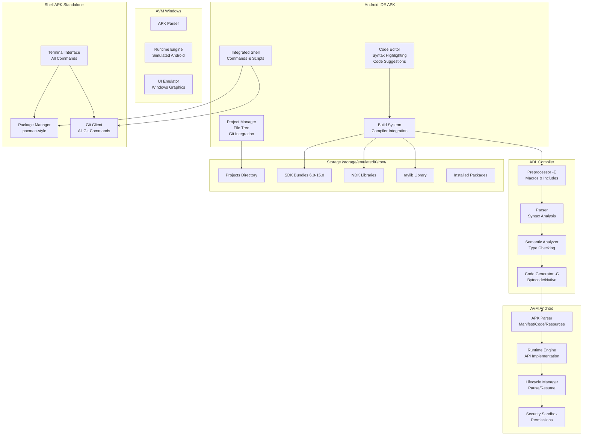
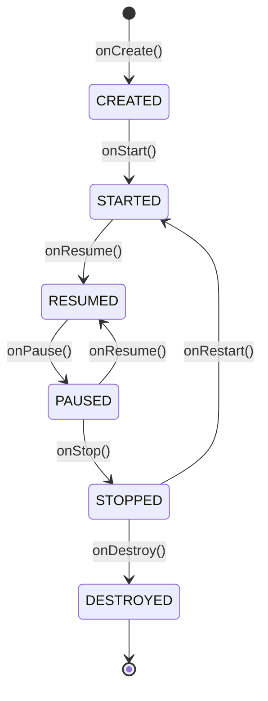
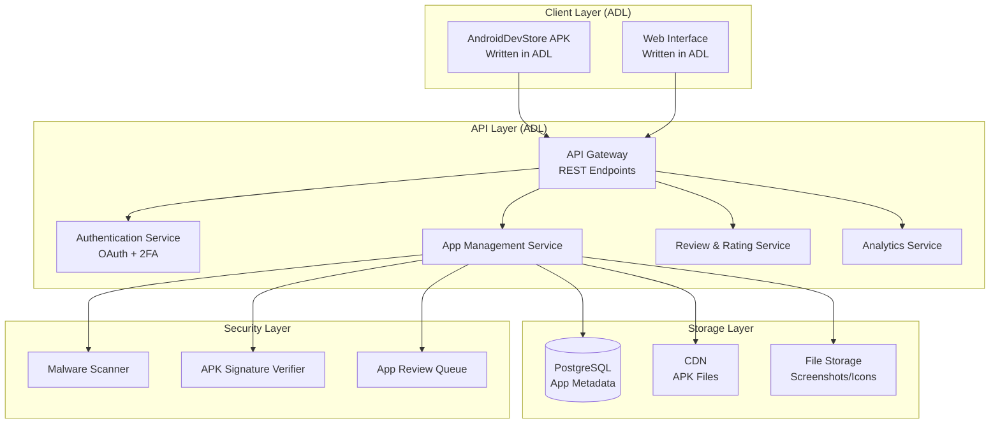
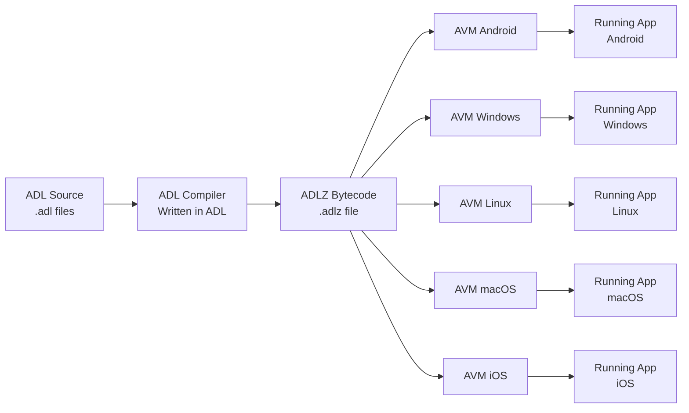
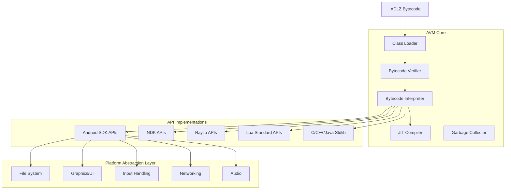
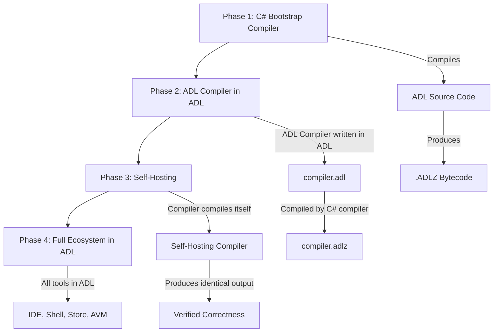
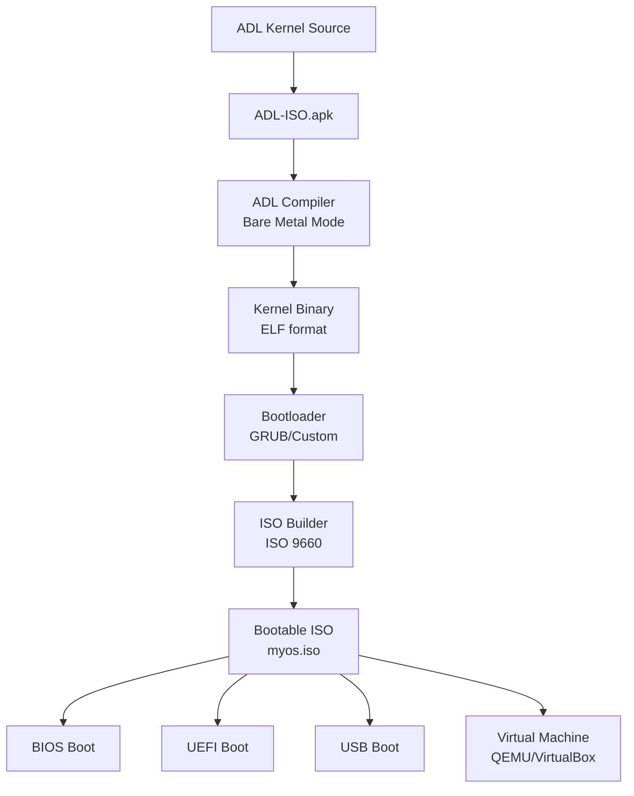

# Design Document: Android Development Ecosystem

## Overview

The Android Development Ecosystem is a comprehensive, self-contained development environment that runs entirely on Android devices (with Windows support for the VM component). The system consists of five major components:

1. **Android IDE** - A full-featured mobile IDE with syntax highlighting, code suggestions, and integrated tools
2. **ADL (Android Development Language)** - Uses pure Java and C++ syntax with built-in Android/NDK/raylib APIs, automatic dependency resolution, and automatic memory management
3. **ADL Compiler** - A smart compiler that automatically discovers dependencies, manages memory, and provides friendly error messages
4. **AVM (Android Virtual Machine)** - A custom APK parser and execution environment for Android and Windows
5. **Shell System** - An integrated and standalone terminal with Linux commands, Git, and package management

**Key Features**:
- **Pure Java and C++ Syntax**: No custom hybrid syntax - write standard Java or C++ code
- **Zero Configuration**: No config files needed - just compile and run
- **Zero Dependencies**: Compiler needs no external tools, DLLs, or libraries
- **Cross-Platform**: Compile to Android APK, Windows .exe, Linux, and macOS from anywhere
- **Automatic Everything**: Compiler automatically discovers dependencies, manages memory, and handles file inclusion
- **Simple Compilation**: Just tell the compiler what to compile - it figures out the rest
- **Friendly Error Messages**: Clear, helpful error messages with suggestions
- **Smaller, Usable Names**: Simplified API names for common operations (original names still available)
- **Built-in raylib**: All raylib graphics, audio, input, and utility functions available without imports
- **Complete Standard Libraries**: All C++, Java, and C standard library functions built-in (no .dll/.so/.a files needed)
- **Flexible APK Packaging**: Choose installer mode (shared runtime) or standalone mode (no dependencies)
- **Multi-Window Support**: Create and manage multiple windows for true multitasking
- **Full Input Support**: Keyboard, mouse, touch, and gamepad input on all platforms
- **Ultra-Simple Game Development**: Make games in just a few lines with raylib - no complex setup
- **Namespace Support**: Full namespace support for code organization
- **Completely Offline**: All SDKs (6.0-15.0), NDK features, raylib, and standard libraries bundled locally

## Architecture

### High-Level Architecture



### Component Interaction Flow

1. **Development Flow**: Developer writes ADL code → IDE provides syntax highlighting and suggestions → Developer triggers build → Compiler processes code → AVM executes result
2. **Shell Flow**: Developer opens shell → Executes commands (Git, pacman, compiler) → Shell interacts with file system and external tools
3. **Cross-Platform Flow**: Code compiled on Android → APK transferred to Windows → AVM Windows executes with simulated environment


## Components and Interfaces

### 1. Android IDE

#### 1.1 Code Editor Component

**Purpose**: Provide real-time code editing with syntax highlighting and intelligent suggestions.

**Data Structures**:
```typescript
interface EditorState {
  currentFile: ADLFile;
  cursorPosition: Position;
  selection: Range | null;
  syntaxTokens: Token[];
  suggestions: Suggestion[];
  undoStack: Edit[];
  redoStack: Edit[];
}

interface Token {
  type: TokenType; // KEYWORD, TYPE, STRING, COMMENT, OPERATOR, IDENTIFIER
  range: Range;
  color: Color;
}

interface Suggestion {
  text: string;
  type: SuggestionType; // METHOD, CLASS, VARIABLE, KEYWORD, API
  signature: string | null;
  documentation: string;
  priority: number;
}

interface Position {
  line: number;
  column: number;
}

interface Range {
  start: Position;
  end: Position;
}
```

**Algorithms**:
- **Syntax Highlighting**: Incremental lexical analysis using a state machine that processes only changed lines
- **Code Suggestions**: Context-aware trie-based lookup with type inference for filtering

**Implementation Details**:
- Use a custom text buffer with gap buffer data structure for efficient insertions/deletions
- Syntax highlighting runs on a background thread with debouncing (300ms delay)
- Suggestion engine maintains an index of all available APIs, updated when SDK version changes
- Support touch gestures: pinch-to-zoom, two-finger scroll, long-press for context menu

#### 1.2 Project Manager Component

**Purpose**: Manage project structure, file operations, and Git integration.

**Data Structures**:
```typescript
interface Project {
  name: string;
  path: string; // Relative to /storage/emulated/0/root/
  files: ADLFile[];
  targetSDK: SDKVersion;
  buildConfig: BuildConfiguration;
  gitStatus: GitStatus | null;
}

interface ADLFile {
  name: string;
  path: string;
  content: string;
  lastModified: Date;
  gitStatus: FileGitStatus; // UNTRACKED, MODIFIED, STAGED, COMMITTED
}

interface BuildConfiguration {
  compilerFlags: string[];
  outputPath: string;
  includeDirectories: string[];
  defines: Map<string, string>;
}

interface GitStatus {
  branch: string;
  remoteURL: string | null;
  uncommittedChanges: number;
  unpushedCommits: number;
}
```

**Implementation Details**:
- File tree uses a virtual scrolling list for performance with large projects
- Git status updates asynchronously every 5 seconds when project is active
- Project state persisted to SQLite database for quick restoration
- Support drag-and-drop file reorganization in the file tree
- Home directory (~) resolution: Replace ~ with /storage/emulated/0/root/ in all file paths

#### 1.3 Build System Component

**Purpose**: Orchestrate compilation process and display results.

**Data Structures**:
```typescript
interface BuildRequest {
  project: Project;
  mode: BuildMode; // PREPROCESS_ONLY, COMPILE, FULL_BUILD
  flags: string[];
}

interface BuildResult {
  success: boolean;
  outputPath: string | null;
  errors: CompilerError[];
  warnings: CompilerWarning[];
  duration: number;
}

interface CompilerError {
  file: string;
  line: number;
  column: number;
  message: string;
  severity: ErrorSeverity; // ERROR, WARNING, INFO
}
```

**Implementation Details**:
- Invoke ADL compiler as a subprocess with IPC for progress updates
- Parse compiler output using regex patterns to extract file:line:column:message
- Display errors inline in the editor with red underlines
- Support incremental builds by tracking file modification timestamps

#### 1.4 Integrated Shell Component

**Purpose**: Provide terminal access within the IDE for command execution.

**Data Structures**:
```typescript
interface ShellSession {
  workingDirectory: string;
  environment: Map<string, string>;
  history: string[];
  historyIndex: number;
  runningProcess: Process | null;
}

interface Process {
  pid: number;
  command: string;
  stdin: Stream;
  stdout: Stream;
  stderr: Stream;
  exitCode: number | null;
}
```

**Implementation Details**:
- Embed a terminal emulator widget with VT100 escape sequence support
- Execute commands using Android's ProcessBuilder with proper environment setup
- Support command history with up/down arrow keys (circular buffer of 1000 commands)
- Implement built-in commands (cd, ls, etc.) natively for performance
- Pipe support: Parse command line and connect stdout of one process to stdin of next
- Home directory: Set HOME environment variable to /storage/emulated/0/root/

### 2. ADL Language

#### 2.1 Language Syntax

**Pure Java and C++ Syntax**: ADL uses standard Java and C++ syntax without any custom hybrid constructs. Developers write pure Java or pure C++ code, and the compiler handles the integration automatically.

**Java Syntax Example**:
```java
// Pure Java syntax - ultra simple!
package com.example;

public class MainActivity {
    public static void main(String[] args) {
        // Built-in Android API (no import needed)
        Activity activity = createActivity();
        activity.setContentView(R.layout.main);
    }
    
    public void onCreate() {
        Button btn = new Button();
        btn.setText("Click me");
    }
}
```

**C++ Syntax Example**:
```cpp
// Pure C++ syntax with namespaces
namespace com::example {
    class DataProcessor {
        void process(int* data, size_t length) {
            // Automatic memory management - no manual free needed
            for (size_t i = 0; i < length; i++) {
                data[i] *= 2;
            }
        }
        
        void render() {
            // OpenGL ES available without includes
            glClear(GL_COLOR_BUFFER_BIT);
            glDrawArrays(GL_TRIANGLES, 0, 3);
        }
    };
}
```

**raylib Example - Even Simpler!**:
```cpp
// Make a game in just a few lines - no imports!
class SimpleGame {
    void run() {
        initWindow(800, 600, "My First Game");
        setTargetFPS(60);
        
        Texture2D player = loadTexture("player.png");
        Vector2 pos = {400, 300};
        
        while (!windowShouldClose()) {
            // Input
            if (isKeyDown(KEY_RIGHT)) pos.x += 5;
            if (isKeyDown(KEY_LEFT)) pos.x -= 5;
            
            // Draw
            beginDrawing();
            clearBackground(RAYWHITE);
            drawTexture(player, pos.x, pos.y, WHITE);
            drawText("Use arrows!", 10, 10, 20, DARKGRAY);
            endDrawing();
        }
        
        closeWindow();
        // No cleanup needed - automatic!
    }
};
```

**Automatic File Inclusion**: The compiler automatically discovers and includes all necessary files in the project. No explicit `#include` or `import` statements are required - the compiler analyzes dependencies and includes files in the correct order.

**Automatic Memory Management**: The compiler provides automatic memory management for both Java and C++ code:
- Automatic garbage collection for Java objects
- Automatic reference counting and cleanup for C++ objects
- No manual `delete` or `free` calls needed
- Compiler inserts cleanup code at appropriate scope boundaries

**Built-in APIs**: All Android SDK, NDK, raylib, and standard library APIs are available without imports or includes:
- Android SDK: Activity, View, Intent, Context, etc.
- NDK Graphics: OpenGL ES, Vulkan, EGL
- NDK Audio: OpenSL ES, AAudio
- NDK Sensors: ASensorManager, accelerometer, gyroscope
- NDK Input: AInputQueue, touch events, keyboard
- JNI: Native method declarations and implementations
- raylib: All graphics, audio, input, textures, models, and utility functions
- C++ Standard Library: iostream, vector, string, map, algorithm, thread, mutex, etc.
- Java Standard Library: Collections, Stream, Optional, Date, Math, etc.
- C Standard Library: stdio, stdlib, string, math, time, etc.

#### 2.2 Type System

**Data Structures**:
```typescript
interface Type {
  name: string;
  kind: TypeKind; // PRIMITIVE, CLASS, INTERFACE, POINTER, ARRAY, NAMESPACE
  namespace: string | null;
  methods: Method[];
  fields: Field[];
  superType: Type | null;
}

interface Method {
  name: string;
  returnType: Type;
  parameters: Parameter[];
  accessModifier: AccessModifier; // PUBLIC, PRIVATE, PROTECTED
  isStatic: boolean;
  isNative: boolean;
}

interface Field {
  name: string;
  type: Type;
  accessModifier: AccessModifier;
  isStatic: boolean;
}
```

**Type Inference**: ADL supports type inference for local variables in both Java and C++:
```java
// Java style
var result = computeValue(); // Type inferred from computeValue() return type
```

```cpp
// C++ style
auto result = computeValue(); // Type inferred from computeValue() return type
```

#### 2.3 Automatic Dependency Resolution

**Compiler Behavior**: When compiling a project, the compiler automatically:
1. Scans all `.adl` files in the project directory
2. Analyzes class and namespace dependencies
3. Determines the correct compilation order
4. Includes files automatically without explicit directives

**Example Project Structure**:
```
MyApp/
  Main.adl        // Uses Utils and Data classes
  Utils.adl       // Utility functions
  Data.adl        // Data models
```

**Compilation**:
```bash
# User simply tells compiler what to compile
$ adlc -C -o app.apk Main.adl

# Compiler automatically:
# 1. Discovers Utils.adl and Data.adl are needed
# 2. Compiles them in dependency order
# 3. Links everything together
```

#### 2.4 Automatic Memory Management

**Java Objects**: Standard garbage collection - objects are automatically freed when no longer referenced.

**C++ Objects**: Compiler provides automatic memory management:
- **Reference Counting**: Compiler tracks object references automatically
- **Scope-Based Cleanup**: Objects are automatically destroyed when leaving scope
- **Smart Pointers**: Compiler converts raw pointers to smart pointers internally
- **No Manual Cleanup**: No need for `delete`, `free`, or manual destructors

**Example**:
```cpp
void processImage() {
    // Compiler automatically manages memory
    Image* img = new Image(1920, 1080);
    img->apply(filter);
    img->save("output.png");
    // No delete needed - compiler inserts cleanup automatically
}
```

**Memory Safety**: Compiler prevents common memory errors:
- No dangling pointers
- No double-free errors
- No memory leaks
- Automatic null checking

### 3. ADL Compiler

#### 3.1 Compiler Architecture

The ADL compiler is a multi-stage compiler with a simplified interface:

**Simple Compilation**: User just specifies what to compile - the compiler handles everything else automatically:
- Discovers all dependencies
- Determines compilation order
- Manages memory automatically
- Provides friendly error messages

**Compiler Modes**:
1. **Compilation Mode (-C)**: Full compilation to executable format
2. **Output Mode (-o)**: Specifies output file path
3. **Preprocessing Mode (-E)**: Optional - outputs preprocessed source (for debugging)

**Zero Configuration**: No configuration files needed unless you want to customize:
```bash
# Just compile - no config needed!
$ adlc -C -o app.apk Main.adl

# That's it! The compiler:
# - Uses sensible defaults for everything
# - Targets latest Android SDK automatically
# - Optimizes for the current device
# - Manages all dependencies
# - No project.json, no build.gradle, no XML configs
```

**Optional Configuration**: Create project.json only if you want to customize:
```json
{
  "name": "MyApp",
  "targetSDK": 33,
  "packageMode": "standalone"
}
```

**Simple Usage**:
```bash
# Android APK (default)
$ adlc -C -o app.apk Main.adl

# Windows executable
$ adlc -C -o app.exe --platform windows Main.adl

# Linux executable
$ adlc -C -o app --platform linux Main.adl

# macOS executable
$ adlc -C -o app.app --platform macos Main.adl

# Cross-compile from Android to Windows
$ adlc -C -o app.exe --platform windows Main.adl

# The compiler:
# - Finds all dependencies automatically
# - Compiles in the right order
# - Manages memory automatically
# - Links everything together
# - No external dependencies needed
```

**Compiler Pipeline**:

```mermaid
graph LR
    Source[ADL Source] --> Discovery[Dependency Discovery]
    Discovery --> Lexer
    Lexer --> Parser
    Parser --> AST[Abstract Syntax Tree]
    AST --> Semantic[Semantic Analyzer]
    Semantic --> TypeChecker[Type Checker]
    TypeChecker --> MemoryMgmt[Memory Management Insertion]
    MemoryMgmt --> Optimizer
    Optimizer --> CodeGen[Code Generator]
    CodeGen --> Output[APK/Binary]
```


#### 3.2 Preprocessor (-E flag)

**Purpose**: Handle C-style preprocessing directives (optional - not required for normal compilation).

**Note**: The preprocessor is optional. The compiler automatically handles file dependencies without requiring `#include` directives. The `-E` flag is provided for advanced users who want to see the preprocessed output.

**Data Structures**:
```typescript
interface PreprocessorState {
  defines: Map<string, MacroDefinition>;
  discoveredFiles: string[]; // Files found by dependency analysis
  currentFile: string;
  currentLine: number;
}

interface MacroDefinition {
  name: string;
  parameters: string[] | null;
  replacement: string;
}
```

**Algorithms**:
- **Automatic File Discovery**: Scan project directory and analyze dependencies
- **Macro Expansion**: Recursive descent with parameter substitution (if macros are used)
- **Dependency Resolution**: Build dependency graph and determine compilation order

**Implementation Details**:
```typescript
class Preprocessor {
  process(entryFile: string, flags: PreprocessorFlags): PreprocessedSource {
    // Phase 1: Discover all files automatically
    const allFiles = this.discoverDependencies(entryFile);
    
    // Phase 2: Combine files in dependency order
    let output = this.combineFiles(allFiles);
    
    // Phase 3: Expand macros (if any)
    output = this.expandMacros(output);
    
    return {
      source: output,
      lineMap: this.buildLineMap()
    };
  }
  
  discoverDependencies(entryFile: string): string[] {
    const discovered = new Set<string>();
    const queue = [entryFile];
    
    while (queue.length > 0) {
      const file = queue.shift()!;
      if (discovered.has(file)) continue;
      
      discovered.add(file);
      
      // Parse file and find referenced classes/namespaces
      const refs = this.findReferences(file);
      
      // Find files that define those references
      for (const ref of refs) {
        const definingFile = this.findDefiningFile(ref);
        if (definingFile && !discovered.has(definingFile)) {
          queue.push(definingFile);
        }
      }
    }
    
    return Array.from(discovered);
  }
  
  findReferences(file: string): string[] {
    // Parse file and extract all class/namespace references
    const source = this.readFile(file);
    const ast = this.parse(source);
    return this.extractReferences(ast);
  }
}
```

#### 3.3 Lexer and Parser

**Purpose**: Convert source code into an Abstract Syntax Tree (AST).

**Data Structures**:
```typescript
interface ASTNode {
  type: NodeType;
  location: SourceLocation;
  children: ASTNode[];
}

interface SourceLocation {
  file: string;
  line: number;
  column: number;
}

// Specific node types
interface ClassDeclaration extends ASTNode {
  name: string;
  namespace: string | null;
  superClass: string | null;
  methods: MethodDeclaration[];
  fields: FieldDeclaration[];
  accessModifier: AccessModifier;
}

interface MethodDeclaration extends ASTNode {
  name: string;
  returnType: TypeReference;
  parameters: Parameter[];
  body: BlockStatement;
  isStatic: boolean;
  isNative: boolean;
}

interface Expression extends ASTNode {
  evaluatedType: Type | null; // Filled in by semantic analyzer
}
```

**Parsing Algorithm**: Recursive descent parser with operator precedence climbing for expressions.

**Implementation Details**:
- Lexer produces tokens with location information for error reporting
- Parser builds AST with full location tracking for every node
- Support both Java-style and C++-style syntax by checking context
- Error recovery: On syntax error, skip to next statement boundary and continue parsing

#### 3.4 Semantic Analyzer and Type Checker

**Purpose**: Validate program semantics and resolve types.

**Data Structures**:
```typescript
interface SymbolTable {
  parent: SymbolTable | null;
  symbols: Map<string, Symbol>;
  
  lookup(name: string): Symbol | null {
    return this.symbols.get(name) ?? this.parent?.lookup(name) ?? null;
  }
  
  define(name: string, symbol: Symbol): void {
    if (this.symbols.has(name)) {
      throw new Error(`Symbol ${name} already defined`);
    }
    this.symbols.set(name, symbol);
  }
}

interface Symbol {
  name: string;
  type: Type;
  kind: SymbolKind; // VARIABLE, METHOD, CLASS, NAMESPACE
  location: SourceLocation;
}
```

**Type Checking Algorithm**:
```typescript
class TypeChecker {
  checkExpression(expr: Expression, symbolTable: SymbolTable): Type {
    switch (expr.type) {
      case NodeType.BINARY_OP:
        const left = this.checkExpression(expr.left, symbolTable);
        const right = this.checkExpression(expr.right, symbolTable);
        return this.checkBinaryOp(expr.operator, left, right);
      
      case NodeType.METHOD_CALL:
        const receiver = this.checkExpression(expr.receiver, symbolTable);
        const method = this.lookupMethod(receiver, expr.methodName);
        this.checkArguments(method, expr.arguments, symbolTable);
        return method.returnType;
      
      case NodeType.IDENTIFIER:
        const symbol = symbolTable.lookup(expr.name);
        if (!symbol) {
          throw new TypeError(`Undefined symbol: ${expr.name}`);
        }
        return symbol.type;
    }
  }
}
```

#### 3.5 Code Generator (-C flag)

**Purpose**: Generate executable bytecode or native code from AST with automatic memory management.

**Output Format**: Hybrid bytecode + native code format
- Java-style code → Dalvik-compatible bytecode with garbage collection
- C++-style code → Native ARM/x86 code with automatic reference counting
- Built-in API calls → Direct function pointers to AVM implementations

**Automatic Memory Management**:
The code generator automatically inserts memory management code:
- **Reference Counting**: Track object references and free when count reaches zero
- **Scope Guards**: Insert cleanup code at scope boundaries
- **Smart Pointer Conversion**: Convert raw pointers to reference-counted smart pointers
- **Null Safety**: Insert automatic null checks before pointer dereferences

**Data Structures**:
```typescript
interface CodeGenContext {
  targetSDK: SDKVersion;
  targetArchitecture: Architecture; // ARM, ARM64, x86, x86_64
  optimizationLevel: number; // 0-3
  outputFormat: OutputFormat; // BYTECODE, NATIVE, HYBRID
  memoryManagement: MemoryManagementStrategy; // AUTO, MANUAL
}

interface GeneratedCode {
  bytecode: BytecodeChunk[];
  nativeCode: NativeCodeChunk[];
  metadata: CodeMetadata;
  memoryManagementCode: MemoryManagementInstructions[];
}

interface MemoryManagementInstructions {
  scopeId: string;
  allocations: Allocation[];
  deallocations: Deallocation[];
  refCountOps: RefCountOperation[];
}

interface BytecodeChunk {
  className: string;
  methods: BytecodeMethod[];
}

interface BytecodeMethod {
  name: string;
  signature: string;
  instructions: Instruction[];
  maxStack: number;
  maxLocals: number;
}

interface NativeCodeChunk {
  functionName: string;
  machineCode: Uint8Array;
  relocations: Relocation[];
}
```

**Code Generation Algorithm**:
```typescript
class CodeGenerator {
  generate(ast: ASTNode, context: CodeGenContext): GeneratedCode {
    const result: GeneratedCode = {
      bytecode: [],
      nativeCode: [],
      metadata: this.buildMetadata(ast),
      memoryManagementCode: []
    };
    
    for (const classNode of ast.classes) {
      if (this.isJavaStyle(classNode)) {
        result.bytecode.push(this.generateBytecode(classNode));
      } else {
        // Generate native code with automatic memory management
        const nativeCode = this.generateNative(classNode);
        const memMgmt = this.insertMemoryManagement(nativeCode);
        result.nativeCode.push(nativeCode);
        result.memoryManagementCode.push(memMgmt);
      }
    }
    
    return result;
  }
  
  insertMemoryManagement(code: NativeCodeChunk): MemoryManagementInstructions {
    // Analyze code to find allocations
    const allocations = this.findAllocations(code);
    
    // Insert reference counting
    const refCountOps = this.insertRefCounting(allocations);
    
    // Insert scope-based cleanup
    const deallocations = this.insertScopeCleanup(allocations);
    
    return {
      scopeId: code.functionName,
      allocations,
      deallocations,
      refCountOps
    };
  }
  
  insertRefCounting(allocations: Allocation[]): RefCountOperation[] {
    const ops: RefCountOperation[] = [];
    
    for (const alloc of allocations) {
      // Insert ref count increment when assigned
      ops.push({
        type: 'INCREMENT',
        pointer: alloc.pointer,
        location: alloc.assignmentLocation
      });
      
      // Insert ref count decrement when leaving scope
      ops.push({
        type: 'DECREMENT',
        pointer: alloc.pointer,
        location: alloc.scopeEnd
      });
    }
    
    return ops;
  }
}
```

**Memory Management Example**:

**Input Code**:
```cpp
void process() {
    Image* img = new Image(1920, 1080);
    img->apply(filter);
    img->save("output.png");
}
```

**Generated Code (conceptual)**:
```cpp
void process() {
    Image* img = new Image(1920, 1080);
    __ref_count_init(img);  // Compiler inserted
    
    img->apply(filter);
    img->save("output.png");
    
    __ref_count_dec(img);   // Compiler inserted
    if (__ref_count_is_zero(img)) {
        __safe_delete(img);  // Compiler inserted
    }
}
```

#### 3.6 Error Reporting

**Purpose**: Provide clear, friendly, actionable error messages.

**Error Message Format**:
```
<file>:<line>:<column>: <severity>: <message>
  <source line>
  <caret indicator>
  
Suggestion: <helpful suggestion>
```

**Example - Friendly Syntax Error**:
```
Main.adl:15:23: error: unknown variable 'result'
    int total = result + 5;
                ^~~~~~
  
Suggestion: Did you mean 'results'? Or did you forget to declare 'result'?
```

**Example - Friendly Type Error**:
```
Main.adl:20:15: error: cannot convert String to int
    int count = "hello";
                ^~~~~~~
  
Suggestion: Use Integer.parseInt("hello") to convert String to int
```

**Example - Friendly Missing Dependency**:
```
Main.adl:10:5: error: class 'Utils' not found
    Utils.log("message");
    ^~~~~
  
Suggestion: Make sure Utils.adl exists in your project directory
```

**Data Structures**:
```typescript
interface CompilerDiagnostic {
  severity: DiagnosticSeverity; // ERROR, WARNING, INFO
  location: SourceLocation;
  message: string;
  friendlyMessage: string; // Human-friendly explanation
  sourceSnippet: string;
  suggestions: string[];
  quickFixes: QuickFix[]; // Automated fixes the IDE can apply
}

interface QuickFix {
  description: string;
  replacement: CodeReplacement;
}

interface CodeReplacement {
  range: Range;
  newText: string;
}
```

**Implementation Details**:
- Collect all errors during compilation (don't stop at first error)
- Sort errors by file, then line, then column
- Include source context (1 line before and after error)
- Provide friendly suggestions for common mistakes:
  - Typos: "Did you mean 'variable'?"
  - Missing declarations: "Did you forget to declare 'x'?"
  - Type mismatches: "Use X.parse() to convert Y to X"
  - Missing files: "Make sure File.adl exists in your project"
- Format output for easy parsing by IDE (file:line:column: prefix)
- Use simple, non-technical language when possible
- Avoid compiler jargon (e.g., say "unknown variable" not "undefined symbol")

### 4. AVM (Android Virtual Machine)

#### 4.1 APK Parser

**Purpose**: Extract and validate APK contents.

**Data Structures**:
```typescript
interface APKStructure {
  manifest: AndroidManifest;
  code: CodeBundle;
  resources: ResourceBundle;
  assets: AssetBundle;
  nativeLibs: Map<Architecture, NativeLibrary[]>;
}

interface AndroidManifest {
  packageName: string;
  versionCode: number;
  versionName: string;
  minSDK: number;
  targetSDK: number;
  permissions: Permission[];
  activities: ActivityDeclaration[];
  services: ServiceDeclaration[];
  entryPoint: string; // Main activity class name
}
```

**Parsing Algorithm**:
```typescript
class APKParser {
  parse(apkPath: string): APKStructure {
    // APK is a ZIP file
    const zip = this.openZip(apkPath);
    
    // Extract manifest (binary XML format)
    const manifestXML = this.decodeBinaryXML(zip.read("AndroidManifest.xml"));
    const manifest = this.parseManifest(manifestXML);
    
    // Extract code (classes.dex or custom format)
    const code = this.parseCode(zip.read("classes.dex"));
    
    // Extract resources (resources.arsc)
    const resources = this.parseResources(zip.read("resources.arsc"));
    
    // Extract assets
    const assets = this.extractAssets(zip, "assets/");
    
    // Extract native libraries
    const nativeLibs = this.extractNativeLibs(zip, "lib/");
    
    return { manifest, code, resources, assets, nativeLibs };
  }
  
  decodeBinaryXML(data: Uint8Array): string {
    // Android uses binary XML format for efficiency
    // Decode using AXML parser
    const parser = new AXMLParser(data);
    return parser.toXMLString();
  }
}
```

**Implementation Details**:
- Use existing ZIP library for APK extraction
- Implement AXML (Android Binary XML) parser for manifest
- Validate APK signature for security
- Support both Dalvik bytecode and custom ADL bytecode formats
- Cache parsed APK structure for faster subsequent launches

#### 4.2 Runtime Engine

**Purpose**: Execute application code and provide Android API implementations.

**Data Structures**:
```typescript
interface RuntimeContext {
  application: Application;
  activities: Map<string, Activity>;
  services: Map<string, Service>;
  permissions: Set<Permission>;
  fileSystem: SandboxedFileSystem;
  classLoader: ClassLoader;
}
```

```typescript
interface ClassLoader {
  loadedClasses: Map<string, Class>;
  
  loadClass(name: string): Class {
    if (this.loadedClasses.has(name)) {
      return this.loadedClasses.get(name);
    }
    
    // Load from bytecode or native code
    const classData = this.findClassData(name);
    const cls = this.defineClass(name, classData);
    this.loadedClasses.set(name, cls);
    return cls;
  }
}

interface Interpreter {
  execute(method: Method, args: any[]): any {
    const frame = new StackFrame(method);
    
    for (const instruction of method.instructions) {
      switch (instruction.opcode) {
        case Opcode.INVOKE_VIRTUAL:
          this.invokeMethod(instruction.target, frame);
          break;
        case Opcode.INVOKE_STATIC:
          this.invokeStaticMethod(instruction.target, frame);
          break;
        case Opcode.INVOKE_BUILTIN:
          this.invokeBuiltinAPI(instruction.apiId, frame);
          break;
        // ... other opcodes
      }
    }
    
    return frame.returnValue;
  }
  
  invokeBuiltinAPI(apiId: number, frame: StackFrame): void {
    // Direct call to AVM's Android API implementation
    const api = this.builtinAPIs[apiId];
    const args = frame.popArguments(api.parameterCount);
    const result = api.implementation(...args);
    frame.push(result);
  }
}
```

**Android API Implementation**: AVM provides implementations for all Android SDK APIs:
- **UI APIs**: Activity, View, ViewGroup, Layout managers
- **Storage APIs**: SharedPreferences, SQLite, File I/O
- **Network APIs**: HttpURLConnection, Socket
- **System APIs**: Intent, Context, PackageManager
- **NDK APIs**: OpenGL ES, Vulkan, OpenSL ES, sensors, input

#### 4.3 Lifecycle Manager

**Purpose**: Manage application lifecycle events (create, start, resume, pause, stop, destroy).

**Data Structures**:
```typescript
interface LifecycleState {
  current: LifecyclePhase;
  history: LifecycleEvent[];
}

enum LifecyclePhase {
  CREATED,
  STARTED,
  RESUMED,
  PAUSED,
  STOPPED,
  DESTROYED
}

interface LifecycleEvent {
  phase: LifecyclePhase;
  timestamp: Date;
}
```

**State Machine**:


**Implementation Details**:
```typescript
class LifecycleManager {
  transition(activity: Activity, newPhase: LifecyclePhase): void {
    const currentPhase = activity.lifecycleState.current;
    
    // Validate transition
    if (!this.isValidTransition(currentPhase, newPhase)) {
      throw new Error(`Invalid lifecycle transition: ${currentPhase} -> ${newPhase}`);
    }
    
    // Call lifecycle callback
    switch (newPhase) {
      case LifecyclePhase.CREATED:
        activity.onCreate();
        break;
      case LifecyclePhase.PAUSED:
        activity.onPause();
        this.saveInstanceState(activity);
        break;
      case LifecyclePhase.DESTROYED:
        activity.onDestroy();
        this.releaseResources(activity);
        break;
    }
    
    activity.lifecycleState.current = newPhase;
  }
}
```

#### 4.4 Security and Sandboxing

**Purpose**: Isolate applications and enforce permission model.

**Data Structures**:
```typescript
interface Sandbox {
  appId: string;
  dataDirectory: string; // /data/data/<package>/
  permissions: Set<Permission>;
  fileAccessPolicy: FileAccessPolicy;
}

interface FileAccessPolicy {
  allowedPaths: string[];
  deniedPaths: string[];
  
  canAccess(path: string): boolean {
    // Check if path is within allowed directories
    for (const allowed of this.allowedPaths) {
      if (path.startsWith(allowed)) {
        return true;
      }
    }
    return false;
  }
}

enum Permission {
  INTERNET,
  READ_EXTERNAL_STORAGE,
  WRITE_EXTERNAL_STORAGE,
  CAMERA,
  LOCATION,
  MICROPHONE,
  // ... all Android permissions
}
```

**Security Enforcement**:
```typescript
class SecurityManager {
  checkPermission(permission: Permission, sandbox: Sandbox): boolean {
    if (!sandbox.permissions.has(permission)) {
      // Permission not granted - prompt user
      return this.requestPermission(permission, sandbox);
    }
    return true;
  }
  
  checkFileAccess(path: string, sandbox: Sandbox): void {
    if (!sandbox.fileAccessPolicy.canAccess(path)) {
      throw new SecurityException(`Access denied: ${path}`);
    }
  }
  
  requestPermission(permission: Permission, sandbox: Sandbox): boolean {
    // Show permission dialog to user
    const granted = this.showPermissionDialog(permission);
    if (granted) {
      sandbox.permissions.add(permission);
    }
    return granted;
  }
}
```

**Implementation Details**:
- Each application runs in isolated process with separate memory space
- File system access restricted to app's data directory and explicitly granted paths
- Network access requires INTERNET permission
- Dangerous permissions require runtime user approval
- System APIs that require permissions check before execution

#### 4.5 AVM Windows Platform

**Purpose**: Run Android applications on Windows for development and testing.

**Architecture Differences**:
- **UI Rendering**: Use Windows GDI+/DirectX instead of Android SurfaceFlinger
- **File System**: Map Android paths to Windows paths (e.g., /data/data/ → C:\Users\...\AppData\)
- **Hardware Emulation**: Simulate sensors, GPS, camera using desktop equivalents or mock data
- **API Implementation**: Same API surface as AVM Android, but with Windows-native backends

**Data Structures**:
```typescript
interface WindowsEmulationLayer {
  windowHandle: HWND;
  graphicsContext: GraphicsContext;
  inputEmulator: InputEmulator;
  sensorEmulator: SensorEmulator;
}

interface GraphicsContext {
  renderAndroidView(view: View): void {
    // Convert Android View hierarchy to Windows controls
    const windowsControl = this.convertToWindowsControl(view);
    this.renderControl(windowsControl);
  }
}

interface SensorEmulator {
  accelerometer: Vector3;
  gyroscope: Vector3;
  gps: GPSCoordinates;
  
  simulateMotion(motion: MotionEvent): void {
    // Update sensor values based on simulated motion
  }
}
```

**Implementation Details**:
- Package AVM Windows as standalone .exe with embedded runtime
- Support drag-and-drop APK files to launch
- Provide developer tools: logcat viewer, file browser, network inspector
- Support debugging with breakpoints and variable inspection
- Emulate multi-touch using mouse + keyboard modifiers

### 5. Shell System

#### 5.1 Integrated Shell (in IDE)

**Purpose**: Provide terminal access within the IDE.

**Command Categories**:
1. **File Operations**: ls, cd, mkdir, rm, cp, mv, cat, grep, find, chmod, chown
2. **Development Tools**: ADL compiler, AVM launcher, build scripts
3. **Version Control**: All Git commands
4. **Package Management**: pacman-style commands
5. **System Tools**: ps, kill, env, export, echo, pwd
6. **Network Tools**: wget, curl, ssh, scp, nmap, netstat, ifconfig
7. **Arch Linux Tools**: systemctl, journalctl, uname

**Data Structures**:
```typescript
interface Command {
  name: string;
  execute(args: string[], context: ShellContext): CommandResult;
  autocomplete(partial: string, context: ShellContext): string[];
}

interface ShellContext {
  workingDirectory: string;
  environment: Map<string, string>;
  stdin: Stream;
  stdout: Stream;
  stderr: Stream;
}

interface CommandResult {
  exitCode: number;
  output: string;
  error: string;
}
```

**Built-in Command Implementation**:
```typescript
class LSCommand implements Command {
  name = "ls";
  
  execute(args: string[], context: ShellContext): CommandResult {
    const flags = this.parseFlags(args); // -l, -a, -h, etc.
    const path = args.find(a => !a.startsWith('-')) ?? context.workingDirectory;
    
    const files = this.listFiles(path, flags.showHidden);
    
    if (flags.longFormat) {
      return this.formatLongListing(files);
    } else {
      return this.formatShortListing(files);
    }
  }
  
  formatLongListing(files: FileInfo[]): CommandResult {
    const lines = files.map(f => 
      `${f.permissions} ${f.owner} ${f.group} ${f.size} ${f.modifiedDate} ${f.name}`
    );
    return { exitCode: 0, output: lines.join('\n'), error: '' };
  }
}
```

**Home Directory Implementation**:
- Set HOME environment variable to /storage/emulated/0/root/
- All shell sessions start in HOME directory
- Tilde (~) expansion: Replace ~ with HOME in all paths
- Create HOME directory on first launch if it doesn't exist

#### 5.2 Standalone Shell APK

**Purpose**: Independent terminal application with full command support.

**Architecture**:
```typescript
interface ShellAPK {
  terminalUI: TerminalView;
  commandExecutor: CommandExecutor;
  sessionManager: SessionManager;
}

interface TerminalView {
  displayPrompt(): void;
  readInput(): Promise<string>;
  writeOutput(text: string, color: Color): void;
  handleKeyPress(key: KeyEvent): void;
}

interface SessionManager {
  sessions: Map<string, ShellSession>;
  activeSession: string;
  
  createSession(): string {
    const id = this.generateSessionId();
    const session = new ShellSession(id);
    session.workingDirectory = "/storage/emulated/0/root/";
    this.sessions.set(id, session);
    return id;
  }
}
```

**Implementation Details**:
- Full VT100 terminal emulation with ANSI color support
- Support multiple tabs/sessions
- Persistent command history across app restarts
- Support for shell scripts (.sh files) with shebang
- Background process management (jobs, fg, bg)
- Signal handling (Ctrl+C, Ctrl+Z)

#### 5.3 Git Integration

**Purpose**: Full Git version control support.

**Implementation Strategy**: Embed libgit2 (C library) with JNI bindings.

**Data Structures**:
```typescript
interface GitRepository {
  path: string;
  head: string; // Current branch or commit
  remotes: Map<string, string>;
  config: GitConfig;
}

interface GitConfig {
  userName: string;
  userEmail: string;
  sshKeyPath: string;
  httpsToken: string;
}
```

**Git Command Implementation**:
```typescript
class GitCommand implements Command {
  name = "git";
  
  execute(args: string[], context: ShellContext): CommandResult {
    const subcommand = args[0];
    
    switch (subcommand) {
      case "clone":
        return this.clone(args[1], context);
      case "add":
        return this.add(args.slice(1), context);
      case "commit":
        return this.commit(args, context);
      case "push":
        return this.push(args, context);
      case "pull":
        return this.pull(args, context);
      case "status":
        return this.status(context);
      // ... all other Git commands
    }
  }
  
  clone(url: string, context: ShellContext): CommandResult {
    const repo = this.gitLib.clone(url, context.workingDirectory);
    return { exitCode: 0, output: `Cloned ${url}`, error: '' };
  }
  
  commit(args: string[], context: ShellContext): CommandResult {
    const message = this.extractMessage(args); // -m flag
    const repo = this.openRepository(context.workingDirectory);
    const commitId = repo.commit(message);
    return { exitCode: 0, output: `[${repo.branch}] ${commitId}`, error: '' };
  }
}
```

**Authentication**:
- SSH: Store keys in ~/.ssh/ directory, use for authentication
- HTTPS: Store tokens in Git credential helper
- Support for GitHub, GitLab, Bitbucket

**IDE Integration**:
- Show file modification status in file tree (M, A, D, ??)
- Display current branch in status bar
- Highlight uncommitted changes in editor gutter
- Quick actions: stage, unstage, commit, push

#### 5.4 Package Manager

**Purpose**: Install and manage development tools and libraries.

**Architecture**:
```typescript
interface PackageManager {
  repositories: Repository[];
  installedPackages: Map<string, Package>;
  packageCache: string; // ~/.cache/pacman/
  
  install(packageName: string): void {
    const pkg = this.resolvePackage(packageName);
    const deps = this.resolveDependencies(pkg);
    
    for (const dep of deps) {
      if (!this.isInstalled(dep)) {
        this.install(dep.name);
      }
    }
    
    this.downloadAndInstall(pkg);
  }
}

interface Package {
  name: string;
  version: string;
  description: string;
  dependencies: Dependency[];
  files: PackageFile[];
  installScript: string | null;
}

interface Repository {
  url: string;
  packages: PackageIndex;
  
  search(query: string): Package[] {
    return this.packages.filter(p => 
      p.name.includes(query) || p.description.includes(query)
    );
  }
}
```

**Pacman-style Commands**:
```typescript
class PacmanCommand implements Command {
  name = "pacman";
  
  execute(args: string[], context: ShellContext): CommandResult {
    const flags = this.parseFlags(args);
    
    if (flags.sync && flags.install) {
      // pacman -S <package>
      return this.install(args.packages);
    } else if (flags.remove) {
      // pacman -R <package>
      return this.remove(args.packages);
    } else if (flags.sync && flags.refresh) {
      // pacman -Sy
      return this.refreshRepositories();
    } else if (flags.sync && flags.upgrade) {
      // pacman -Syu
      return this.upgradeAll();
    } else if (flags.query) {
      // pacman -Q
      return this.listInstalled();
    } else if (flags.search) {
      // pacman -Ss <query>
      return this.search(args.query);
    }
  }
}
```

**Package Repository**:
- Host package repository on CDN for fast downloads
- Package format: tar.gz with metadata file
- Support for binary packages (pre-compiled) and source packages
- Automatic dependency resolution using topological sort
- Package categories: compilers, libraries, tools, utilities, languages

**Example Packages**:
- python3: Python interpreter
- nodejs: Node.js runtime
- gcc: GNU C compiler
- make: Build automation tool
- vim: Text editor
- openssh: SSH client/server
- sqlite3: Database engine

### 6. SDK and NDK Support

#### 6.1 Multi-SDK Version Support

**Purpose**: Support targeting Android SDK versions 6.0 (API 23) through 15.0.

**Data Structures**:
```typescript
interface SDKBundle {
  version: string; // "6.0", "7.0", etc.
  apiLevel: number; // 23, 24, etc.
  apis: APIDefinition[];
  resources: ResourceBundle;
  buildTools: BuildTools;
}

interface APIDefinition {
  className: string;
  methods: MethodSignature[];
  fields: FieldSignature[];
  minSDK: number;
  deprecated: boolean;
}
```

**SDK Storage**:
```
/storage/emulated/0/root/
  sdk/
    android-23/  (6.0)
    android-24/  (7.0)
    android-25/  (7.1)
    android-26/  (8.0)
    android-27/  (8.1)
    android-28/  (9.0)
    android-29/  (10.0)
    android-30/  (11.0)
    android-31/  (12.0)
    android-33/  (13.0)
    android-34/  (14.0)
    android-35/  (15.0)
```

**API Compatibility Checking**:
```typescript
class APICompatibilityChecker {
  checkMethod(method: MethodCall, targetSDK: number): void {
    const apiDef = this.lookupAPI(method.className, method.methodName);
    
    if (apiDef.minSDK > targetSDK) {
      throw new CompatibilityError(
        `${method.className}.${method.methodName} requires API ${apiDef.minSDK}, ` +
        `but target SDK is ${targetSDK}`
      );
    }
    
    if (apiDef.deprecated) {
      this.warn(`${method.className}.${method.methodName} is deprecated`);
    }
  }
}
```

#### 6.2 NDK Feature Support

**Purpose**: Provide access to all NDK APIs for high-performance native code.

**NDK API Categories**:
1. **Graphics**: OpenGL ES 2.0/3.0/3.1/3.2, Vulkan, EGL, raylib
2. **Audio**: OpenSL ES, AAudio, raylib audio
3. **Sensors**: Accelerometer, gyroscope, magnetometer, proximity
4. **Input**: Touch events, keyboard, game controllers, raylib input
5. **Camera**: Camera2 API, image capture
6. **Media**: MediaCodec, MediaMuxer, video encoding/decoding
7. **Native Activity**: NativeActivity for pure native apps
8. **JNI**: Java Native Interface for Java/C++ interop
9. **raylib**: Complete 2D/3D game development library with graphics, audio, input, textures, models, and utilities

**Data Structures**:
```typescript
interface NDKBinding {
  functionName: string;
  nativeSymbol: string;
  parameters: Type[];
  returnType: Type;
  library: string; // libGLESv2.so, libOpenSLES.so, etc.
}

interface NativeLibrary {
  name: string;
  path: string;
  symbols: Map<string, NativeSymbol>;
  dependencies: string[];
}
```

**ADL NDK Integration**:
```java
// Pure Java with simple, usable names
public class GameActivity {
    public void onCreate() {
        // OpenGL ES with friendly names
        Display display = getDisplay();
        display.init();
        
        // Create OpenGL context with simple API
        Context ctx = display.createContext();
        
        // Render loop
        while (running) {
            clear(COLOR_BUFFER | DEPTH_BUFFER);
            renderScene();
            display.swap();
        }
    }
}
```

```cpp
// Pure C++ with simple, usable names
class AudioProcessor {
    void process(short* buffer, int length) {
        // Automatic memory management - no manual cleanup
        Filter* filter = new Filter();
        
        for (int i = 0; i < length; i++) {
            buffer[i] = filter->apply(buffer[i]);
        }
        // No delete needed - compiler handles it
    }
};
```

**Simplified API Names**: ADL provides shorter, more intuitive names for common NDK functions:
- `getDisplay()` instead of `eglGetDisplay(EGL_DEFAULT_DISPLAY)`
- `display.init()` instead of `eglInitialize(display, &major, &minor)`
- `display.createContext()` instead of `eglCreateContext(display, config, EGL_NO_CONTEXT, attribs)`
- `clear(flags)` instead of `glClear(GL_COLOR_BUFFER_BIT | GL_DEPTH_BUFFER_BIT)`
- `display.swap()` instead of `eglSwapBuffers(display, surface)`

**Original NDK names still available**: Developers can use original NDK function names if preferred.

#### 6.3 raylib Integration

**Purpose**: Provide a simple, easy-to-use game development library built into ADL for 2D and 3D graphics, audio, input, and more.

**raylib Philosophy**: raylib is designed to be simple and easy to use, perfect for game development, prototyping, and learning. All raylib functions are available without any imports or includes.

**raylib API Categories**:
1. **Core**: Window management, timing, input handling, camera
2. **Shapes**: 2D shape drawing (circles, rectangles, lines, polygons)
3. **Textures**: Image loading, texture management, sprite rendering
4. **Text**: Font loading and text rendering
5. **Models**: 3D model loading and rendering
6. **Audio**: Sound and music loading and playback
7. **Math**: Vector, matrix, and quaternion operations

**Simplified raylib Syntax**: ADL makes raylib even simpler with ultra-short function names and automatic resource management.

**Example - Simple 2D Game**:
```cpp
// Pure C++ with raylib - no imports needed!
class Game {
    void run() {
        // Initialize window - super simple!
        initWindow(800, 600, "My Game");
        setTargetFPS(60);
        
        // Load resources - automatic memory management
        Texture2D player = loadTexture("player.png");
        Sound jump = loadSound("jump.wav");
        Music bgm = loadMusicStream("music.mp3");
        
        playMusicStream(bgm);
        
        Vector2 pos = {400, 300};
        
        // Game loop
        while (!windowShouldClose()) {
            // Update
            updateMusicStream(bgm);
            
            if (isKeyDown(KEY_RIGHT)) pos.x += 5;
            if (isKeyDown(KEY_LEFT)) pos.x -= 5;
            if (isKeyPressed(KEY_SPACE)) playSound(jump);
            
            // Draw
            beginDrawing();
            clearBackground(RAYWHITE);
            
            drawTexture(player, pos.x, pos.y, WHITE);
            drawText("Use arrows to move!", 10, 10, 20, DARKGRAY);
            drawFPS(10, 40);
            
            endDrawing();
        }
        
        closeWindow();
        // No manual cleanup needed - compiler handles it!
    }
};
```

**Example - 3D Graphics**:
```cpp
class Game3D {
    void run() {
        initWindow(800, 600, "3D Game");
        
        // 3D camera setup - simple!
        Camera3D camera = {0};
        camera.position = {10, 10, 10};
        camera.target = {0, 0, 0};
        camera.up = {0, 1, 0};
        camera.fovy = 45;
        camera.projection = CAMERA_PERSPECTIVE;
        
        // Load 3D model
        Model model = loadModel("robot.obj");
        Texture2D texture = loadTexture("robot.png");
        model.materials[0].maps[MATERIAL_MAP_DIFFUSE].texture = texture;
        
        setTargetFPS(60);
        
        while (!windowShouldClose()) {
            // Update camera
            updateCamera(&camera, CAMERA_ORBITAL);
            
            // Draw
            beginDrawing();
            clearBackground(RAYWHITE);
            
            beginMode3D(camera);
            
            drawModel(model, {0, 0, 0}, 1.0f, WHITE);
            drawGrid(10, 1.0f);
            
            endMode3D();
            
            drawText("3D Model Viewer", 10, 10, 20, DARKGRAY);
            drawFPS(10, 40);
            
            endDrawing();
        }
        
        closeWindow();
    }
};
```

**Example - Audio System**:
```cpp
class AudioDemo {
    void run() {
        initWindow(800, 600, "Audio Demo");
        initAudioDevice();
        
        // Load audio - automatic management
        Music music = loadMusicStream("background.mp3");
        Sound[] sounds = {
            loadSound("explosion.wav"),
            loadSound("pickup.wav"),
            loadSound("laser.wav")
        };
        
        playMusicStream(music);
        setMusicVolume(music, 0.5f);
        
        setTargetFPS(60);
        
        while (!windowShouldClose()) {
            updateMusicStream(music);
            
            // Play sounds on key press
            if (isKeyPressed(KEY_ONE)) playSound(sounds[0]);
            if (isKeyPressed(KEY_TWO)) playSound(sounds[1]);
            if (isKeyPressed(KEY_THREE)) playSound(sounds[2]);
            
            // Volume control
            if (isKeyDown(KEY_UP)) {
                float vol = getMusicVolume(music);
                setMusicVolume(music, vol + 0.01f);
            }
            if (isKeyDown(KEY_DOWN)) {
                float vol = getMusicVolume(music);
                setMusicVolume(music, vol - 0.01f);
            }
            
            beginDrawing();
            clearBackground(RAYWHITE);
            
            drawText("Press 1, 2, 3 for sounds", 10, 10, 20, DARKGRAY);
            drawText("Up/Down for volume", 10, 40, 20, DARKGRAY);
            
            endDrawing();
        }
        
        closeAudioDevice();
        closeWindow();
    }
};
```

**Complete raylib API Available**:

**Core Functions**:
- `initWindow(width, height, title)` - Initialize window
- `closeWindow()` - Close window
- `windowShouldClose()` - Check if window should close
- `setTargetFPS(fps)` - Set target FPS
- `getFrameTime()` - Get frame time
- `getTime()` - Get elapsed time
- `getFPS()` - Get current FPS

**Input Functions**:
- `isKeyPressed(key)` - Check if key pressed once
- `isKeyDown(key)` - Check if key is held down
- `isKeyReleased(key)` - Check if key released
- `isMouseButtonPressed(button)` - Check mouse button
- `getMousePosition()` - Get mouse position
- `getMouseX()`, `getMouseY()` - Get mouse coordinates
- `getTouchPosition(index)` - Get touch position (mobile)
- `getTouchPointCount()` - Get number of touch points

**Drawing Functions**:
- `beginDrawing()` - Start drawing
- `endDrawing()` - End drawing
- `clearBackground(color)` - Clear screen
- `drawPixel(x, y, color)` - Draw pixel
- `drawLine(x1, y1, x2, y2, color)` - Draw line
- `drawCircle(x, y, radius, color)` - Draw circle
- `drawRectangle(x, y, width, height, color)` - Draw rectangle
- `drawTriangle(v1, v2, v3, color)` - Draw triangle
- `drawPoly(center, sides, radius, rotation, color)` - Draw polygon

**Texture Functions**:
- `loadTexture(filename)` - Load texture from file
- `loadTextureFromImage(image)` - Load texture from image
- `unloadTexture(texture)` - Unload texture (optional - auto-managed)
- `drawTexture(texture, x, y, tint)` - Draw texture
- `drawTextureEx(texture, pos, rotation, scale, tint)` - Draw with transform
- `drawTexturePro(texture, source, dest, origin, rotation, tint)` - Advanced draw

**Image Functions**:
- `loadImage(filename)` - Load image
- `loadImageFromTexture(texture)` - Load image from texture
- `exportImage(image, filename)` - Export image to file
- `imageResize(image, width, height)` - Resize image
- `imageCrop(image, crop)` - Crop image
- `imageColorTint(image, color)` - Tint image

**Text Functions**:
- `drawText(text, x, y, fontSize, color)` - Draw text
- `drawTextEx(font, text, position, fontSize, spacing, tint)` - Draw with font
- `loadFont(filename)` - Load font
- `measureText(text, fontSize)` - Measure text width
- `drawFPS(x, y)` - Draw FPS counter

**Audio Functions**:
- `initAudioDevice()` - Initialize audio
- `closeAudioDevice()` - Close audio
- `loadSound(filename)` - Load sound effect
- `playSound(sound)` - Play sound
- `stopSound(sound)` - Stop sound
- `pauseSound(sound)` - Pause sound
- `resumeSound(sound)` - Resume sound
- `setSoundVolume(sound, volume)` - Set volume (0.0-1.0)
- `loadMusicStream(filename)` - Load music
- `playMusicStream(music)` - Play music
- `updateMusicStream(music)` - Update music (call every frame)
- `stopMusicStream(music)` - Stop music
- `pauseMusicStream(music)` - Pause music
- `resumeMusicStream(music)` - Resume music
- `setMusicVolume(music, volume)` - Set music volume

**3D Functions**:
- `beginMode3D(camera)` - Begin 3D mode
- `endMode3D()` - End 3D mode
- `loadModel(filename)` - Load 3D model
- `drawModel(model, position, scale, tint)` - Draw model
- `drawModelEx(model, position, rotationAxis, angle, scale, tint)` - Draw with rotation
- `drawCube(position, width, height, length, color)` - Draw cube
- `drawSphere(position, radius, color)` - Draw sphere
- `drawGrid(slices, spacing)` - Draw grid
- `updateCamera(camera, mode)` - Update camera

**Camera Functions**:
- `setCameraMode(camera, mode)` - Set camera mode
- `updateCamera(camera, mode)` - Update camera
- Camera modes: `CAMERA_FREE`, `CAMERA_ORBITAL`, `CAMERA_FIRST_PERSON`, `CAMERA_THIRD_PERSON`

**Math Functions** (all built-in):
- Vector2: `vector2Add`, `vector2Subtract`, `vector2Length`, `vector2Normalize`, `vector2DotProduct`
- Vector3: `vector3Add`, `vector3Subtract`, `vector3Length`, `vector3Normalize`, `vector3CrossProduct`
- Matrix: `matrixIdentity`, `matrixTranslate`, `matrixRotate`, `matrixScale`, `matrixMultiply`
- Quaternion: `quaternionIdentity`, `quaternionFromEuler`, `quaternionToEuler`, `quaternionSlerp`

**Colors** (all predefined):
- `LIGHTGRAY`, `GRAY`, `DARKGRAY`, `YELLOW`, `GOLD`, `ORANGE`, `PINK`, `RED`, `MAROON`, `GREEN`, `LIME`, `DARKGREEN`, `SKYBLUE`, `BLUE`, `DARKBLUE`, `PURPLE`, `VIOLET`, `DARKPURPLE`, `BEIGE`, `BROWN`, `DARKBROWN`, `WHITE`, `BLACK`, `BLANK`, `MAGENTA`, `RAYWHITE`

**Key Constants**:
- `KEY_SPACE`, `KEY_ENTER`, `KEY_ESCAPE`, `KEY_BACKSPACE`, `KEY_TAB`
- `KEY_RIGHT`, `KEY_LEFT`, `KEY_DOWN`, `KEY_UP`
- `KEY_A` through `KEY_Z`, `KEY_ZERO` through `KEY_NINE`
- `MOUSE_BUTTON_LEFT`, `MOUSE_BUTTON_RIGHT`, `MOUSE_BUTTON_MIDDLE`

**Data Structures**:
```typescript
interface RaylibBinding {
  functionName: string;
  category: RaylibCategory;
  parameters: Type[];
  returnType: Type;
  description: string;
  simplified: boolean; // Whether this is a simplified ADL version
}

enum RaylibCategory {
  CORE,
  SHAPES,
  TEXTURES,
  TEXT,
  MODELS,
  AUDIO,
  MATH,
  INPUT
}

interface RaylibResource {
  type: ResourceType; // TEXTURE, SOUND, MUSIC, MODEL, FONT
  handle: number;
  path: string;
  autoManaged: boolean; // Compiler handles cleanup
}
```

**Automatic Resource Management**: The compiler automatically manages raylib resources:
- Textures, sounds, music, models, and fonts are automatically unloaded when out of scope
- No need to call `unloadTexture()`, `unloadSound()`, etc.
- Compiler inserts cleanup code at appropriate boundaries
- Prevents resource leaks and memory issues

**Integration with Android**:
- raylib window runs in Android Activity
- Touch input automatically mapped to mouse input
- Accelerometer accessible through raylib sensor functions
- Audio uses Android audio backend
- File I/O uses Android asset system

**Performance**: raylib is highly optimized:
- Hardware-accelerated rendering using OpenGL ES
- Efficient batching of draw calls
- Minimal overhead for 2D games
- Full 3D capabilities with model loading

**Why raylib?**:
- Much simpler than OpenGL ES or Vulkan
- Perfect for 2D games, prototypes, and learning
- Complete game development library in one package
- No external dependencies or complex setup
- Works great alongside OpenGL ES and Vulkan for advanced users

#### 6.4 Standard Library Support

**Purpose**: Provide complete C, C++, and Java standard library functionality without requiring external .dll, .so, or .a files.

**Philosophy**: All standard library functions are built directly into the ADL runtime. No linking, no external dependencies, no missing libraries - everything just works.

**C++ Standard Library (Complete)**:

All C++ standard headers are available without includes:

**Containers**:
```cpp
// All STL containers work without includes!
class DataManager {
    void process() {
        // Vectors
        vector<int> numbers = {1, 2, 3, 4, 5};
        numbers.push_back(6);
        
        // Maps
        map<string, int> scores;
        scores["player1"] = 100;
        scores["player2"] = 200;
        
        // Sets
        set<string> uniqueNames;
        uniqueNames.insert("Alice");
        uniqueNames.insert("Bob");
        
        // Lists
        list<double> values;
        values.push_front(3.14);
        values.push_back(2.71);
        
        // Queues and Stacks
        queue<int> taskQueue;
        stack<int> undoStack;
        
        // Unordered containers
        unordered_map<string, int> fastLookup;
        unordered_set<int> fastSet;
    }
};
```

**Algorithms**:
```cpp
class AlgorithmDemo {
    void run() {
        vector<int> data = {5, 2, 8, 1, 9};
        
        // Sorting
        sort(data.begin(), data.end());
        
        // Searching
        auto it = find(data.begin(), data.end(), 8);
        
        // Transforming
        transform(data.begin(), data.end(), data.begin(), 
                  [](int x) { return x * 2; });
        
        // Filtering
        auto result = copy_if(data.begin(), data.end(), 
                              back_inserter(filtered),
                              [](int x) { return x > 5; });
        
        // Accumulating
        int sum = accumulate(data.begin(), data.end(), 0);
        
        // Min/Max
        int minVal = *min_element(data.begin(), data.end());
        int maxVal = *max_element(data.begin(), data.end());
    }
};
```

**Strings**:
```cpp
class StringDemo {
    void process() {
        // String operations
        string text = "Hello, World!";
        string upper = text;
        transform(upper.begin(), upper.end(), upper.begin(), ::toupper);
        
        // String streams
        stringstream ss;
        ss << "Value: " << 42 << ", Pi: " << 3.14;
        string result = ss.str();
        
        // Parsing
        stringstream parser("123 456 789");
        int a, b, c;
        parser >> a >> b >> c;
        
        // Regular expressions
        regex pattern("\\d+");
        smatch matches;
        regex_search(text, matches, pattern);
    }
};
```

**I/O Streams**:
```cpp
class IODemo {
    void fileOperations() {
        // File output
        ofstream outFile("data.txt");
        outFile << "Line 1" << endl;
        outFile << "Line 2" << endl;
        outFile.close();
        
        // File input
        ifstream inFile("data.txt");
        string line;
        while (getline(inFile, line)) {
            cout << line << endl;
        }
        inFile.close();
        
        // Binary I/O
        ofstream binFile("data.bin", ios::binary);
        int value = 42;
        binFile.write(reinterpret_cast<char*>(&value), sizeof(value));
        binFile.close();
    }
};
```

**Threading and Concurrency**:
```cpp
class ThreadDemo {
    void runParallel() {
        // Threads
        thread t1([]() { cout << "Thread 1" << endl; });
        thread t2([]() { cout << "Thread 2" << endl; });
        t1.join();
        t2.join();
        
        // Mutex
        mutex mtx;
        mtx.lock();
        // Critical section
        mtx.unlock();
        
        // Lock guard (RAII)
        {
            lock_guard<mutex> lock(mtx);
            // Automatically unlocked
        }
        
        // Condition variables
        condition_variable cv;
        unique_lock<mutex> lock(mtx);
        cv.wait(lock);
        cv.notify_one();
        
        // Atomic operations
        atomic<int> counter(0);
        counter++;
        counter.fetch_add(5);
        
        // Futures and promises
        promise<int> prom;
        future<int> fut = prom.get_future();
        thread t([&prom]() { prom.set_value(42); });
        int result = fut.get();
        t.join();
    }
};
```

**Smart Pointers**:
```cpp
class SmartPointerDemo {
    void manage() {
        // Unique pointer (exclusive ownership)
        unique_ptr<int> ptr1 = make_unique<int>(42);
        
        // Shared pointer (reference counted)
        shared_ptr<int> ptr2 = make_shared<int>(100);
        shared_ptr<int> ptr3 = ptr2; // Shared ownership
        
        // Weak pointer (non-owning reference)
        weak_ptr<int> weak = ptr2;
        if (auto locked = weak.lock()) {
            // Use locked pointer
        }
    }
};
```

**Chrono (Time)**:
```cpp
class TimeDemo {
    void timing() {
        // Current time
        auto now = chrono::system_clock::now();
        
        // Duration
        auto duration = chrono::seconds(5);
        auto millis = chrono::milliseconds(500);
        
        // Timing code
        auto start = chrono::high_resolution_clock::now();
        // ... do work ...
        auto end = chrono::high_resolution_clock::now();
        auto elapsed = chrono::duration_cast<chrono::milliseconds>(end - start);
        
        // Sleep
        this_thread::sleep_for(chrono::seconds(1));
    }
};
```

**Java Standard Library (Complete)**:

All Java standard classes are available without imports:

**Collections**:
```java
class CollectionsDemo {
    void process() {
        // Lists
        ArrayList<String> list = new ArrayList<>();
        list.add("Apple");
        list.add("Banana");
        
        LinkedList<Integer> linked = new LinkedList<>();
        linked.addFirst(1);
        linked.addLast(2);
        
        // Sets
        HashSet<String> set = new HashSet<>();
        set.add("unique");
        
        TreeSet<Integer> sorted = new TreeSet<>();
        sorted.add(5);
        sorted.add(1);
        
        // Maps
        HashMap<String, Integer> map = new HashMap<>();
        map.put("key", 42);
        
        TreeMap<String, String> sortedMap = new TreeMap<>();
        sortedMap.put("a", "first");
    }
}
```

**Streams**:
```java
class StreamDemo {
    void process() {
        List<Integer> numbers = Arrays.asList(1, 2, 3, 4, 5);
        
        // Filter and map
        List<Integer> doubled = numbers.stream()
            .filter(n -> n > 2)
            .map(n -> n * 2)
            .collect(Collectors.toList());
        
        // Reduce
        int sum = numbers.stream()
            .reduce(0, Integer::sum);
        
        // Parallel processing
        numbers.parallelStream()
            .forEach(System.out::println);
    }
}
```

**Optional**:
```java
class OptionalDemo {
    void handle() {
        Optional<String> maybe = Optional.of("value");
        
        // Check and get
        if (maybe.isPresent()) {
            String value = maybe.get();
        }
        
        // Or else
        String result = maybe.orElse("default");
        
        // Map
        Optional<Integer> length = maybe.map(String::length);
    }
}
```

**Date and Time**:
```java
class DateTimeDemo {
    void timing() {
        // Current date/time
        LocalDate today = LocalDate.now();
        LocalTime now = LocalTime.now();
        LocalDateTime dateTime = LocalDateTime.now();
        
        // Formatting
        DateTimeFormatter formatter = DateTimeFormatter.ofPattern("yyyy-MM-dd");
        String formatted = today.format(formatter);
        
        // Parsing
        LocalDate parsed = LocalDate.parse("2024-01-15", formatter);
        
        // Arithmetic
        LocalDate tomorrow = today.plusDays(1);
        LocalDate nextWeek = today.plusWeeks(1);
    }
}
```

**C Standard Library (Complete)**:

All C standard functions are available:

```cpp
// C standard library - no includes needed!
class CLibDemo {
    void standardC() {
        // stdio.h
        printf("Hello, %s!\n", "World");
        scanf("%d", &value);
        FILE* file = fopen("data.txt", "r");
        fprintf(file, "Data: %d\n", 42);
        fclose(file);
        
        // stdlib.h
        int* arr = (int*)malloc(10 * sizeof(int));
        free(arr);
        int random = rand();
        srand(time(NULL));
        int num = atoi("123");
        
        // string.h
        char str[100];
        strcpy(str, "Hello");
        strcat(str, " World");
        int len = strlen(str);
        int cmp = strcmp(str, "Hello World");
        char* found = strstr(str, "World");
        
        // math.h
        double result = sqrt(16.0);
        double power = pow(2.0, 3.0);
        double sine = sin(3.14159 / 2);
        double cosine = cos(0.0);
        double absolute = fabs(-5.5);
        
        // time.h
        time_t now = time(NULL);
        struct tm* timeinfo = localtime(&now);
        char buffer[80];
        strftime(buffer, 80, "%Y-%m-%d %H:%M:%S", timeinfo);
    }
};
```

**Implementation Details**:
- All standard library functions are compiled directly into the ADL runtime
- No external .dll, .so, or .a files required
- No linking step needed - everything is built-in
- Full compatibility with standard C++17, Java 11, and C11
- Automatic memory management for C++ and Java (C functions still require manual management)
- Thread-safe implementations for all concurrent operations

**Performance**:
- Zero overhead for standard library calls
- Optimized implementations for mobile devices
- Efficient memory usage
- Hardware acceleration where applicable

#### 6.5 APK Packaging Options

**Purpose**: Provide flexible APK packaging for different deployment scenarios.

**Two Packaging Modes**:

1. **Installer APK** (Recommended for distribution)
2. **Standalone APK** (Recommended for single-app deployment)

**Installer APK Mode**:

The APK includes the AVM runtime, ADL compiler, and IDE as an installer:

```bash
# Compile as installer APK
$ adlc -C -o MyApp.apk --package-mode installer Main.adl

# When installed on device:
# 1. Installs AVM runtime (if not present)
# 2. Installs ADL compiler (if not present)
# 3. Installs Android IDE (if not present)
# 4. Installs the application
```

**Benefits**:
- Smaller individual APK size (shared runtime)
- Multiple apps can share the same AVM/compiler
- Easy updates (update runtime once, all apps benefit)
- Full development environment available

**Standalone APK Mode**:

The APK bundles everything needed to run independently:

```bash
# Compile as standalone APK
$ adlc -C -o MyApp.apk --package-mode standalone Main.adl

# When installed on device:
# - Runs completely independently
# - No dependencies on other apps
# - Works on any Android version (6.0+)
```

**Benefits**:
- No dependencies - works anywhere
- Guaranteed compatibility
- Single APK distribution
- No shared runtime conflicts

**Android Version Compatibility**:

Both modes support all Android versions from 6.0 (API 23) onwards:

```typescript
interface APKPackaging {
  mode: PackageMode; // INSTALLER or STANDALONE
  minSDK: number; // Minimum: 23 (Android 6.0)
  targetSDK: number; // User-specified
  includeRuntime: boolean; // True for standalone
  includeCompiler: boolean; // True for installer
  includeIDE: boolean; // True for installer
}

enum PackageMode {
  INSTALLER,   // Installs AVM + Compiler + IDE + App
  STANDALONE   // Self-contained, no dependencies
}
```

**Compilation Options**:
```bash
# Installer mode (default)
$ adlc -C -o app.apk Main.adl

# Standalone mode
$ adlc -C -o app.apk --standalone Main.adl

# Specify minimum Android version
$ adlc -C -o app.apk --min-sdk 23 --target-sdk 33 Main.adl

# Include specific components in installer
$ adlc -C -o app.apk --include-runtime --include-compiler --include-ide Main.adl
```

**Project Configuration**:
```json
{
  "name": "MyApp",
  "version": "1.0.0",
  "packageMode": "standalone",
  "minSDK": 23,
  "targetSDK": 33,
  "buildConfig": {
    "entryPoint": "Main.adl",
    "outputPath": "build/app.apk",
    "includeRuntime": true,
    "includeCompiler": false,
    "includeIDE": false
  }
}
```

#### 6.6 Windowing System

**Purpose**: Enable true multitasking with multiple windows, just like desktop operating systems.

**Philosophy**: ADL applications can create and manage multiple windows, allowing users to multitask efficiently on Android devices.

**Window Management**:

```cpp
// Create multiple windows - ultra simple!
class MultiWindowApp {
    void run() {
        // Create main window
        Window mainWindow = createWindow(800, 600, "Main Window");
        setWindowPosition(mainWindow, 100, 100);
        
        // Create secondary window
        Window toolWindow = createWindow(400, 300, "Tools");
        setWindowPosition(toolWindow, 920, 100);
        
        // Create floating window
        Window floatWindow = createWindow(300, 200, "Floating");
        setWindowFloating(floatWindow, true);
        setWindowAlwaysOnTop(floatWindow, true);
        
        // Main loop
        while (!shouldCloseAllWindows()) {
            // Update main window
            if (isWindowFocused(mainWindow)) {
                setCurrentWindow(mainWindow);
                beginDrawing();
                clearBackground(RAYWHITE);
                drawText("Main Window", 10, 10, 20, BLACK);
                endDrawing();
            }
            
            // Update tool window
            if (isWindowFocused(toolWindow)) {
                setCurrentWindow(toolWindow);
                beginDrawing();
                clearBackground(LIGHTGRAY);
                drawText("Tools", 10, 10, 20, BLACK);
                endDrawing();
            }
            
            // Update floating window
            if (isWindowFocused(floatWindow)) {
                setCurrentWindow(floatWindow);
                beginDrawing();
                clearBackground(SKYBLUE);
                drawText("Floating", 10, 10, 20, BLACK);
                endDrawing();
            }
        }
        
        closeAllWindows();
    }
};
```

**Window API**:

**Window Creation**:
```cpp
// Create window
Window createWindow(int width, int height, const char* title);

// Create window with flags
Window createWindowEx(int width, int height, const char* title, WindowFlags flags);

// Window flags
enum WindowFlags {
    WINDOW_RESIZABLE = 0x01,
    WINDOW_UNDECORATED = 0x02,
    WINDOW_TRANSPARENT = 0x04,
    WINDOW_ALWAYS_ON_TOP = 0x08,
    WINDOW_FULLSCREEN = 0x10,
    WINDOW_MAXIMIZED = 0x20,
    WINDOW_MINIMIZED = 0x40
};
```

**Window Properties**:
```cpp
// Position and size
void setWindowPosition(Window window, int x, int y);
void setWindowSize(Window window, int width, int height);
Vector2 getWindowPosition(Window window);
Vector2 getWindowSize(Window window);

// State
void setWindowTitle(Window window, const char* title);
void setWindowIcon(Window window, Image icon);
void setWindowMinSize(Window window, int width, int height);
void setWindowMaxSize(Window window, int width, int height);

// Visibility
void showWindow(Window window);
void hideWindow(Window window);
void minimizeWindow(Window window);
void maximizeWindow(Window window);
void restoreWindow(Window window);

// Focus
void focusWindow(Window window);
bool isWindowFocused(Window window);
Window getFocusedWindow();

// Floating and layering
void setWindowFloating(Window window, bool floating);
void setWindowAlwaysOnTop(Window window, bool alwaysOnTop);
void setWindowOpacity(Window window, float opacity);

// Close
void closeWindow(Window window);
bool shouldCloseWindow(Window window);
bool shouldCloseAllWindows();
void closeAllWindows();
```

**Window Events**:
```cpp
class WindowEventDemo {
    void handleEvents() {
        Window window = createWindow(800, 600, "Events");
        
        while (!shouldCloseWindow(window)) {
            // Window events
            if (isWindowResized(window)) {
                Vector2 size = getWindowSize(window);
                printf("Resized to %dx%d\n", (int)size.x, (int)size.y);
            }
            
            if (isWindowMoved(window)) {
                Vector2 pos = getWindowPosition(window);
                printf("Moved to %d,%d\n", (int)pos.x, (int)pos.y);
            }
            
            if (isWindowFocusGained(window)) {
                printf("Window gained focus\n");
            }
            
            if (isWindowFocusLost(window)) {
                printf("Window lost focus\n");
            }
            
            if (isWindowMinimized(window)) {
                printf("Window minimized\n");
            }
            
            if (isWindowMaximized(window)) {
                printf("Window maximized\n");
            }
            
            // Render
            setCurrentWindow(window);
            beginDrawing();
            clearBackground(RAYWHITE);
            drawText("Window Events", 10, 10, 20, BLACK);
            endDrawing();
        }
        
        closeWindow(window);
    }
};
```

**Multi-Window Rendering**:
```cpp
class MultiWindowRenderer {
    void render() {
        Window window1 = createWindow(800, 600, "View 1");
        Window window2 = createWindow(800, 600, "View 2");
        
        Texture2D texture = loadTexture("image.png");
        
        while (!shouldCloseAllWindows()) {
            // Render to window 1
            setCurrentWindow(window1);
            beginDrawing();
            clearBackground(RAYWHITE);
            drawTexture(texture, 0, 0, WHITE);
            drawText("Window 1", 10, 10, 20, BLACK);
            endDrawing();
            
            // Render to window 2
            setCurrentWindow(window2);
            beginDrawing();
            clearBackground(LIGHTGRAY);
            drawTexture(texture, 100, 100, WHITE);
            drawText("Window 2", 10, 10, 20, BLACK);
            endDrawing();
        }
        
        closeAllWindows();
    }
};
```

**Window Manager Integration**:

ADL windows integrate with the Android window manager:

```typescript
interface WindowManager {
  windows: Map<number, WindowState>;
  focusedWindow: number | null;
  
  createWindow(config: WindowConfig): Window {
    const window = this.allocateWindow(config);
    this.registerWithAndroid(window);
    return window;
  }
  
  registerWithAndroid(window: Window): void {
    // Register as Android window
    // Appears in recent apps
    // Supports split-screen
    // Supports picture-in-picture
  }
}

interface WindowState {
  id: number;
  title: string;
  position: Vector2;
  size: Vector2;
  flags: WindowFlags;
  surface: Surface; // Android Surface for rendering
  focused: boolean;
  visible: boolean;
}
```

**Android Integration**:
- Each window appears as a separate task in Android's recent apps
- Windows support Android split-screen mode
- Windows support picture-in-picture mode
- Windows respect Android's window management policies
- Windows can be moved between displays (multi-display support)

**Desktop-Like Experience**:
- Drag windows to reposition
- Resize windows by dragging edges
- Minimize/maximize/close buttons
- Window snapping (snap to edges)
- Alt+Tab window switching
- Taskbar integration (if available)

**Performance**:
- Each window has its own rendering context
- Efficient multi-window rendering
- Hardware acceleration for all windows
- Minimal overhead per window

**Use Cases**:
- Multi-document interfaces (MDI)
- Tool palettes and floating panels
- Split-view applications
- Multi-monitor support
- Picture-in-picture video
- Floating widgets

#### 6.7 Cross-Platform Compilation

**Purpose**: Compile ADL code to native executables for Windows, Linux, and macOS from any platform.

**Philosophy**: Write once, compile anywhere. The ADL compiler can generate native executables for any platform without requiring platform-specific tools or dependencies.

**Supported Platforms**:
1. **Android** - APK files (default)
2. **Windows** - .exe executables
3. **Linux** - Native executables
4. **macOS** - .app bundles

**Cross-Compilation**:

The ADL compiler can cross-compile from any platform to any other platform:

```bash
# Compile on Android, target Windows
$ adlc -C -o game.exe --platform windows Main.adl

# Compile on Android, target Linux
$ adlc -C -o game --platform linux Main.adl

# Compile on Android, target macOS
$ adlc -C -o game.app --platform macos Main.adl

# Compile on Windows, target Android
$ adlc -C -o game.apk --platform android Main.adl

# Compile for all platforms at once
$ adlc -C -o game --platform all Main.adl
# Generates: game.apk, game.exe, game (Linux), game.app (macOS)
```

**Platform-Specific Code**:

Use platform detection for platform-specific features:

```cpp
class CrossPlatformApp {
    void run() {
        initWindow(800, 600, "Cross-Platform App");
        
        // Platform detection
        #ifdef PLATFORM_ANDROID
            // Android-specific code
            enableTouchInput();
        #endif
        
        #ifdef PLATFORM_WINDOWS
            // Windows-specific code
            enableMouseInput();
        #endif
        
        #ifdef PLATFORM_LINUX
            // Linux-specific code
            setupX11();
        #endif
        
        #ifdef PLATFORM_MACOS
            // macOS-specific code
            setupCocoa();
        #endif
        
        // Common code works everywhere
        while (!windowShouldClose()) {
            beginDrawing();
            clearBackground(RAYWHITE);
            drawText("Works on all platforms!", 10, 10, 20, BLACK);
            endDrawing();
        }
        
        closeWindow();
    }
};
```

**Keyboard and Mouse Input API**:

**Keyboard Functions**:
```cpp
// Key state
bool isKeyPressed(int key);      // Key pressed once
bool isKeyDown(int key);          // Key held down
bool isKeyReleased(int key);      // Key released
bool isKeyUp(int key);            // Key not pressed

// Key codes (all platforms)
KEY_SPACE, KEY_ENTER, KEY_ESCAPE, KEY_BACKSPACE, KEY_TAB
KEY_RIGHT, KEY_LEFT, KEY_DOWN, KEY_UP
KEY_A through KEY_Z
KEY_ZERO through KEY_NINE
KEY_F1 through KEY_F12
KEY_LEFT_SHIFT, KEY_RIGHT_SHIFT
KEY_LEFT_CONTROL, KEY_RIGHT_CONTROL
KEY_LEFT_ALT, KEY_RIGHT_ALT
KEY_LEFT_SUPER, KEY_RIGHT_SUPER (Windows key / Command key)
```

**Mouse Functions**:
```cpp
// Mouse buttons
bool isMouseButtonPressed(int button);
bool isMouseButtonDown(int button);
bool isMouseButtonReleased(int button);

// Mouse position
Vector2 getMousePosition();
int getMouseX();
int getMouseY();
Vector2 getMouseDelta();          // Movement since last frame

// Mouse wheel
float getMouseWheelMove();        // Vertical scroll
Vector2 getMouseWheelMoveV();     // Horizontal + vertical scroll

// Mouse cursor
void showCursor();
void hideCursor();
void enableCursor();              // Normal cursor
void disableCursor();             // Locked cursor (FPS games)
```

**Zero Dependencies**:

The ADL compiler has absolutely zero external dependencies:

**No External Compilers**:
- Does NOT require GCC, Clang, MSVC, or any other compiler
- Does NOT require Android NDK
- Does NOT require Java JDK
- Does NOT require any build tools (Make, CMake, Gradle, etc.)

**No External Libraries**:
- Does NOT require .dll files (Windows)
- Does NOT require .so files (Linux/Android)
- Does NOT require .dylib files (macOS)
- Does NOT require .a files (static libraries)
- Does NOT require any system libraries

**Self-Contained**:
- Single executable file (adlc or adlc.exe)
- All code generation built-in
- All standard libraries built-in
- All platform support built-in
- No installation required - just run it

**Compilation Speed**:
- Small projects (<100 files): <1 second
- Medium projects (100-1000 files): 1-5 seconds
- Large projects (1000+ files): 5-30 seconds
- Incremental builds: <1 second

**JNI Support**:
```java
// Pure Java - JNI-style native method declaration
public class NativeLib {
    public native int compute(int[] data);
    
    static {
        System.loadLibrary("native-lib");
    }
}
```

```cpp
// Pure C++ - Implementation in separate file (compiler links automatically)
// File: NativeLib.cpp
extern "C" JNIEXPORT jint JNICALL
Java_NativeLib_compute(JNIEnv* env, jobject obj, jintArray data) {
    jint* elements = env->GetIntArrayElements(data, nullptr);
    jint result = 0;
    
    // Native computation with automatic memory management
    for (int i = 0; i < length; i++) {
        result += elements[i] * elements[i];
    }
    
    env->ReleaseIntArrayElements(data, elements, 0);
    return result;
    // No manual cleanup needed - compiler handles it
}
```

### 7. Code Suggestion System

#### 7.1 Suggestion Engine

**Purpose**: Provide intelligent, context-aware code completion.

**Data Structures**:
```typescript
interface SuggestionEngine {
  apiIndex: APIIndex;
  symbolTable: SymbolTable;
  typeInference: TypeInferenceEngine;
}

interface APIIndex {
  classes: Map<string, ClassInfo>;
  methods: Map<string, MethodInfo[]>;
  
  search(prefix: string, context: CodeContext): Suggestion[] {
    const results: Suggestion[] = [];
    
    // Search classes
    for (const [name, info] of this.classes) {
      if (name.startsWith(prefix)) {
        results.push(this.createClassSuggestion(info));
      }
    }
    
    // Search methods
    for (const [name, infos] of this.methods) {
      if (name.startsWith(prefix)) {
        results.push(...infos.map(i => this.createMethodSuggestion(i)));
      }
    }
    
    return this.rankSuggestions(results, context);
  }
}
```

**Context-Aware Filtering**:
```typescript
interface CodeContext {
  cursorPosition: Position;
  currentExpression: Expression | null;
  expectedType: Type | null;
  scope: SymbolTable;
}

class TypeInferenceEngine {
  inferType(expr: Expression, scope: SymbolTable): Type | null {
    switch (expr.type) {
      case ExprType.IDENTIFIER:
        const symbol = scope.lookup(expr.name);
        return symbol?.type ?? null;
      
      case ExprType.METHOD_CALL:
        const receiver = this.inferType(expr.receiver, scope);
        if (receiver) {
          const method = this.lookupMethod(receiver, expr.methodName);
          return method?.returnType ?? null;
        }
        return null;
      
      case ExprType.MEMBER_ACCESS:
        const object = this.inferType(expr.object, scope);
        if (object) {
          const field = this.lookupField(object, expr.memberName);
          return field?.type ?? null;
        }
        return null;
    }
  }
}
```

**Suggestion Ranking Algorithm**:
```typescript
class SuggestionRanker {
  rank(suggestions: Suggestion[], context: CodeContext): Suggestion[] {
    return suggestions
      .map(s => ({ suggestion: s, score: this.score(s, context) }))
      .sort((a, b) => b.score - a.score)
      .map(x => x.suggestion);
  }
  
  score(suggestion: Suggestion, context: CodeContext): number {
    let score = 0;
    
    // Prefix match quality
    score += this.prefixMatchScore(suggestion.text, context.prefix);
    
    // Type compatibility
    if (context.expectedType && this.isCompatible(suggestion.type, context.expectedType)) {
      score += 50;
    }
    
    // Frequency of use (learn from user behavior)
    score += this.usageFrequency(suggestion.text) * 10;
    
    // Recency (recently used suggestions ranked higher)
    score += this.recencyScore(suggestion.text);
    
    return score;
  }
}
```

#### 7.2 API Discovery

**Purpose**: Help developers discover available APIs without documentation.

**Implementation**:
- Show method signatures with parameter names and types
- Display brief documentation from API metadata
- Show example usage for common APIs
- Suggest related APIs (e.g., if using Activity, suggest Intent)

**Data Structures**:
```typescript
interface APIDocumentation {
  className: string;
  methodName: string;
  signature: string;
  description: string;
  parameters: ParameterDoc[];
  returnValue: string;
  example: string;
  relatedAPIs: string[];
}

interface ParameterDoc {
  name: string;
  type: string;
  description: string;
}
```

**UI Presentation**:
```
┌─────────────────────────────────────────┐
│ Suggestions                             │
├─────────────────────────────────────────┤
│ ▸ setContentView(View view)            │
│   Set the activity content to a view   │
│   Parameters:                           │
│     view: The view to display           │
│                                         │
│ ▸ setContentView(int layoutResID)      │
│   Set the activity content from layout  │
│   Parameters:                           │
│     layoutResID: Resource ID of layout  │
└─────────────────────────────────────────┘
```

### 8. Cross-Component Integration

#### 8.1 IDE to Compiler Integration

**Data Flow**:
```
IDE Build Request → Compiler Invocation → Compiler Output → IDE Error Display
```

**Implementation**:
```typescript
class BuildIntegration {
  async build(project: Project): Promise<BuildResult> {
    // Prepare compiler arguments
    const args = [
      '-C',  // Compile mode
      '-o', project.buildConfig.outputPath,
      '--target-sdk', project.targetSDK.toString(),
      ...project.buildConfig.compilerFlags,
      ...project.files.map(f => f.path)
    ];
    
    // Invoke compiler
    const process = this.spawnCompiler(args);
    
    // Stream output
    const errors: CompilerError[] = [];
    process.stdout.on('data', (data) => {
      const error = this.parseCompilerOutput(data);
      if (error) {
        errors.push(error);
        this.displayErrorInEditor(error);
      }
    });
    
    await process.waitForExit();
    
    return {
      success: process.exitCode === 0,
      outputPath: project.buildConfig.outputPath,
      errors: errors,
      warnings: [],
      duration: process.duration
    };
  }
}
```

#### 8.2 IDE to AVM Integration

**Data Flow**:
```
IDE Run Request → AVM Launch → Application Execution → Runtime Events → IDE Display
```

**Implementation**:
```typescript
class AVMIntegration {
  async runApplication(apkPath: string): Promise<void> {
    // Launch AVM with APK
    const avm = this.launchAVM(apkPath);
    
    // Set up IPC for debugging
    this.setupDebugConnection(avm);
    
    // Monitor application lifecycle
    avm.on('lifecycle', (event: LifecycleEvent) => {
      this.updateIDEStatus(event);
    });
    
    // Monitor runtime errors
    avm.on('error', (error: RuntimeError) => {
      this.displayRuntimeError(error);
    });
    
    // Monitor log output
    avm.on('log', (message: LogMessage) => {
      this.appendToLogcat(message);
    });
  }
  
  async setBreakpoint(file: string, line: number): Promise<void> {
    // Send breakpoint to AVM via IPC
    await this.debugConnection.send({
      type: 'SET_BREAKPOINT',
      file: file,
      line: line
    });
  }
}
```

#### 8.3 Compiler to AVM Integration

**Output Format**: Custom bytecode format with metadata.

**Data Structures**:
```typescript
interface CompiledAPK {
  manifest: AndroidManifest;
  code: CodeBundle;
  resources: ResourceBundle;
  metadata: CompilationMetadata;
}

interface CompilationMetadata {
  sourceFiles: SourceFileMapping[];
  debugSymbols: DebugSymbol[];
  lineNumberTable: LineNumberMapping[];
}

interface SourceFileMapping {
  originalPath: string;
  checksum: string;
}

interface LineNumberMapping {
  bytecodeOffset: number;
  sourceFile: string;
  sourceLine: number;
}
```

**Debugging Support**:
- Compiler embeds source file mappings for stack traces
- Line number table maps bytecode to source lines
- Debug symbols include variable names and types
- AVM uses metadata to provide meaningful error messages

#### 8.4 Shell to Compiler/AVM Integration

**Command Line Interface**:
```bash
# Simple compilation - compiler handles everything
$ adlc -C -o app.apk Main.adl

# Compiler automatically:
# - Finds all dependencies
# - Compiles in correct order
# - Manages memory
# - Links everything

# Optional: See preprocessed output (for debugging)
$ adlc -E -o preprocessed.adl Main.adl

# Run application
$ avm app.apk

# Run with debugging
$ avm --debug --port 5005 app.apk
```

**Implementation**:
```typescript
class ShellIntegration {
  registerCommands(): void {
    this.commandRegistry.register(new ADLCompilerCommand());
    this.commandRegistry.register(new AVMCommand());
  }
}

class ADLCompilerCommand implements Command {
  name = "adlc";
  
  execute(args: string[], context: ShellContext): CommandResult {
    const flags = this.parseFlags(args);
    const entryFile = args.find(a => a.endsWith('.adl'));
    
    if (!entryFile) {
      return { 
        exitCode: 1, 
        output: '', 
        error: 'Error: Please specify an ADL file to compile\nUsage: adlc -C -o output.apk Main.adl'
      };
    }
    
    const compiler = new ADLCompiler();
    const result = compiler.compile(entryFile, flags);
    
    if (result.success) {
      return { 
        exitCode: 0, 
        output: `✓ Compiled successfully\n  Output: ${flags.outputPath}`, 
        error: '' 
      };
    } else {
      // Friendly error messages
      const errors = result.errors.map(e => e.friendlyMessage).join('\n\n');
      return { 
        exitCode: 1, 
        output: '', 
        error: errors
      };
    }
  }
}
```

## Data Models

### Project Structure

```
/storage/emulated/0/root/
  projects/
    MyApp/
      Main.adl          # Entry point - compiler finds dependencies automatically
      Utils.adl         # Utility functions
      Data.adl          # Data models
      res/
        layout/
          main.xml
        values/
          strings.xml
      build/
        app.apk
      .git/
      project.json
```

**project.json**:
```json
{
  "name": "MyApp",
  "version": "1.0.0",
  "targetSDK": 33,
  "minSDK": 23,
  "packageName": "com.example.myapp",
  "buildConfig": {
    "entryPoint": "Main.adl",
    "outputPath": "build/app.apk",
    "optimizationLevel": 2
  }
}
```

**Note**: No need to list all source files - the compiler automatically discovers them from the entry point.

### File System Layout

```
/storage/emulated/0/root/          # Home directory (~)
  projects/                         # User projects
    MyApp/
    AnotherApp/
  sdk/                              # Android SDK bundles
    android-23/
    android-24/
    ...
    android-35/
  ndk/                              # NDK libraries
    lib/
      arm64-v8a/
        libGLESv2.so
        libOpenSLES.so
        libraylib.so
      armeabi-v7a/
      x86/
      x86_64/
    include/
      GLES2/
      SLES/
      raylib/
        raylib.h
        raymath.h
        rlgl.h
  .ssh/                             # SSH keys for Git
    id_rsa
    id_rsa.pub
    known_hosts
  .cache/                           # Package manager cache
    pacman/
      packages/
  .config/                          # Configuration files
    git/
      config
    shell/
      history
      aliases
```

### Database Schema

**IDE Database** (SQLite):
```sql
CREATE TABLE projects (
  id INTEGER PRIMARY KEY,
  name TEXT NOT NULL,
  path TEXT NOT NULL UNIQUE,
  target_sdk INTEGER,
  last_opened TIMESTAMP,
  git_remote TEXT
);

CREATE TABLE files (
  id INTEGER PRIMARY KEY,
  project_id INTEGER,
  path TEXT NOT NULL,
  last_modified TIMESTAMP,
  git_status TEXT,
  FOREIGN KEY (project_id) REFERENCES projects(id)
);

CREATE TABLE editor_state (
  file_id INTEGER PRIMARY KEY,
  cursor_line INTEGER,
  cursor_column INTEGER,
  scroll_position INTEGER,
  folded_regions TEXT, -- JSON array
  FOREIGN KEY (file_id) REFERENCES files(id)
);

CREATE TABLE suggestions_usage (
  suggestion TEXT PRIMARY KEY,
  usage_count INTEGER,
  last_used TIMESTAMP
);
```

## Correctness Properties

*A property is a characteristic or behavior that should hold true across all valid executions of a system—essentially, a formal statement about what the system should do. Properties serve as the bridge between human-readable specifications and machine-verifiable correctness guarantees.*

Before defining the correctness properties, I need to analyze each acceptance criterion from the requirements document to determine which are testable as properties, examples, or edge cases.


## 9. Fast Compression Archiving System

### 9.1 Overview

The Fast Compression Archiving System is a high-performance compression tool written entirely in ADL that works across all platforms (Android, Windows, Linux, macOS). It combines the speed of Zstandard (zstd) with custom optimizations to achieve excellent compression ratios in minimal time.

**Key Features**:
- Written in pure ADL for cross-platform compatibility
- Multi-threaded compression utilizing all CPU cores
- Three compression modes: fast, balanced, maximum
- File type detection for optimal compression strategies
- Incremental compression for large files
- AES-256 encryption support
- Compatible with standard zstd format
- Zero external dependencies

### 9.2 Architecture

```mermaid
graph TB
    subgraph "Compression Pipeline"
        Input[Input Files/Folders] --> FileScanner[File Scanner<br/>Metadata Collection]
        FileScanner --> TypeDetector[File Type Detector<br/>Optimal Strategy Selection]
        TypeDetector --> Chunker[File Chunker<br/>Split into Blocks]
        Chunker --> ThreadPool[Thread Pool<br/>Parallel Compression]
        ThreadPool --> Compressor1[Zstd Compressor<br/>Thread 1]
        ThreadPool --> Compressor2[Zstd Compressor<br/>Thread 2]
        ThreadPool --> CompressorN[Zstd Compressor<br/>Thread N]
        Compressor1 --> Merger[Block Merger<br/>Combine Results]
        Compressor2 --> Merger
        CompressorN --> Merger
        Merger --> Encryptor[Optional Encryptor<br/>AES-256]
        Encryptor --> Output[Output Archive]
    end
    
    subgraph "Decompression Pipeline"
        ArchiveInput[Compressed Archive] --> Decryptor[Optional Decryptor<br/>AES-256]
        Decryptor --> HeaderParser[Header Parser<br/>Read Metadata]
        HeaderParser --> BlockReader[Block Reader<br/>Sequential/Parallel]
        BlockReader --> Decompressor[Zstd Decompressor<br/>Multi-threaded]
        Decompressor --> FileWriter[File Writer<br/>Restore Files]
        FileWriter --> MetadataRestorer[Metadata Restorer<br/>Timestamps/Permissions]
        MetadataRestorer --> DecompressedOutput[Decompressed Files]
    end
```



### 9.3 Compression Modes

#### Fast Mode
- **Target**: 10GB → 5-6GB in under 5 minutes
- **Zstd Level**: 1-3
- **Block Size**: 16MB
- **Thread Count**: All available cores
- **Use Case**: Quick backups, temporary archives, development builds

#### Balanced Mode (Default)
- **Target**: 10GB → 4-5GB in 15-30 minutes
- **Zstd Level**: 6-10
- **Block Size**: 32MB
- **Thread Count**: All available cores
- **Use Case**: General purpose archiving, distribution packages

#### Maximum Mode
- **Target**: 10GB → 3-4GB in under 60 minutes
- **Zstd Level**: 15-19
- **Block Size**: 64MB
- **Thread Count**: All available cores
- **Use Case**: Long-term storage, bandwidth-limited distribution

### 9.4 File Type Detection and Optimization

Different file types compress differently. The system detects file types and applies optimal strategies:

```typescript
enum FileType {
  TEXT,           // Source code, logs, text files
  BINARY,         // Executables, compiled code
  MEDIA_IMAGE,    // JPEG, PNG, GIF (already compressed)
  MEDIA_VIDEO,    // MP4, AVI, MKV (already compressed)
  MEDIA_AUDIO,    // MP3, AAC, FLAC (already compressed)
  ARCHIVE,        // ZIP, RAR, 7z (already compressed)
  DATABASE,       // SQLite, DB files
  DOCUMENT        // PDF, DOCX, XLSX
}

interface CompressionStrategy {
  fileType: FileType;
  zstdLevel: number;
  dictionarySize: number;
  skipCompression: boolean;  // For already compressed files
}

const STRATEGIES: Map<FileType, CompressionStrategy> = {
  [FileType.TEXT]: {
    fileType: FileType.TEXT,
    zstdLevel: 10,  // Text compresses very well
    dictionarySize: 128 * 1024,  // 128KB dictionary
    skipCompression: false
  },
  [FileType.BINARY]: {
    fileType: FileType.BINARY,
    zstdLevel: 8,
    dictionarySize: 64 * 1024,
    skipCompression: false
  },
  [FileType.MEDIA_IMAGE]: {
    fileType: FileType.MEDIA_IMAGE,
    zstdLevel: 0,  // Skip compression
    dictionarySize: 0,
    skipCompression: true  // Already compressed
  },
  // ... other strategies
};
```

### 9.5 Archive Format

**File Structure**:
```
┌─────────────────────────────────────┐
│ Magic Number (4 bytes): "ADLZ"     │
├─────────────────────────────────────┤
│ Version (2 bytes): 0x0001           │
├─────────────────────────────────────┤
│ Flags (2 bytes):                    │
│   - Bit 0: Encrypted                │
│   - Bit 1: Multi-threaded           │
│   - Bit 2-15: Reserved              │
├─────────────────────────────────────┤
│ Compression Mode (1 byte):          │
│   0=Fast, 1=Balanced, 2=Maximum     │
├─────────────────────────────────────┤
│ Thread Count (1 byte)               │
├─────────────────────────────────────┤
│ File Count (4 bytes)                │
├─────────────────────────────────────┤
│ Total Uncompressed Size (8 bytes)   │
├─────────────────────────────────────┤
│ Total Compressed Size (8 bytes)     │
├─────────────────────────────────────┤
│ Metadata Section Offset (8 bytes)   │
├─────────────────────────────────────┤
│ Encryption IV (16 bytes, if enc.)   │
├─────────────────────────────────────┤
│                                     │
│ Compressed Data Blocks              │
│ (Zstd frames)                       │
│                                     │
├─────────────────────────────────────┤
│                                     │
│ File Metadata Section               │
│ (File names, sizes, timestamps,     │
│  permissions, block mappings)       │
│                                     │
└─────────────────────────────────────┘
```

**Metadata Entry Format**:
```typescript
interface FileMetadata {
  path: string;                    // Relative path in archive
  originalSize: number;            // Uncompressed size
  compressedSize: number;          // Compressed size
  timestamp: number;               // Unix timestamp
  permissions: number;             // Unix permissions (chmod)
  attributes: number;              // Platform-specific attributes
  checksum: number;                // CRC32 checksum
  blockOffsets: number[];          // Offsets to compressed blocks
  blockSizes: number[];            // Sizes of compressed blocks
  fileType: FileType;              // Detected file type
}
```

### 9.6 Multi-threaded Compression Algorithm

```typescript
class ParallelCompressor {
  private threadPool: ThreadPool;
  private blockSize: number;
  
  async compressFile(
    inputPath: string, 
    outputPath: string, 
    mode: CompressionMode
  ): Promise<CompressionResult> {
    
    // 1. Detect file type
    const fileType = this.detectFileType(inputPath);
    const strategy = STRATEGIES.get(fileType);
    
    // 2. Skip if already compressed
    if (strategy.skipCompression) {
      return this.copyFile(inputPath, outputPath);
    }
    
    // 3. Split file into blocks
    const blocks = this.splitIntoBlocks(inputPath, this.blockSize);
    
    // 4. Compress blocks in parallel
    const compressedBlocks = await Promise.all(
      blocks.map(block => 
        this.threadPool.submit(() => 
          this.compressBlock(block, strategy.zstdLevel)
        )
      )
    );
    
    // 5. Merge compressed blocks
    const mergedData = this.mergeBlocks(compressedBlocks);
    
    // 6. Write to output
    await this.writeArchive(outputPath, mergedData);
    
    return {
      originalSize: blocks.reduce((sum, b) => sum + b.size, 0),
      compressedSize: mergedData.length,
      compressionRatio: mergedData.length / originalSize,
      duration: Date.now() - startTime
    };
  }
  
  private compressBlock(block: DataBlock, level: number): CompressedBlock {
    // Use zstd compression
    const zstd = new ZstdCompressor(level);
    const compressed = zstd.compress(block.data);
    
    return {
      originalSize: block.size,
      compressedData: compressed,
      checksum: this.calculateCRC32(block.data)
    };
  }
}
```

### 9.7 Incremental Compression

For very large files (>1GB), the system supports incremental compression with progress reporting:

```typescript
class IncrementalCompressor {
  async compressWithProgress(
    inputPath: string,
    outputPath: string,
    progressCallback: (progress: Progress) => void
  ): Promise<void> {
    
    const fileSize = this.getFileSize(inputPath);
    const blockSize = this.calculateOptimalBlockSize(fileSize);
    const totalBlocks = Math.ceil(fileSize / blockSize);
    
    let processedBlocks = 0;
    let processedBytes = 0;
    
    const inputStream = this.openInputStream(inputPath);
    const outputStream = this.openOutputStream(outputPath);
    
    while (!inputStream.eof()) {
      // Read block
      const block = inputStream.readBlock(blockSize);
      
      // Compress block
      const compressed = this.compressBlock(block);
      
      // Write compressed block
      outputStream.writeBlock(compressed);
      
      // Update progress
      processedBlocks++;
      processedBytes += block.size;
      
      progressCallback({
        processedBlocks: processedBlocks,
        totalBlocks: totalBlocks,
        processedBytes: processedBytes,
        totalBytes: fileSize,
        percentage: (processedBytes / fileSize) * 100,
        estimatedTimeRemaining: this.estimateTimeRemaining(
          processedBytes, 
          fileSize, 
          startTime
        )
      });
    }
    
    inputStream.close();
    outputStream.close();
  }
}
```

### 9.8 Encryption Support

Optional AES-256 encryption for secure archives:

```typescript
class EncryptedArchive {
  async createEncrypted(
    inputFiles: string[],
    outputPath: string,
    password: string
  ): Promise<void> {
    
    // 1. Derive encryption key from password
    const salt = this.generateRandomSalt(32);
    const key = this.deriveKey(password, salt, 100000);  // PBKDF2
    
    // 2. Generate random IV
    const iv = this.generateRandomIV(16);
    
    // 3. Compress files
    const compressedData = await this.compressFiles(inputFiles);
    
    // 4. Encrypt compressed data
    const cipher = new AES256(key, iv);
    const encryptedData = cipher.encrypt(compressedData);
    
    // 5. Write archive with encryption metadata
    await this.writeEncryptedArchive(
      outputPath,
      encryptedData,
      salt,
      iv
    );
  }
  
  async extractEncrypted(
    archivePath: string,
    outputDir: string,
    password: string
  ): Promise<void> {
    
    // 1. Read archive header
    const header = await this.readArchiveHeader(archivePath);
    
    if (!header.encrypted) {
      throw new Error("Archive is not encrypted");
    }
    
    // 2. Derive decryption key
    const key = this.deriveKey(password, header.salt, 100000);
    
    // 3. Decrypt data
    const cipher = new AES256(key, header.iv);
    const decryptedData = cipher.decrypt(header.encryptedData);
    
    // 4. Decompress
    await this.decompressFiles(decryptedData, outputDir);
  }
}
```

### 9.9 Command-Line Interface

```bash
# Compress files/folders
$ adlzip -c archive.adlz file1.txt folder1/

# Compress with specific mode
$ adlzip -c -m fast archive.adlz data/
$ adlzip -c -m balanced archive.adlz data/
$ adlzip -c -m maximum archive.adlz data/

# Compress with encryption
$ adlzip -c -e -p mypassword archive.adlz sensitive_data/

# Decompress
$ adlzip -x archive.adlz output_folder/

# Decompress encrypted
$ adlzip -x -p mypassword archive.adlz output_folder/

# List archive contents
$ adlzip -l archive.adlz

# Test archive integrity
$ adlzip -t archive.adlz

# Show compression statistics
$ adlzip -s archive.adlz

# Compress with progress
$ adlzip -c -v archive.adlz large_folder/
```

**CLI Implementation**:
```typescript
class ADLZipCLI {
  async execute(args: string[]): Promise<number> {
    const options = this.parseArguments(args);
    
    switch (options.operation) {
      case Operation.COMPRESS:
        return await this.compress(options);
      
      case Operation.EXTRACT:
        return await this.extract(options);
      
      case Operation.LIST:
        return await this.list(options);
      
      case Operation.TEST:
        return await this.test(options);
      
      case Operation.STATS:
        return await this.showStats(options);
    }
  }
  
  private async compress(options: Options): Promise<number> {
    const compressor = new ParallelCompressor(options.mode);
    
    if (options.verbose) {
      await compressor.compressWithProgress(
        options.inputPaths,
        options.outputPath,
        (progress) => {
          this.printProgress(progress);
        }
      );
    } else {
      await compressor.compress(
        options.inputPaths,
        options.outputPath
      );
    }
    
    return 0;  // Success
  }
  
  private printProgress(progress: Progress): void {
    const bar = this.createProgressBar(progress.percentage);
    const speed = this.formatSpeed(progress.bytesPerSecond);
    const eta = this.formatTime(progress.estimatedTimeRemaining);
    
    console.write(`\r${bar} ${progress.percentage.toFixed(1)}% | ${speed} | ETA: ${eta}`);
  }
}
```

### 9.10 Performance Benchmarks

**Expected Performance** (on modern multi-core CPU):

| File Type | Size | Fast Mode | Balanced Mode | Maximum Mode |
|-----------|------|-----------|---------------|--------------|
| Source Code | 10GB | 2-3 min → 1.5GB | 10-15 min → 1.2GB | 30-40 min → 1.0GB |
| Binary Files | 10GB | 3-4 min → 4GB | 15-20 min → 3.5GB | 40-50 min → 3GB |
| Mixed Data | 10GB | 3-5 min → 5GB | 15-30 min → 4GB | 45-60 min → 3.5GB |
| Already Compressed | 10GB | 1 min → 10GB (copy) | 1 min → 10GB (copy) | 1 min → 10GB (copy) |

**Decompression Speed**: 3-5x faster than compression (typically 2-5 minutes for 10GB)

### 9.11 Integration with ADL Ecosystem

The compression system integrates seamlessly with the ADL ecosystem:

1. **IDE Integration**: Compress/decompress projects directly from IDE
2. **Build System**: Automatically compress build outputs
3. **Package Manager**: Use for package distribution
4. **Shell Integration**: Available as `adlzip` command
5. **Cross-Platform**: Works identically on Android, Windows, Linux, macOS

**IDE Menu Integration**:
```
Project Menu
├── Build
├── Run
├── Clean
└── Archive
    ├── Compress Project (Fast)
    ├── Compress Project (Balanced)
    ├── Compress Project (Maximum)
    └── Extract Archive...
```

### 9.12 Error Handling

```typescript
enum CompressionError {
  FILE_NOT_FOUND,
  INSUFFICIENT_SPACE,
  PERMISSION_DENIED,
  CORRUPTED_ARCHIVE,
  WRONG_PASSWORD,
  UNSUPPORTED_VERSION,
  CHECKSUM_MISMATCH
}

class CompressionException extends Error {
  constructor(
    public errorType: CompressionError,
    public details: string
  ) {
    super(`Compression error: ${details}`);
  }
}

// Friendly error messages
const ERROR_MESSAGES = {
  [CompressionError.FILE_NOT_FOUND]: 
    "Could not find the file or folder to compress. Please check the path.",
  [CompressionError.INSUFFICIENT_SPACE]: 
    "Not enough disk space to create the archive. Free up some space and try again.",
  [CompressionError.CORRUPTED_ARCHIVE]: 
    "The archive appears to be corrupted. It may have been damaged during transfer.",
  [CompressionError.WRONG_PASSWORD]: 
    "Incorrect password. Please try again.",
  [CompressionError.CHECKSUM_MISMATCH]: 
    "Data integrity check failed. The archive may be corrupted."
};
```


## 10. AndroidDevStore - Application Marketplace

### 10.1 Overview

AndroidDevStore is a centralized application marketplace for ADL applications, written entirely in ADL and compiled to a native Android APK. It provides a platform for developers to distribute applications and for users to discover, download, and install apps built with the ADL ecosystem.

**Key Features**:
- Written entirely in ADL (not C#)
- Compiles to native Android APK using ADL_Compiler
- Mobile app for browsing and installing applications
- Backend REST API for app management
- Developer portal for uploading and managing apps
- Automatic updates for installed applications
- Integrated with ADL ecosystem components (Compiler, IDE, AVM, Shell)
- Security scanning and app review process
- User reviews and ratings system
- CDN-backed fast downloads

### 10.2 Architecture




### 10.3 Database Schema

```sql
-- Apps table
CREATE TABLE apps (
    id SERIAL PRIMARY KEY,
    package_name VARCHAR(255) UNIQUE NOT NULL,
    name VARCHAR(255) NOT NULL,
    version VARCHAR(50) NOT NULL,
    version_code INTEGER NOT NULL,
    description TEXT,
    developer_id INTEGER REFERENCES developers(id),
    category_id INTEGER REFERENCES categories(id),
    icon_url VARCHAR(500),
    apk_url VARCHAR(500),
    apk_size BIGINT,
    downloads INTEGER DEFAULT 0,
    rating DECIMAL(2,1) DEFAULT 0.0,
    review_count INTEGER DEFAULT 0,
    status VARCHAR(50) DEFAULT 'pending', -- pending, approved, rejected
    created_at TIMESTAMP DEFAULT NOW(),
    updated_at TIMESTAMP DEFAULT NOW()
);

-- Categories table
CREATE TABLE categories (
    id SERIAL PRIMARY KEY,
    name VARCHAR(100) UNIQUE NOT NULL,
    slug VARCHAR(100) UNIQUE NOT NULL,
    icon VARCHAR(255),
    description TEXT
);

-- Developers table
CREATE TABLE developers (
    id SERIAL PRIMARY KEY,
    username VARCHAR(100) UNIQUE NOT NULL,
    email VARCHAR(255) UNIQUE NOT NULL,
    display_name VARCHAR(255),
    verified BOOLEAN DEFAULT FALSE,
    oauth_provider VARCHAR(50), -- google, github
    oauth_id VARCHAR(255),
    two_factor_enabled BOOLEAN DEFAULT FALSE,
    created_at TIMESTAMP DEFAULT NOW()
);


-- Reviews table
CREATE TABLE reviews (
    id SERIAL PRIMARY KEY,
    app_id INTEGER REFERENCES apps(id),
    user_id INTEGER REFERENCES users(id),
    rating INTEGER CHECK (rating >= 1 AND rating <= 5),
    comment TEXT,
    created_at TIMESTAMP DEFAULT NOW(),
    updated_at TIMESTAMP DEFAULT NOW(),
    UNIQUE(app_id, user_id)
);

-- Users table
CREATE TABLE users (
    id SERIAL PRIMARY KEY,
    username VARCHAR(100) UNIQUE NOT NULL,
    email VARCHAR(255) UNIQUE NOT NULL,
    oauth_provider VARCHAR(50),
    oauth_id VARCHAR(255),
    created_at TIMESTAMP DEFAULT NOW()
);

-- Downloads table (for analytics)
CREATE TABLE downloads (
    id SERIAL PRIMARY KEY,
    app_id INTEGER REFERENCES apps(id),
    user_id INTEGER REFERENCES users(id),
    downloaded_at TIMESTAMP DEFAULT NOW(),
    device_info JSONB
);

-- Screenshots table
CREATE TABLE screenshots (
    id SERIAL PRIMARY KEY,
    app_id INTEGER REFERENCES apps(id),
    url VARCHAR(500) NOT NULL,
    order_index INTEGER DEFAULT 0
);
```


### 10.4 REST API Endpoints

**App Management**:
```
GET    /api/v1/apps                    - List all apps (with pagination, filters)
GET    /api/v1/apps/:id                - Get app details
POST   /api/v1/apps                    - Upload new app (requires auth)
PUT    /api/v1/apps/:id                - Update app (requires auth)
DELETE /api/v1/apps/:id                - Delete app (requires auth)
GET    /api/v1/apps/search?q=query     - Search apps
GET    /api/v1/apps/category/:slug     - Get apps by category
GET    /api/v1/apps/featured           - Get featured apps
GET    /api/v1/apps/trending           - Get trending apps
POST   /api/v1/apps/:id/download       - Track download
```

**Reviews and Ratings**:
```
GET    /api/v1/apps/:id/reviews        - Get app reviews
POST   /api/v1/apps/:id/reviews        - Submit review (requires auth)
PUT    /api/v1/reviews/:id             - Update review (requires auth)
DELETE /api/v1/reviews/:id             - Delete review (requires auth)
```

**Authentication**:
```
POST   /api/v1/auth/login              - Login with OAuth
POST   /api/v1/auth/logout             - Logout
GET    /api/v1/auth/me                 - Get current user
POST   /api/v1/auth/2fa/enable         - Enable 2FA
POST   /api/v1/auth/2fa/verify         - Verify 2FA code
```

**Developer Portal**:
```
GET    /api/v1/developer/apps          - Get developer's apps
GET    /api/v1/developer/analytics     - Get analytics data
POST   /api/v1/developer/verify        - Request developer verification
```


### 10.5 Mobile App UI (Written in ADL)

**Main Screens**:

1. **Home Screen**
   - Featured apps carousel
   - Trending apps section
   - Categories grid
   - Search bar

2. **App Details Screen**
   - App icon, name, developer
   - Screenshots carousel
   - Description
   - Rating and reviews
   - Download/Install button
   - Version info, size, permissions

3. **Category Screen**
   - List of apps in category
   - Sort options (popular, recent, rating)
   - Filter options

4. **Search Screen**
   - Search input
   - Search results list
   - Recent searches
   - Suggested searches

5. **My Apps Screen**
   - Installed apps list
   - Update available indicator
   - Uninstall option

6. **Developer Portal Screen**
   - Upload new app
   - Manage existing apps
   - View analytics
   - Respond to reviews

**ADL UI Implementation Example**:
```java
// Written in ADL, compiles to Android APK
public class HomeActivity extends Activity {
    private RecyclerView featuredApps;
    private RecyclerView trendingApps;
    private GridView categoriesGrid;
    
    @Override
    protected void onCreate(Bundle savedInstanceState) {
        super.onCreate(savedInstanceState);
        setContentView(R.layout.activity_home);
        
        // Initialize views
        featuredApps = findViewById(R.id.featured_apps);
        trendingApps = findViewById(R.id.trending_apps);
        categoriesGrid = findViewById(R.id.categories_grid);
        
        // Load data from API
        loadFeaturedApps();
        loadTrendingApps();
        loadCategories();
    }
    
    private void loadFeaturedApps() {
        ApiClient.get("/api/v1/apps/featured", (response) -> {
            List<App> apps = parseApps(response);
            featuredApps.setAdapter(new AppAdapter(apps));
        });
    }
}
```


### 10.6 Security Features

**APK Verification**:
```java
// Written in ADL
public class APKVerifier {
    public VerificationResult verifyAPK(File apkFile) {
        VerificationResult result = new VerificationResult();
        
        // 1. Verify APK signature
        if (!verifySignature(apkFile)) {
            result.addError("Invalid APK signature");
            return result;
        }
        
        // 2. Scan for malware
        MalwareScanner scanner = new MalwareScanner();
        ScanResult scanResult = scanner.scan(apkFile);
        if (scanResult.threatsFound > 0) {
            result.addError("Malware detected: " + scanResult.threats);
            return result;
        }
        
        // 3. Check dangerous permissions
        List<String> permissions = extractPermissions(apkFile);
        List<String> dangerous = filterDangerousPermissions(permissions);
        if (dangerous.size() > 0) {
            result.addWarning("Dangerous permissions: " + dangerous);
        }
        
        // 4. Verify package name
        String packageName = extractPackageName(apkFile);
        if (!isValidPackageName(packageName)) {
            result.addError("Invalid package name");
            return result;
        }
        
        result.setValid(true);
        return result;
    }
}
```

**Encryption for Sensitive Data**:
```java
// OAuth tokens and user data encrypted at rest
public class SecureStorage {
    private static final String AES_KEY = generateKey();
    
    public void storeToken(String token) {
        String encrypted = AES256.encrypt(token, AES_KEY);
        SharedPreferences.put("auth_token", encrypted);
    }
    
    public String getToken() {
        String encrypted = SharedPreferences.get("auth_token");
        return AES256.decrypt(encrypted, AES_KEY);
    }
}
```


### 10.7 Ecosystem Integration

**ADL Compiler Integration**:
```java
// List compiler in store as installable component
public class EcosystemComponent {
    public static final Component ADL_COMPILER = new Component(
        "com.adl.compiler",
        "ADL Compiler",
        "Zero-dependency compiler for ADL language",
        "https://cdn.adlstore.com/compiler/latest.apk",
        ComponentType.COMPILER
    );
    
    public static final Component ANDROID_IDE = new Component(
        "com.adl.ide",
        "Android IDE",
        "Full-featured mobile IDE for ADL development",
        "https://cdn.adlstore.com/ide/latest.apk",
        ComponentType.IDE
    );
    
    public static final Component AVM = new Component(
        "com.adl.avm",
        "Android Virtual Machine",
        "Execute ADL-compiled APKs",
        "https://cdn.adlstore.com/avm/latest.apk",
        ComponentType.RUNTIME
    );
    
    public static final Component SHELL = new Component(
        "com.adl.shell",
        "ADL Shell",
        "Linux-style terminal with Git and package manager",
        "https://cdn.adlstore.com/shell/latest.apk",
        ComponentType.SHELL
    );
}

// One-click installation
public void installComponent(Component component) {
    // Check if already installed
    if (isInstalled(component.packageName)) {
        showMessage("Component already installed");
        return;
    }
    
    // Download APK
    downloadAPK(component.apkUrl, (apkFile) -> {
        // Verify signature
        if (!verifySignature(apkFile)) {
            showError("Invalid signature");
            return;
        }
        
        // Install
        installAPK(apkFile);
    });
}
```


### 10.8 GCC-Style Compiler Flags

The ADL compiler supports GCC-style flags for familiar workflows:

**Preprocessing Flag (-E)**:
```bash
# Output preprocessed source to stdout
$ adlc -E main.adl

# Output preprocessed source to file
$ adlc -E main.adl -o main.i

# Preprocess with macro definitions
$ adlc -E -DDEBUG -DVERSION=1.0 main.adl
```

**Common Compilation Flags**:
```bash
# Compile only (no linking)
$ adlc -c main.adl -o main.o

# Specify output file
$ adlc main.adl -o myapp.apk

# Include directories
$ adlc -I./include -I./lib main.adl

# Define macros
$ adlc -DDEBUG -DPLATFORM_ANDROID main.adl

# Optimization levels
$ adlc -O0 main.adl  # No optimization
$ adlc -O1 main.adl  # Basic optimization
$ adlc -O2 main.adl  # Standard optimization
$ adlc -O3 main.adl  # Maximum optimization

# Debug symbols
$ adlc -g main.adl

# Warnings
$ adlc -Wall main.adl        # All warnings
$ adlc -Werror main.adl      # Treat warnings as errors

# Language standard
$ adlc -std=java main.adl
$ adlc -std=cpp main.adl
$ adlc -std=c main.adl

# Verbose output
$ adlc -v main.adl

# Multiple input files
$ adlc main.adl utils.adl helpers.adl -o myapp.apk

# Library paths and linking
$ adlc -L./libs -lmylib main.adl
```

**Implementation in ADL Compiler**:
```java
// CommandLineParser.java (written in C# but shows the design)
public class CommandLineOptions {
    public boolean preprocessOnly = false;  // -E flag
    public String outputFile = null;        // -o flag
    public boolean compileOnly = false;     // -c flag
    public List<String> includeDirs = new ArrayList<>();  // -I flag
    public Map<String, String> defines = new HashMap<>(); // -D flag
    public int optimizationLevel = 2;       // -O flag
    public boolean debugSymbols = false;    // -g flag
    public boolean allWarnings = false;     // -Wall flag
    public boolean warningsAsErrors = false; // -Werror flag
    public String languageStandard = "auto"; // -std flag
    public boolean verbose = false;         // -v flag
    public List<String> inputFiles = new ArrayList<>();
    public List<String> libraryPaths = new ArrayList<>(); // -L flag
    public List<String> libraries = new ArrayList<>();    // -l flag
}
```


## 11. Lua Standard Library APIs with C++/Java Syntax

### 11.1 Overview

ADL provides Lua's powerful and convenient standard library APIs but uses C++/Java syntax for control flow and function definitions. This gives developers the best of both worlds: Lua's simple, elegant APIs with familiar C++/Java syntax.

**Key Principle**: Use Lua's API design, not Lua's syntax.

### 11.2 Syntax Comparison

**Lua Syntax (NOT used in ADL)**:
```lua
-- Lua style (we DON'T use this)
if x > 10 then
    print("Greater")
else
    print("Smaller")
end

function add(a, b)
    return a + b
end
```

**ADL Syntax (C++/Java style)**:
```java
// ADL style (we DO use this)
if (x > 10) {
    io.write("Greater\n");
} else {
    io.write("Smaller\n");
}

int add(int a, int b) {
    return a + b;
}
```

### 11.3 IO Library (io.*)

All IO functions available without imports:

```java
// Reading from stdin
String line = io.read();           // Read one line
String all = io.read("*a");        // Read all input
int num = io.read("*n");           // Read a number

// Writing to stdout
io.write("Hello, World!\n");
io.write("Value: ", 42, "\n");

// File operations
File f = io.open("data.txt", "r");
if (f != null) {
    String content = f.read("*a");
    f.close();
}

// Writing to file
File out = io.open("output.txt", "w");
out.write("Line 1\n");
out.write("Line 2\n");
out.close();

// Line-by-line reading
for (String line : io.lines("file.txt")) {
    io.write(line, "\n");
}

// Set default input/output
io.input("input.txt");   // Set default input file
io.output("output.txt"); // Set default output file
io.write("Goes to output.txt\n");

// Flush output
io.flush();
```


### 11.4 Math Library (math.*)

```java
// Constants
double pi = math.pi;        // 3.14159...
double huge = math.huge;    // Infinity

// Basic operations
double abs = math.abs(-5);           // 5
double min = math.min(3, 7, 2);      // 2
double max = math.max(3, 7, 2);      // 7
double floor = math.floor(3.7);      // 3
double ceil = math.ceil(3.2);        // 4

// Trigonometry (radians)
double sin = math.sin(math.pi / 2);  // 1.0
double cos = math.cos(0);            // 1.0
double tan = math.tan(math.pi / 4);  // 1.0
double asin = math.asin(1);          // pi/2
double acos = math.acos(1);          // 0
double atan = math.atan(1);          // pi/4
double atan2 = math.atan2(y, x);     // Angle from origin

// Exponential and logarithmic
double exp = math.exp(1);            // e
double log = math.log(math.e);       // 1
double log10 = math.log10(100);      // 2
double pow = math.pow(2, 8);         // 256
double sqrt = math.sqrt(16);         // 4

// Rounding
double modf_int, modf_frac;
modf_int = math.modf(3.14, &modf_frac);  // int=3, frac=0.14

// Random numbers
math.randomseed(os.time());          // Seed with current time
int rand1 = math.random();           // Random integer
int rand2 = math.random(10);         // Random 1-10
int rand3 = math.random(5, 15);      // Random 5-15
double rand4 = math.random() / math.random();  // Random float

// Degrees/Radians conversion
double deg = math.deg(math.pi);      // 180
double rad = math.rad(180);          // pi
```


### 11.5 String Library (string.*)

```java
// String length
int len = string.len("Hello");       // 5

// Substring
String sub = string.sub("Hello", 2, 4);  // "ell"
String sub2 = string.sub("Hello", -3);   // "llo" (negative index from end)

// Find and match
int pos = string.find("Hello World", "World");  // 7
String match = string.match("Price: $50", "%d+");  // "50"

// Format (printf-style)
String formatted = string.format("Name: %s, Age: %d", "John", 25);
String hex = string.format("%x", 255);  // "ff"
String float = string.format("%.2f", 3.14159);  // "3.14"

// Case conversion
String upper = string.upper("hello");    // "HELLO"
String lower = string.lower("HELLO");    // "hello"

// Repeat
String rep = string.rep("Ha", 3);        // "HaHaHa"

// Reverse
String rev = string.reverse("Hello");    // "olleH"

// Character codes
int byte = string.byte("A");             // 65
String char = string.char(65, 66, 67);   // "ABC"

// Pattern matching and replacement
String replaced = string.gsub("Hello World", "World", "ADL");  // "Hello ADL"
String cleaned = string.gsub("a1b2c3", "%d", "");  // "abc"

// Iteration over matches
for (String word : string.gmatch("one two three", "%w+")) {
    io.write(word, "\n");
}
```


### 11.6 Table Library (table.*)

```java
// Create table (array/list)
List<int> numbers = {1, 2, 3, 4, 5};

// Insert elements
table.insert(numbers, 6);           // Append to end
table.insert(numbers, 1, 0);        // Insert at position 1

// Remove elements
int removed = table.remove(numbers);      // Remove last element
int removed2 = table.remove(numbers, 1);  // Remove at position 1

// Concatenate
String joined = table.concat({"a", "b", "c"}, ", ");  // "a, b, c"

// Sort
List<int> unsorted = {5, 2, 8, 1, 9};
table.sort(unsorted);  // {1, 2, 5, 8, 9}

// Custom sort
table.sort(unsorted, (a, b) -> { return a > b; });  // Descending

// Pack/Unpack (varargs)
List<Object> packed = table.pack(1, 2, 3, "four");
int a, b, c;
String d;
table.unpack(packed, &a, &b, &c, &d);
```

### 11.7 OS Library (os.*)

```java
// Time operations
long timestamp = os.time();                    // Current Unix timestamp
long specific = os.time({year=2024, month=12, day=25});  // Specific date

// Date formatting
String date = os.date("%Y-%m-%d %H:%M:%S");   // "2024-12-18 15:30:45"
String iso = os.date("!%Y-%m-%dT%H:%M:%SZ");  // UTC ISO format

// Clock (CPU time)
double start = os.clock();
// ... do work ...
double elapsed = os.clock() - start;

// Execute shell commands
int exitCode = os.execute("ls -la");
String output = os.execute("echo Hello");

// Environment variables
String home = os.getenv("HOME");
String path = os.getenv("PATH");

// File operations
os.remove("temp.txt");                        // Delete file
os.rename("old.txt", "new.txt");              // Rename file

// Temporary file
String tmpFile = os.tmpname();                // Generate temp filename

// Exit program
os.exit(0);        // Exit with success
os.exit(1);        // Exit with error
```


### 11.8 UTF-8 Library (utf8.*)

```java
// UTF-8 string length (in characters, not bytes)
int len = utf8.len("Hello 世界");  // 8 characters

// Character codes
int code = utf8.codepoint("世");   // Unicode codepoint
String char = utf8.char(19990);    // "世"

// Iterate over UTF-8 characters
for (int pos, int codepoint : utf8.codes("Hello 世界")) {
    io.write(string.format("Position %d: U+%04X\n", pos, codepoint));
}

// Byte offset of character
int offset = utf8.offset("Hello 世界", 7);  // Byte position of 7th character
```

### 11.9 Coroutine Library (coroutine.*)

```java
// Create coroutine
Coroutine co = coroutine.create(() -> {
    io.write("Coroutine started\n");
    coroutine.yield(1);
    io.write("Coroutine resumed\n");
    coroutine.yield(2);
    io.write("Coroutine finished\n");
    return 3;
});

// Resume coroutine
boolean success;
Object value;
(success, value) = coroutine.resume(co);  // Prints "Coroutine started", returns 1
(success, value) = coroutine.resume(co);  // Prints "Coroutine resumed", returns 2
(success, value) = coroutine.resume(co);  // Prints "Coroutine finished", returns 3

// Check status
String status = coroutine.status(co);  // "suspended", "running", "normal", "dead"

// Wrap coroutine as function
Function wrapped = coroutine.wrap(() -> {
    coroutine.yield("First");
    coroutine.yield("Second");
    return "Done";
});

String result1 = wrapped();  // "First"
String result2 = wrapped();  // "Second"
String result3 = wrapped();  // "Done"
```


### 11.10 Complete Example: File Processing with Lua APIs

```java
// ADL program using Lua-style APIs with C++/Java syntax
public class FileProcessor {
    public static void main(String[] args) {
        // Check arguments
        if (args.length < 2) {
            io.write("Usage: fileprocessor <input> <output>\n");
            os.exit(1);
        }
        
        String inputFile = args[0];
        String outputFile = args[1];
        
        // Open input file
        File input = io.open(inputFile, "r");
        if (input == null) {
            io.write(string.format("Error: Cannot open %s\n", inputFile));
            os.exit(1);
        }
        
        // Open output file
        File output = io.open(outputFile, "w");
        if (output == null) {
            io.write(string.format("Error: Cannot create %s\n", outputFile));
            input.close();
            os.exit(1);
        }
        
        // Process file line by line
        int lineNum = 0;
        double totalLength = 0;
        
        for (String line : io.lines(inputFile)) {
            lineNum++;
            
            // Convert to uppercase
            String processed = string.upper(line);
            
            // Add line number
            String formatted = string.format("[%04d] %s\n", lineNum, processed);
            
            // Write to output
            output.write(formatted);
            
            // Track statistics
            totalLength += string.len(line);
        }
        
        // Close files
        input.close();
        output.close();
        
        // Print statistics
        double avgLength = totalLength / lineNum;
        io.write(string.format("Processed %d lines\n", lineNum));
        io.write(string.format("Average line length: %.2f\n", avgLength));
        io.write(string.format("Output written to: %s\n", outputFile));
    }
}
```


## 12. ADL-Based Ecosystem Components

### 12.1 Overview

All major ecosystem components (Shell, IDE, AndroidDevStore, compression tool) are written in ADL and compiled using the ADL compiler. This demonstrates ADL's capabilities and creates a self-hosting ecosystem.

**Self-Hosting Benefits**:
- Proves ADL is production-ready
- Provides reference implementations
- Enables rapid iteration on the language
- Creates a virtuous cycle of improvements

### 12.2 Component Implementation Status

| Component | Language | Status |
|-----------|----------|--------|
| ADL Compiler | C# (bootstrap) | Initial implementation |
| AVM Runtime | C# (bootstrap) | Initial implementation |
| Shell APK | ADL | To be implemented |
| Android IDE | ADL | To be implemented |
| AndroidDevStore | ADL | To be implemented |
| Compression Tool | ADL | To be implemented |

**Migration Path**:
1. Phase 1: C# compiler and runtime (bootstrap)
2. Phase 2: ADL applications (Shell, IDE, Store)
3. Phase 3: Self-hosting compiler (ADL compiles itself)
4. Phase 4: Self-hosting runtime (AVM in ADL)

### 12.3 ADL IDE Project Templates

The IDE provides pre-built templates for common project types:

**Template Categories**:

1. **Empty Project**
   - Minimal ADL project structure
   - Single main.adl file
   - Basic build configuration

2. **Hello World**
   - Simple console application
   - Demonstrates io.write and basic syntax
   - Good starting point for beginners

3. **Android App**
   - Activity-based Android application
   - UI layout with buttons and text
   - Event handling examples

4. **Game (raylib)**
   - Game loop with raylib
   - Window creation and rendering
   - Input handling (keyboard, mouse, touch)
   - Example sprites and assets

5. **REST API Client**
   - HTTP client implementation
   - JSON parsing
   - Async request handling
   - Example API integration

6. **Database App**
   - SQLite database setup
   - CRUD operations
   - Data models and queries
   - UI for data display

7. **Shell Script**
   - Command-line tool template
   - Argument parsing
   - File operations
   - Error handling

8. **Compression Tool**
   - File compression/decompression
   - Progress reporting
   - Multi-threaded processing
   - CLI interface


### 12.4 Template Example: Hello World

```java
// Template: Hello World
// Description: Simple console application demonstrating basic ADL syntax

public class HelloWorld {
    public static void main(String[] args) {
        // Using Lua-style io library
        io.write("Hello, World!\n");
        io.write("Welcome to ADL!\n");
        
        // Get user input
        io.write("What's your name? ");
        String name = io.read();
        
        // Format output
        String greeting = string.format("Hello, %s!\n", name);
        io.write(greeting);
        
        // Math example
        double pi = math.pi;
        io.write(string.format("Pi is approximately %.5f\n", pi));
    }
}
```

### 12.5 Template Example: Game with raylib

```java
// Template: Simple Game
// Description: Basic game using raylib for graphics

public class SimpleGame {
    private static final int SCREEN_WIDTH = 800;
    private static final int SCREEN_HEIGHT = 600;
    
    private int playerX = 400;
    private int playerY = 300;
    private int score = 0;
    
    public static void main(String[] args) {
        SimpleGame game = new SimpleGame();
        game.run();
    }
    
    public void run() {
        // Initialize window
        initWindow(SCREEN_WIDTH, SCREEN_HEIGHT, "Simple Game");
        setTargetFPS(60);
        
        // Game loop
        while (!windowShouldClose()) {
            update();
            render();
        }
        
        // Cleanup
        closeWindow();
    }
    
    private void update() {
        // Handle input
        if (isKeyDown(KEY_RIGHT)) playerX += 5;
        if (isKeyDown(KEY_LEFT)) playerX -= 5;
        if (isKeyDown(KEY_DOWN)) playerY += 5;
        if (isKeyDown(KEY_UP)) playerY -= 5;
        
        // Keep player in bounds
        playerX = math.max(0, math.min(playerX, SCREEN_WIDTH));
        playerY = math.max(0, math.min(playerY, SCREEN_HEIGHT));
    }
    
    private void render() {
        beginDrawing();
        clearBackground(RAYWHITE);
        
        // Draw player
        drawCircle(playerX, playerY, 20, BLUE);
        
        // Draw score
        String scoreText = string.format("Score: %d", score);
        drawText(scoreText, 10, 10, 20, BLACK);
        
        endDrawing();
    }
}
```


### 12.6 IDE Code Snippets and Live Templates

The IDE provides quick code snippets for common patterns:

**IO Snippets**:
- `ior` → `String line = io.read();`
- `iow` → `io.write("text\n");`
- `iof` → File open/close template
- `iol` → io.lines iteration template

**Math Snippets**:
- `mrand` → `math.random()` with seed
- `mtrig` → Trigonometry calculation template
- `mpow` → Power/exponential template

**String Snippets**:
- `sfmt` → `string.format()` template
- `ssub` → `string.sub()` template
- `sgsub` → `string.gsub()` pattern replacement

**Table Snippets**:
- `tins` → `table.insert()` template
- `trem` → `table.remove()` template
- `tsort` → `table.sort()` with custom comparator

**Example Live Template**:
```
Trigger: "iofile"
Expands to:
File f = io.open("${1:filename}", "${2:r}");
if (f != null) {
    ${3:// Process file}
    f.close();
}
```

### 12.7 Custom Template Creation

Developers can create custom templates:

```json
// Template definition: .kiro/templates/my-template.json
{
  "name": "My Custom Template",
  "description": "Description of what this template does",
  "category": "Custom",
  "files": [
    {
      "path": "src/Main.adl",
      "content": "// Template content here\npublic class Main {\n    // ...\n}"
    },
    {
      "path": "README.md",
      "content": "# ${PROJECT_NAME}\n\n${PROJECT_DESCRIPTION}"
    }
  ],
  "variables": [
    {
      "name": "PROJECT_NAME",
      "prompt": "Enter project name:",
      "default": "MyProject"
    },
    {
      "name": "PROJECT_DESCRIPTION",
      "prompt": "Enter project description:",
      "default": "A new ADL project"
    }
  ]
}
```

### 12.8 Shell Implementation in ADL

The Shell APK will be rewritten in ADL:

```java
// Shell.adl - Main shell implementation
public class Shell {
    private CommandHistory history;
    private Environment env;
    private String currentDir;
    
    public static void main(String[] args) {
        Shell shell = new Shell();
        shell.run();
    }
    
    public void run() {
        // Initialize
        history = new CommandHistory(1000);
        env = new Environment();
        currentDir = os.getenv("HOME");
        
        // Print welcome message
        io.write("ADL Shell v1.0\n");
        io.write(string.format("Home: %s\n\n", currentDir));
        
        // Main loop
        while (true) {
            // Print prompt
            io.write(string.format("%s $ ", currentDir));
            
            // Read command
            String command = io.read();
            if (command == null) break;
            
            // Add to history
            history.add(command);
            
            // Execute command
            executeCommand(command);
        }
    }
    
    private void executeCommand(String command) {
        // Parse command
        List<String> parts = string.gmatch(command, "%S+");
        if (parts.size() == 0) return;
        
        String cmd = parts[0];
        List<String> args = parts.subList(1, parts.size());
        
        // Built-in commands
        if (cmd == "cd") {
            changeDirectory(args);
        } else if (cmd == "ls") {
            listDirectory(args);
        } else if (cmd == "exit") {
            os.exit(0);
        } else {
            // External command
            int exitCode = os.execute(command);
            if (exitCode != 0) {
                io.write(string.format("Command failed with exit code %d\n", exitCode));
            }
        }
    }
}
```

This completes the design for Lua APIs and ADL-based ecosystem components!


## 13. Universal Bytecode Format (.ADLZ)

### 13.1 Overview

The .ADLZ format is ADL's universal bytecode format, similar to JVM's .class files. It allows "write once, run anywhere" by compiling ADL source code to platform-independent bytecode that runs on AVM.

**Key Characteristics**:
- Platform-independent bytecode
- Single file contains code, metadata, and resources
- Magic number "ADLZ" (0x41444C5A) for identification
- Optimized for both interpretation and JIT compilation
- Supports versioning and backward compatibility
- Same format used for compression archives

### 13.2 File Format Structure

```
┌─────────────────────────────────────────────┐
│ Magic Number (4 bytes): "ADLZ" (0x41444C5A)│
├─────────────────────────────────────────────┤
│ Format Version (2 bytes): 0x0001            │
├─────────────────────────────────────────────┤
│ Flags (2 bytes):                            │
│   - Bit 0: Has Debug Info                  │
│   - Bit 1: Compressed                       │
│   - Bit 2: Encrypted                        │
│   - Bit 3: JIT Optimized                   │
│   - Bit 4-15: Reserved                     │
├─────────────────────────────────────────────┤
│ Constant Pool Size (4 bytes)               │
├─────────────────────────────────────────────┤
│ Constant Pool                               │
│   - Strings, Numbers, Type References       │
├─────────────────────────────────────────────┤
│ Class/Module Count (4 bytes)               │
├─────────────────────────────────────────────┤
│ Class/Module Definitions                    │
│   - Methods, Fields, Bytecode              │
├─────────────────────────────────────────────┤
│ Resource Section (optional)                 │
│   - Images, Sounds, Data Files             │
├─────────────────────────────────────────────┤
│ Debug Info Section (optional)               │
│   - Line Numbers, Variable Names           │
├─────────────────────────────────────────────┤
│ Metadata Section                            │
│   - Entry Point, Dependencies, Version     │
└─────────────────────────────────────────────┘
```


### 13.3 Bytecode Instruction Set

The ADLZ bytecode is stack-based like JVM but optimized for ADL:

```
// Arithmetic
ADD, SUB, MUL, DIV, MOD, NEG
IADD, ISUB, IMUL, IDIV, IMOD  // Integer operations
FADD, FSUB, FMUL, FDIV        // Float operations

// Stack manipulation
PUSH <value>      // Push constant
POP               // Pop value
DUP               // Duplicate top
SWAP              // Swap top two

// Local variables
LOAD <index>      // Load local variable
STORE <index>     // Store to local variable
LOADFIELD <name>  // Load object field
STOREFIELD <name> // Store to object field

// Control flow
JMP <offset>      // Unconditional jump
JMPIF <offset>    // Jump if true
JMPNOT <offset>   // Jump if false
CALL <method>     // Call method
RETURN            // Return from method
YIELD             // Coroutine yield

// Object operations
NEW <class>       // Create new object
NEWARRAY <type>   // Create new array
GETELEM           // Get array element
SETELEM           // Set array element
INSTANCEOF <type> // Type check

// Lua API operations
IOREAD            // io.read()
IOWRITE           // io.write()
MATHSIN           // math.sin()
STRINGFMT         // string.format()
// ... other Lua APIs as bytecode instructions
```

### 13.4 Constant Pool Format

```typescript
enum ConstantType {
    UTF8 = 1,           // String constant
    INTEGER = 2,        // Integer constant
    FLOAT = 3,          // Float constant
    CLASS = 4,          // Class reference
    METHOD = 5,         // Method reference
    FIELD = 6,          // Field reference
    STRING = 7,         // String reference (index to UTF8)
    NAMEANDTYPE = 8     // Name and type descriptor
}

interface ConstantPoolEntry {
    type: ConstantType;
    data: any;
}

// Example constant pool
ConstantPool = [
    { type: UTF8, data: "Hello, World!" },
    { type: UTF8, data: "main" },
    { type: UTF8, data: "(Ljava/lang/String;)V" },
    { type: CLASS, data: "MyClass" },
    { type: METHOD, data: { class: 3, nameAndType: 5 } },
    { type: NAMEANDTYPE, data: { name: 1, descriptor: 2 } }
];
```


### 13.5 Compilation Flow



### 13.6 Running ADLZ Files

**Direct Execution**:
```bash
# Run .adlz file directly
$ avm myapp.adlz

# Run with arguments
$ avm myapp.adlz arg1 arg2

# Run with JIT compilation
$ avm --jit myapp.adlz

# Run with debugging
$ avm --debug myapp.adlz
```

**Bundled Executables**:
```bash
# Create standalone executable (bundles AVM + .adlz)
$ adlc myapp.adl --bundle --platform android -o myapp.apk
$ adlc myapp.adl --bundle --platform windows -o myapp.exe
$ adlc myapp.adl --bundle --platform linux -o myapp
$ adlc myapp.adl --bundle --platform macos -o myapp.app
$ adlc myapp.adl --bundle --platform ios -o myapp.ipa

# The bundled executable contains:
# 1. AVM runtime for that platform
# 2. The .adlz bytecode
# 3. All resources and dependencies
```

**Distribution Options**:
1. **Distribute .adlz only** - Users need AVM installed (like Java .jar files)
2. **Distribute bundled executable** - Self-contained, no AVM needed
3. **Distribute via AndroidDevStore** - Store handles AVM installation


## 14. AVM as Universal Runtime

### 14.1 Architecture



### 14.2 Platform-Specific Implementations

**Android AVM**:
- Native Android app (APK)
- Uses Android's SurfaceView for rendering
- Direct access to Android APIs
- Runs in Android's Dalvik/ART environment

**Windows AVM**:
- Native Windows executable (.exe)
- Uses Win32 API or DirectX for rendering
- Emulates Android APIs using Windows equivalents
- File paths mapped: /data/data/ → %APPDATA%

**Linux AVM**:
- Native Linux binary
- Uses X11/Wayland for rendering
- GTK or Qt for UI emulation
- File paths mapped: /data/data/ → ~/.local/share/

**macOS AVM**:
- Native macOS app bundle (.app)
- Uses Cocoa for rendering
- File paths mapped: /data/data/ → ~/Library/Application Support/

**iOS AVM**:
- Native iOS app (.ipa)
- Uses UIKit for rendering
- Sandboxed file system
- Requires App Store distribution or TestFlight


### 14.3 Execution Modes

**Interpreted Mode** (default):
- Fast startup
- Lower memory usage
- Good for development and debugging
- ~10-50x slower than native

**JIT Compilation Mode**:
- Compile hot code paths to native
- Adaptive optimization
- Near-native performance for hot loops
- ~2-5x slower than native

**AOT Compilation Mode** (future):
- Compile entire .adlz to native code ahead of time
- Native performance
- Larger binary size
- Longer compilation time

### 14.4 Example: Running ADL App on Multiple Platforms

**ADL Source Code**:
```java
// myapp.adl
public class MyApp {
    public static void main(String[] args) {
        io.write("Hello from ADL!\n");
        io.write(string.format("Running on: %s\n", os.getenv("OS")));
        
        // Create window (works on all platforms)
        initWindow(800, 600, "My App");
        setTargetFPS(60);
        
        while (!windowShouldClose()) {
            beginDrawing();
            clearBackground(RAYWHITE);
            drawText("Hello, World!", 190, 200, 20, LIGHTGRAY);
            endDrawing();
        }
        
        closeWindow();
    }
}
```

**Compile Once**:
```bash
$ adlc myapp.adl -o myapp.adlz
```

**Run Anywhere**:
```bash
# Android
$ avm myapp.adlz

# Windows
C:\> avm.exe myapp.adlz

# Linux
$ ./avm myapp.adlz

# macOS
$ ./avm myapp.adlz

# iOS (via bundled app)
$ adlc myapp.adl --bundle --platform ios -o myapp.ipa
```


## 15. Self-Hosting ADL Compiler

### 15.1 Bootstrap Process



### 15.2 Self-Hosting Verification

**Test Process**:
1. Compile ADL compiler using C# bootstrap: `compiler_v1.adlz`
2. Use `compiler_v1.adlz` to compile itself: `compiler_v2.adlz`
3. Use `compiler_v2.adlz` to compile itself: `compiler_v3.adlz`
4. Verify: `compiler_v2.adlz` == `compiler_v3.adlz` (byte-for-byte identical)

**Verification Script**:
```bash
#!/bin/bash
# Self-hosting verification

echo "Step 1: Compile ADL compiler with C# bootstrap"
csharp-compiler compiler.adl -o compiler_v1.adlz

echo "Step 2: Compile ADL compiler with itself (first generation)"
avm compiler_v1.adlz compiler.adl -o compiler_v2.adlz

echo "Step 3: Compile ADL compiler with itself (second generation)"
avm compiler_v2.adlz compiler.adl -o compiler_v3.adlz

echo "Step 4: Verify byte-for-byte equality"
if cmp -s compiler_v2.adlz compiler_v3.adlz; then
    echo "✓ Self-hosting verified! Compiler is stable."
else
    echo "✗ Self-hosting failed! Output differs."
    exit 1
fi
```

### 15.3 Compiler Architecture in ADL

```java
// compiler.adl - Self-hosting ADL compiler
public class ADLCompiler {
    public static void main(String[] args) {
        // Parse command-line arguments
        Options opts = parseArguments(args);
        
        if (opts.preprocessOnly) {
            // -E flag: preprocess only
            String preprocessed = preprocess(opts.inputFile);
            io.write(preprocessed);
            return;
        }
        
        // Full compilation pipeline
        compile(opts);
    }
    
    private static void compile(Options opts) {
        // 1. Lexical analysis
        List<Token> tokens = lex(opts.inputFile);
        
        // 2. Parsing
        ASTNode ast = parse(tokens);
        
        // 3. Semantic analysis
        analyze(ast);
        
        // 4. Code generation
        byte[] bytecode = generateBytecode(ast);
        
        // 5. Write output
        writeADLZ(opts.outputFile, bytecode);
        
        io.write(string.format("Compiled %s -> %s\n", 
            opts.inputFile, opts.outputFile));
    }
}
```

This completes the universal bytecode and self-hosting design!


## 16. Native Executable Generation

### 16.1 Overview

The ADL compiler can generate native executables for each platform by bundling the AVM runtime with the .adlz bytecode. This creates self-contained applications that don't require users to install AVM separately.

### 16.2 Executable Formats by Platform

**Windows (.exe)**:
```
myapp.exe
├── PE Header (Windows executable format)
├── AVM Runtime (embedded)
│   ├── Bytecode interpreter
│   ├── JIT compiler
│   ├── API implementations
│   └── Platform abstraction layer
├── Embedded .adlz bytecode
└── Resources (icons, manifests, etc.)
```

**Linux (ELF)**:
```
myapp (ELF binary)
├── ELF Header
├── AVM Runtime (statically linked)
├── Embedded .adlz bytecode
└── Resources
```

**macOS (.app bundle)**:
```
MyApp.app/
├── Contents/
│   ├── Info.plist
│   ├── MacOS/
│   │   └── myapp (Mach-O binary with embedded AVM + .adlz)
│   ├── Resources/
│   │   ├── AppIcon.icns
│   │   └── embedded.adlz
│   └── Frameworks/ (if needed)
```

**Android (.apk)**:
```
myapp.apk
├── AndroidManifest.xml
├── classes.dex (AVM runtime compiled to Dalvik)
├── lib/
│   ├── arm64-v8a/
│   │   └── libavm.so
│   └── armeabi-v7a/
│       └── libavm.so
├── assets/
│   └── app.adlz (embedded bytecode)
└── res/ (resources)
```

**iOS (.ipa)**:
```
MyApp.ipa
└── Payload/
    └── MyApp.app/
        ├── Info.plist
        ├── MyApp (Mach-O binary with embedded AVM + .adlz)
        ├── embedded.adlz
        └── Assets.car
```


### 16.3 Compilation Commands

```bash
# Generate .adlz bytecode only (requires AVM to run)
$ adlc myapp.adl -o myapp.adlz

# Generate Windows executable
$ adlc myapp.adl --platform windows --bundle -o myapp.exe

# Generate Linux executable
$ adlc myapp.adl --platform linux --bundle -o myapp

# Generate macOS app bundle
$ adlc myapp.adl --platform macos --bundle -o MyApp.app

# Generate Android APK
$ adlc myapp.adl --platform android --bundle -o myapp.apk

# Generate iOS IPA
$ adlc myapp.adl --platform ios --bundle -o myapp.ipa

# Generate for all platforms at once
$ adlc myapp.adl --platform all --bundle -o myapp
# Produces: myapp.exe, myapp (Linux), MyApp.app, myapp.apk, myapp.ipa

# Optimize AVM runtime (include only used APIs)
$ adlc myapp.adl --platform windows --bundle --optimize-runtime -o myapp.exe
```

### 16.4 Runtime Embedding Strategy

**Minimal AVM Runtime**:
- Analyze .adlz bytecode to determine which APIs are used
- Include only required API implementations
- Strip unused code from AVM runtime
- Result: Smaller executables (5-20MB instead of 50MB+)

**Example**:
```java
// myapp.adl - Only uses io and math
public class MyApp {
    public static void main(String[] args) {
        double result = math.sqrt(16);
        io.write(string.format("Result: %.2f\n", result));
    }
}
```

Compiler analysis:
- Uses: io.write, string.format, math.sqrt
- Doesn't use: Android SDK, NDK, raylib, coroutines, etc.
- Embedded AVM includes: io, string, math modules only
- Result: 8MB executable instead of 50MB


## 17. Low-Resource Device Optimization

### 17.1 Target Device Specifications

**Minimum Requirements**:
- RAM: 2GB
- Storage: 32GB (with ~10GB free for user)
- OS: Android 14
- CPU: Quad-core ARM Cortex-A53 or equivalent

**Ecosystem Storage Budget**:
```
Total: 500MB
├── Android IDE: 150MB
├── ADL Compiler: 100MB
├── AVM Runtime: 80MB
├── Shell: 50MB
├── AndroidDevStore: 70MB
└── Shared libraries: 50MB
```

### 17.2 Memory Optimization Strategies

**IDE Memory Management**:
```java
// Lazy loading of files
public class FileManager {
    private Map<String, WeakReference<FileContent>> cache;
    
    public FileContent loadFile(String path) {
        // Check cache first
        WeakReference<FileContent> ref = cache.get(path);
        if (ref != null) {
            FileContent content = ref.get();
            if (content != null) return content;
        }
        
        // Load from disk
        FileContent content = readFromDisk(path);
        cache.put(path, new WeakReference<>(content));
        return content;
    }
}

// Streaming text editor for large files
public class StreamingEditor {
    private static final int CHUNK_SIZE = 64 * 1024; // 64KB chunks
    
    public void editLargeFile(String path) {
        // Don't load entire file into memory
        // Load visible portion + small buffer
        RandomAccessFile file = new RandomAccessFile(path, "rw");
        long visibleStart = getVisibleLineOffset();
        long visibleEnd = visibleStart + CHUNK_SIZE;
        
        byte[] buffer = new byte[CHUNK_SIZE];
        file.seek(visibleStart);
        file.read(buffer);
        
        // Display only loaded portion
        displayBuffer(buffer);
    }
}
```


**Compiler Memory Management**:
```java
// Streaming compilation - don't load entire project in memory
public class StreamingCompiler {
    public void compileProject(List<String> files) {
        for (String file : files) {
            // Compile one file at a time
            compileFile(file);
            
            // Force garbage collection after each file
            System.gc();
        }
    }
    
    private void compileFile(String file) {
        // 1. Lex (streaming)
        List<Token> tokens = lexStream(file);
        
        // 2. Parse (streaming)
        ASTNode ast = parseStream(tokens);
        tokens = null; // Release tokens immediately
        
        // 3. Analyze
        analyze(ast);
        
        // 4. Generate bytecode
        byte[] bytecode = generate(ast);
        ast = null; // Release AST immediately
        
        // 5. Write to disk
        writeBytecode(bytecode);
        bytecode = null; // Release bytecode
    }
}
```

**AVM Memory Management**:
```java
// Lazy module loading
public class ModuleLoader {
    private Map<String, Module> loadedModules;
    
    public Module loadModule(String name) {
        // Only load when first accessed
        if (!loadedModules.containsKey(name)) {
            Module module = loadFromDisk(name);
            loadedModules.put(name, module);
        }
        return loadedModules.get(name);
    }
}

// Aggressive garbage collection for low memory
public class LowMemoryGC {
    private static final long LOW_MEMORY_THRESHOLD = 50 * 1024 * 1024; // 50MB
    
    public void checkMemory() {
        long freeMemory = Runtime.getRuntime().freeMemory();
        if (freeMemory < LOW_MEMORY_THRESHOLD) {
            // Aggressive GC
            System.gc();
            
            // Clear caches
            clearImageCache();
            clearFontCache();
            clearCompiledCodeCache();
        }
    }
}
```

### 17.3 Storage Optimization

**Incremental Compilation Cache**:
```
.adl_cache/
├── file1.adl.cache (compiled bytecode)
├── file2.adl.cache
└── dependencies.json (dependency graph)

# Only recompile changed files
# Cache saves 90% of compilation time
```

**Automatic Cleanup**:
```java
public class StorageManager {
    public void cleanupOldFiles() {
        // Remove build artifacts older than 7 days
        deleteOldFiles(".adl_cache/", 7);
        
        // Remove temp files
        deleteOldFiles("/tmp/adl/", 1);
        
        // Compress old logs
        compressOldLogs();
    }
    
    public void checkStorageSpace() {
        long freeSpace = getFreeSpace();
        if (freeSpace < 1024 * 1024 * 1024) { // < 1GB
            showWarning("Low storage space! Consider cleaning up.");
        }
    }
}
```


## 18. Verbose Compilation Output

### 18.1 Compilation Progress Display

**Default Output** (normal verbosity):
```
$ adlc myproject/

[1/5] Scanning project...
  Found 12 .adl files

[2/5] Resolving dependencies...
  Building dependency graph... done
  Compilation order: Main.adl, Utils.adl, Database.adl, ...

[3/5] Compiling files...
  [=====>                    ] 25% (3/12) Utils.adl
  Lexing... 0.05s
  Parsing... 0.12s
  Analysis... 0.08s
  Code generation... 0.15s
  ✓ Utils.adl compiled (0.40s)

[4/5] Linking...
  Resolving symbols... done
  Generating bytecode... done

[5/5] Writing output...
  Output: myproject.adlz (2.4 MB)

✓ Compilation successful!
  Total time: 4.8s
  Files compiled: 12
  Lines of code: 3,456
  Bytecode size: 2.4 MB
  Warnings: 0
  Errors: 0
```

**Verbose Output** (-v flag):
```
$ adlc -v myproject/

[1/5] Scanning project...
  Scanning directory: myproject/
  Found: Main.adl (234 lines)
  Found: Utils.adl (156 lines)
  Found: Database.adl (289 lines)
  ...
  Total: 12 files, 3,456 lines

[2/5] Resolving dependencies...
  Analyzing imports in Main.adl...
    Depends on: Utils, Database
  Analyzing imports in Utils.adl...
    Depends on: (none)
  Building dependency graph...
    Main.adl -> Utils.adl, Database.adl
    Database.adl -> Utils.adl
  Topological sort...
    Order: Utils.adl, Database.adl, Main.adl, ...
  ✓ Dependency resolution complete (0.15s)

[3/5] Compiling files... (12 files)
  
  [1/12] Compiling Utils.adl...
    Lexing... 1,234 tokens (0.05s)
    Parsing... 89 AST nodes (0.12s)
    Semantic analysis...
      Symbol table: 23 symbols
      Type checking: 45 expressions
      Memory analysis: 12 allocations
    ✓ Analysis complete (0.08s)
    Code generation...
      Bytecode: 456 instructions
      Constant pool: 34 entries
      Size: 12.3 KB
    ✓ Code generation complete (0.15s)
  ✓ Utils.adl compiled successfully (0.40s)
  
  [2/12] Compiling Database.adl...
    ...

[4/5] Linking...
  Resolving 156 symbol references...
  Merging constant pools... 234 constants
  Optimizing bytecode...
    Dead code elimination: removed 23 instructions
    Constant folding: optimized 12 expressions
  ✓ Linking complete (0.25s)

[5/5] Writing output...
  Writing header... done
  Writing constant pool... done
  Writing bytecode... done
  Writing metadata... done
  Output file: myproject.adlz (2.4 MB)

✓ Compilation successful!
  Total time: 4.8s
  Files compiled: 12
  Lines of code: 3,456
  Bytecode size: 2.4 MB (compressed from 4.1 MB)
  Memory used: 145 MB (peak)
  Warnings: 0
  Errors: 0
```


### 18.2 IDE Build Output Panel

**IDE Build Panel UI**:
```
┌─ Build Output ────────────────────────────────────────┐
│                                                        │
│ Building project: MyApp                                │
│ ━━━━━━━━━━━━━━━━━━━━━━━━━━━━━━━━━━━━━━━━━━━━ 75%     │
│                                                        │
│ [3/5] Compiling files...                              │
│   ✓ Main.adl (0.4s)                                   │
│   ✓ Utils.adl (0.3s)                                  │
│   ⟳ Database.adl (lexing...)                          │
│   ⋯ Network.adl (waiting)                             │
│   ⋯ UI.adl (waiting)                                  │
│                                                        │
│ Time elapsed: 2.1s                                     │
│ Estimated remaining: 0.7s                              │
│ Memory: 156 MB / 300 MB                                │
│                                                        │
│ ▼ Detailed Log                                         │
│   [14:23:45] Starting compilation...                   │
│   [14:23:45] Scanning project directory...            │
│   [14:23:45] Found 5 .adl files                       │
│   [14:23:46] Resolving dependencies...                │
│   [14:23:46] Compiling Main.adl...                    │
│   [14:23:46]   Lexing: 1,234 tokens                   │
│   [14:23:46]   Parsing: 89 AST nodes                  │
│   [14:23:46]   Analysis: 23 symbols, 45 expressions   │
│   [14:23:47]   Code gen: 456 instructions             │
│   [14:23:47] ✓ Main.adl compiled (0.4s)               │
│   ...                                                  │
│                                                        │
│ [Clear] [Copy Log] [Save Log] [Stop Build]            │
└────────────────────────────────────────────────────────┘
```

### 18.3 Progress Reporting Implementation

```java
// Compiler progress reporter
public class CompilationProgress {
    private ProgressListener listener;
    private int totalFiles;
    private int compiledFiles;
    private long startTime;
    
    public void reportPhase(String phase) {
        listener.onPhaseChange(phase);
        io.write(string.format("\n[%s]\n", phase));
    }
    
    public void reportFile(String filename, int index, int total) {
        compiledFiles = index;
        totalFiles = total;
        
        double percentage = (double)index / total * 100;
        long elapsed = os.clock() - startTime;
        long estimated = (long)(elapsed / index * (total - index));
        
        String progress = string.format(
            "[%d/%d] Compiling %s... %.1f%% (ETA: %ds)",
            index, total, filename, percentage, estimated
        );
        
        listener.onProgress(progress, percentage);
        io.write(progress + "\n");
    }
    
    public void reportSubPhase(String subPhase, double duration) {
        String msg = string.format("  %s... %.2fs", subPhase, duration);
        listener.onSubPhase(msg);
        io.write(msg + "\n");
    }
    
    public void reportStats(CompilationStats stats) {
        io.write("\n✓ Compilation successful!\n");
        io.write(string.format("  Total time: %.1fs\n", stats.totalTime));
        io.write(string.format("  Files compiled: %d\n", stats.filesCompiled));
        io.write(string.format("  Lines of code: %,d\n", stats.linesOfCode));
        io.write(string.format("  Bytecode size: %.1f MB\n", stats.bytecodeSize / 1024.0 / 1024.0));
        io.write(string.format("  Memory used: %d MB (peak)\n", stats.peakMemory / 1024 / 1024));
        io.write(string.format("  Warnings: %d\n", stats.warnings));
        io.write(string.format("  Errors: %d\n", stats.errors));
    }
}
```

This completes the native executable generation, low-resource optimization, and verbose output design!


## 19. Turing Completeness and OS Development

### 19.1 Turing Completeness Proof

ADL is Turing-complete because it supports:
1. **Unbounded memory** - Dynamic arrays and heap allocation
2. **Conditional branching** - if/else statements
3. **Loops** - while, for loops (unbounded iteration)
4. **Function calls** - Recursion and function pointers
5. **State manipulation** - Variables and data structures

**Example: Turing Machine in ADL**:
```java
// Turing machine implementation in ADL
public class TuringMachine {
    private List<int> tape;
    private int head;
    private int state;
    
    public void run() {
        while (state != HALT) {
            int symbol = tape[head];
            Transition t = getTransition(state, symbol);
            
            tape[head] = t.writeSymbol;
            head += t.moveDirection;
            state = t.nextState;
        }
    }
}
```

### 19.2 Bare Metal Programming

**Direct Memory Access**:
```cpp
// C++ mode - Direct memory access for kernel development
namespace kernel {
    void writePort(uint16_t port, uint8_t value) {
        // Inline assembly for port I/O
        asm volatile("outb %0, %1" : : "a"(value), "Nd"(port));
    }
    
    uint8_t readPort(uint16_t port) {
        uint8_t value;
        asm volatile("inb %1, %0" : "=a"(value) : "Nd"(port));
        return value;
    }
    
    void* memoryMap(uint64_t physicalAddress) {
        // Map physical address to virtual address
        return (void*)physicalAddress;
    }
}
```

**Interrupt Handlers**:
```cpp
// Interrupt descriptor table
namespace interrupts {
    struct IDTEntry {
        uint16_t offsetLow;
        uint16_t selector;
        uint8_t ist;
        uint8_t flags;
        uint16_t offsetMid;
        uint32_t offsetHigh;
        uint32_t reserved;
    };
    
    IDTEntry idt[256];
    
    void registerHandler(int vector, void (*handler)()) {
        uint64_t handlerAddr = (uint64_t)handler;
        idt[vector].offsetLow = handlerAddr & 0xFFFF;
        idt[vector].offsetMid = (handlerAddr >> 16) & 0xFFFF;
        idt[vector].offsetHigh = (handlerAddr >> 32) & 0xFFFFFFFF;
        idt[vector].selector = 0x08; // Kernel code segment
        idt[vector].flags = 0x8E;    // Present, DPL=0, Interrupt gate
    }
    
    void loadIDT() {
        struct {
            uint16_t limit;
            uint64_t base;
        } __attribute__((packed)) idtr;
        
        idtr.limit = sizeof(idt) - 1;
        idtr.base = (uint64_t)&idt;
        
        asm volatile("lidt %0" : : "m"(idtr));
    }
}
```


### 19.3 Minimal OS Kernel Example

```cpp
// kernel.cpp.adl - Minimal bootable kernel in ADL
namespace boot {
    // Multiboot header for GRUB
    #define MULTIBOOT_MAGIC 0x1BADB002
    #define MULTIBOOT_FLAGS 0x00000003
    
    struct MultibootHeader {
        uint32_t magic;
        uint32_t flags;
        uint32_t checksum;
    } __attribute__((section(".multiboot")));
    
    MultibootHeader header = {
        MULTIBOOT_MAGIC,
        MULTIBOOT_FLAGS,
        -(MULTIBOOT_MAGIC + MULTIBOOT_FLAGS)
    };
}

namespace vga {
    uint16_t* videoMemory = (uint16_t*)0xB8000;
    int cursorX = 0;
    int cursorY = 0;
    
    void putChar(char c) {
        if (c == '\n') {
            cursorX = 0;
            cursorY++;
            return;
        }
        
        int index = cursorY * 80 + cursorX;
        videoMemory[index] = (0x0F << 8) | c; // White on black
        
        cursorX++;
        if (cursorX >= 80) {
            cursorX = 0;
            cursorY++;
        }
    }
    
    void print(const char* str) {
        for (int i = 0; str[i] != '\0'; i++) {
            putChar(str[i]);
        }
    }
}

namespace kernel {
    extern "C" void main() {
        vga::print("Hello from ADL OS!\n");
        vga::print("Kernel is running...\n");
        
        // Halt CPU
        while (true) {
            asm volatile("hlt");
        }
    }
}
```

**Compile to bootable ISO**:
```bash
$ adl-iso kernel.cpp.adl --arch x86_64 --output myos.iso
```


## 20. ADL-ISO - Operating System Builder

### 20.1 Architecture



### 20.2 ISO Generation Process

**ADL-ISO APK Interface**:
```
┌─ ADL-ISO Builder ──────────────────────────────────┐
│                                                     │
│ Project: MyOS                                       │
│ Kernel: kernel.cpp.adl                             │
│ Architecture: [x86_64 ▼]                           │
│ Boot Mode: [BIOS + UEFI ▼]                         │
│                                                     │
│ ┌─ Build Configuration ─────────────────────────┐  │
│ │ ☑ Include GRUB bootloader                     │  │
│ │ ☑ Generate initrd                             │  │
│ │ ☑ Compress kernel (gzip)                      │  │
│ │ ☑ Hybrid ISO (BIOS + UEFI)                    │  │
│ │ ☐ Include GUI (X11/Wayland)                   │  │
│ │ ☐ Include network drivers                     │  │
│ └───────────────────────────────────────────────┘  │
│                                                     │
│ Output: /sdcard/myos.iso                           │
│                                                     │
│ [Build ISO] [Test in Emulator] [Export to USB]    │
│                                                     │
│ ━━━━━━━━━━━━━━━━━━━━━━━━━━━━━━━━━━━━━━━━━━ 100%  │
│ ✓ ISO built successfully! (45.2 MB)               │
│                                                     │
└─────────────────────────────────────────────────────┘
```

### 20.3 Generated ISO Structure

```
myos.iso
├── boot/
│   ├── grub/
│   │   ├── grub.cfg
│   │   ├── i386-pc/ (BIOS modules)
│   │   └── x86_64-efi/ (UEFI modules)
│   ├── vmlinuz (kernel binary)
│   └── initrd.img (initial ramdisk)
├── efi/
│   └── boot/
│       └── bootx64.efi (UEFI bootloader)
└── system/
    ├── bin/ (system binaries)
    ├── lib/ (libraries)
    └── etc/ (configuration)
```


### 20.4 Zero External Dependencies

ADL-ISO includes everything needed:
- **ADL Compiler** (bare metal mode)
- **Assembler** (for inline assembly)
- **Linker** (ELF linker)
- **ISO Builder** (ISO 9660 filesystem creator)
- **GRUB Bootloader** (embedded)
- **QEMU Emulator** (for testing)

All implemented in ADL or bundled as resources - no external tools needed!

### 20.5 OS Templates

**Minimal OS Template**:
```cpp
// Minimal bootable OS - just prints "Hello World"
namespace kernel {
    extern "C" void main() {
        vga::print("Hello from Minimal OS!\n");
        while (true) asm volatile("hlt");
    }
}
```

**Desktop OS Template**:
```cpp
// Desktop OS with GUI, window manager, applications
namespace kernel {
    extern "C" void main() {
        // Initialize hardware
        interrupts::init();
        memory::init();
        pci::init();
        
        // Load drivers
        drivers::loadAll();
        
        // Start GUI
        gui::init();
        windowManager::start();
        
        // Launch desktop environment
        desktop::launch();
    }
}
```

**Server OS Template**:
```cpp
// Server OS with networking, no GUI
namespace kernel {
    extern "C" void main() {
        // Initialize hardware
        interrupts::init();
        memory::init();
        
        // Start network stack
        network::init();
        tcp::init();
        
        // Start services
        ssh::start();
        http::start();
        
        // Enter scheduler loop
        scheduler::run();
    }
}
```


## 21. Multiple Syntax Modes

### 21.1 Syntax Mode Selection

**File Extension Based**:
```
myapp.java.adl  → Java syntax mode
myapp.lua.adl   → Lua syntax mode
myapp.cpp.adl   → C++ syntax mode
myapp.adl       → Auto-detect from content
```

**Pragma Directive**:
```java
#pragma syntax java
// Rest of file uses Java syntax

#pragma syntax lua
// Rest of file uses Lua syntax

#pragma syntax cpp
// Rest of file uses C++ syntax
```

### 21.2 Java Syntax Mode

```java
// myapp.java.adl - Pure Java syntax
package com.example.myapp;

import java.util.*;

public class MyApp {
    private List<String> items;
    
    public MyApp() {
        items = new ArrayList<>();
    }
    
    public void addItem(String item) {
        items.add(item);
    }
    
    public static void main(String[] args) {
        MyApp app = new MyApp();
        app.addItem("Hello");
        app.addItem("World");
        
        // Use Lua APIs with Java syntax
        for (String item : app.items) {
            io.write(item + "\n");
        }
    }
}
```

### 21.3 Lua Syntax Mode (with C++/Java control flow)

```java
// myapp.lua.adl - Lua-style APIs with C++/Java control flow
#pragma syntax lua

// Lua-style function definition but C++ syntax
function greet(name) {
    local greeting = string.format("Hello, %s!", name);
    io.write(greeting + "\n");
}

function main() {
    // Lua-style table
    local numbers = {1, 2, 3, 4, 5};
    
    // C++/Java style loop (not Lua's for-do-end)
    for (int i = 0; i < table.getn(numbers); i++) {
        io.write(string.format("Number: %d\n", numbers[i]));
    }
    
    // Lua-style multiple returns
    local x, y = math.modf(3.14);
    io.write(string.format("Integer: %d, Fraction: %.2f\n", x, y));
}
```

### 21.4 C++ Syntax Mode (Old-Style Namespaces)

```cpp
// myapp.cpp.adl - Traditional C++ syntax
#include <iostream>

// Old-style namespace (not namespace::function syntax in definition)
namespace math {
    double square(double x) {
        return x * x;
    }
    
    double cube(double x) {
        return x * x * x;
    }
}

namespace app {
    void run() {
        // Call with namespace::function syntax
        double result = math::square(5.0);
        io.write(string.format("Square: %.2f\n", result));
        
        result = math::cube(3.0);
        io.write(string.format("Cube: %.2f\n", result));
    }
}

int main() {
    app::run();
    return 0;
}
```


## 22. C Preprocessor Support

### 22.1 Macro Definitions

**Simple Macros**:
```cpp
#define PI 3.14159
#define MAX_SIZE 1024
#define VERSION "1.0.0"

double area = PI * radius * radius;
char buffer[MAX_SIZE];
io.write("Version: " + VERSION + "\n");
```

**Function-like Macros**:
```cpp
#define MAX(a, b) ((a) > (b) ? (a) : (b))
#define MIN(a, b) ((a) < (b) ? (a) : (b))
#define SQUARE(x) ((x) * (x))
#define ABS(x) ((x) < 0 ? -(x) : (x))

int max = MAX(10, 20);  // Expands to: ((10) > (20) ? (10) : (20))
int sq = SQUARE(5);     // Expands to: ((5) * (5))
```

**Variadic Macros**:
```cpp
#define LOG(level, fmt, ...) \
    io.write(string.format("[%s] " fmt "\n", level, __VA_ARGS__))

#define DEBUG(fmt, ...) LOG("DEBUG", fmt, __VA_ARGS__)
#define ERROR(fmt, ...) LOG("ERROR", fmt, __VA_ARGS__)

DEBUG("Value: %d", 42);
ERROR("Failed with code: %d", errno);
```

### 22.2 Conditional Compilation

```cpp
#define DEBUG_MODE 1
#define PLATFORM_ANDROID 1

#ifdef DEBUG_MODE
    io.write("Debug mode enabled\n");
#endif

#ifndef RELEASE_MODE
    io.write("Not in release mode\n");
#endif

#if PLATFORM_ANDROID
    io.write("Running on Android\n");
#elif PLATFORM_WINDOWS
    io.write("Running on Windows\n");
#else
    io.write("Unknown platform\n");
#endif

// Version checking
#define VERSION 150

#if VERSION > 100
    // Use new API
    newAPI::doSomething();
#else
    // Use old API
    oldAPI::doSomething();
#endif
```

### 22.3 Stringification and Token Pasting

**Stringification (#)**:
```cpp
#define STRINGIFY(x) #x
#define TOSTRING(x) STRINGIFY(x)

#define VERSION_MAJOR 1
#define VERSION_MINOR 2
#define VERSION_STRING TOSTRING(VERSION_MAJOR) "." TOSTRING(VERSION_MINOR)

io.write("Version: " + VERSION_STRING + "\n");  // "Version: 1.2"
```

**Token Pasting (##)**:
```cpp
#define CONCAT(a, b) a##b
#define MAKE_FUNCTION(name) void func_##name() { io.write(#name "\n"); }

MAKE_FUNCTION(init)    // Creates: void func_init() { io.write("init\n"); }
MAKE_FUNCTION(cleanup) // Creates: void func_cleanup() { io.write("cleanup\n"); }

int CONCAT(var, 123) = 42;  // Creates: int var123 = 42;
```

### 22.4 Predefined Macros

```cpp
io.write("File: " + __FILE__ + "\n");           // Current file name
io.write("Line: " + string.format("%d", __LINE__) + "\n");  // Current line number
io.write("Date: " + __DATE__ + "\n");           // Compilation date
io.write("Time: " + __TIME__ + "\n");           // Compilation time
io.write("Function: " + __FUNCTION__ + "\n");   // Current function name

#ifdef __ADL__
    io.write("Compiled with ADL compiler\n");
#endif

#ifdef __ANDROID__
    io.write("Target platform: Android\n");
#endif
```

### 22.5 Preprocessing Output (-E flag)

```bash
# Output preprocessed source
$ adlc -E myapp.cpp.adl

# Output to file
$ adlc -E myapp.cpp.adl -o myapp.i

# With macro definitions
$ adlc -E -DDEBUG -DVERSION=2 myapp.cpp.adl
```

**Example**:
```cpp
// Input: myapp.cpp.adl
#define MAX(a, b) ((a) > (b) ? (a) : (b))

int main() {
    int x = MAX(10, 20);
    return 0;
}

// Output after preprocessing (adlc -E myapp.cpp.adl):
int main() {
    int x = ((10) > (20) ? (10) : (20));
    return 0;
}
```

This completes the Turing-complete OS development, ADL-ISO builder, multiple syntax modes, and C preprocessor design!


## 23. Advanced Shell Features

### 23.1 Built-in Text Editors

**Neovim Integration**:
```bash
# Launch nvim
$ nvim myfile.adl

# Nvim with specific config
$ nvim -u ~/.config/nvim/init.vim myfile.adl

# Nvim in diff mode
$ nvim -d file1.adl file2.adl
```

**Implementation**:
- Neovim compiled to .adlz bytecode
- Runs natively in ADL Shell
- Full plugin support (via Lua)
- Integrated with shell environment

**Editor Shortcuts**:
```bash
# Quick edit aliases
$ e myfile.adl      # Opens in default editor (nvim)
$ vi myfile.adl     # Opens in vim
$ nano myfile.adl   # Opens in nano
```

### 23.2 Windows Batch File Support

**Batch File Execution**:
```bash
# Run Windows batch file
$ ./script.bat

# Run with arguments
$ ./build.bat Release x64
```

**Command Translation**:
```batch
REM Windows batch file: build.bat
@echo off
set BUILD_TYPE=%1
set ARCH=%2

echo Building %BUILD_TYPE% for %ARCH%
cd src
mkdir build
copy *.cpp build\
cd build
cl /O2 *.cpp
```

**Translated to Unix**:
```bash
#!/bin/bash
# Automatically translated by ADL Shell
BUILD_TYPE=$1
ARCH=$2

echo "Building $BUILD_TYPE for $ARCH"
cd src
mkdir -p build
cp *.cpp build/
cd build
gcc -O2 *.cpp
```

**Supported Batch Commands**:
- `echo`, `set`, `if`, `for`, `goto`, `call`
- `cd`, `mkdir`, `copy`, `move`, `del`, `ren`
- `dir`, `type`, `find`, `findstr`
- `%VARIABLE%` expansion
- `%1`, `%2`, ... argument variables
- `@echo off`, `REM` comments


### 23.3 Modern Terminal Features

**Blur Effects (Acrylic/Frosted Glass)**:
```json
// Terminal settings: ~/.config/adl-shell/settings.json
{
  "appearance": {
    "theme": "One Dark",
    "backgroundMode": "acrylic",
    "acrylicOpacity": 0.8,
    "blurRadius": 20,
    "tintColor": "#1e1e1e",
    "tintOpacity": 0.6
  }
}
```

**Image Backgrounds**:
```json
{
  "appearance": {
    "backgroundMode": "image",
    "backgroundImage": "/sdcard/Pictures/terminal-bg.jpg",
    "backgroundOpacity": 0.3,
    "backgroundStretch": "fill"  // fill, fit, tile, center
  }
}
```

**Color Scheme Presets**:
```
Available Presets:
├── Solarized Dark
├── Solarized Light
├── Dracula
├── Monokai
├── One Dark
├── One Light
├── Nord
├── Gruvbox Dark
├── Gruvbox Light
├── Tokyo Night
├── Catppuccin
└── Material Theme
```

**Terminal UI with Blur**:
```
┌─ ADL Shell ────────────────────────────────────────┐
│ [Blur Effect: Acrylic]                             │
│ [Background: ~/Pictures/code-bg.jpg @ 30% opacity] │
│                                                     │
│ user@android:~/projects$ ls -la                    │
│ total 48                                            │
│ drwxr-xr-x  5 user user  4096 Dec 18 15:30 .       │
│ drwxr-xr-x 12 user user  4096 Dec 18 14:20 ..      │
│ -rw-r--r--  1 user user  1234 Dec 18 15:30 main.adl│
│                                                     │
│ user@android:~/projects$ _                         │
│                                                     │
│ [Tab 1: ~/projects] [Tab 2: ~/src] [+]            │
└─────────────────────────────────────────────────────┘
```

### 23.4 Split Panes and Tabs

**Split Panes**:
```bash
# Horizontal split
Ctrl+Shift+H

# Vertical split
Ctrl+Shift+V

# Navigate between panes
Ctrl+Shift+Arrow Keys

# Close current pane
Ctrl+Shift+W
```

**Tab Management**:
```bash
# New tab
Ctrl+Shift+T

# Close tab
Ctrl+Shift+W

# Next/Previous tab
Ctrl+Tab / Ctrl+Shift+Tab

# Rename tab
Ctrl+Shift+R
```

**Layout Example**:
```
┌─────────────────────────────────────────────────────┐
│ [Tab 1: Dev] [Tab 2: Build] [Tab 3: Server] [+]   │
├──────────────────────┬──────────────────────────────┤
│ Pane 1: Editor       │ Pane 2: File Browser         │
│                      │                              │
│ $ nvim main.adl      │ $ ls -la                     │
│                      │ main.adl                     │
│                      │ utils.adl                    │
│                      │ build/                       │
├──────────────────────┴──────────────────────────────┤
│ Pane 3: Build Output (Full Width)                  │
│                                                     │
│ $ adlc main.adl                                     │
│ [1/3] Compiling...                                  │
│ ✓ Compilation successful!                          │
└─────────────────────────────────────────────────────┘
```


## 24. Raylib-Style Window Configuration Flags

### 24.1 Window Configuration Flags

**Flag Definitions**:
```java
// Window configuration flags (raylib-style)
public class ConfigFlags {
    public static final int FLAG_WINDOW_RESIZABLE = 0x00000004;
    public static final int FLAG_WINDOW_UNDECORATED = 0x00000008;
    public static final int FLAG_WINDOW_TRANSPARENT = 0x00000010;
    public static final int FLAG_WINDOW_HIDDEN = 0x00000080;
    public static final int FLAG_WINDOW_MINIMIZED = 0x00000200;
    public static final int FLAG_WINDOW_MAXIMIZED = 0x00000400;
    public static final int FLAG_WINDOW_UNFOCUSED = 0x00000800;
    public static final int FLAG_WINDOW_TOPMOST = 0x00001000;
    public static final int FLAG_WINDOW_HIGHDPI = 0x00002000;
    public static final int FLAG_WINDOW_MOUSE_PASSTHROUGH = 0x00004000;
    public static final int FLAG_FULLSCREEN_MODE = 0x00000002;
    public static final int FLAG_VSYNC_HINT = 0x00000040;
    public static final int FLAG_MSAA_4X_HINT = 0x00000020;
    public static final int FLAG_INTERLACED_HINT = 0x00010000;
}
```

### 24.2 Usage Examples

**Basic Window**:
```java
// Simple resizable window
setConfigFlags(FLAG_WINDOW_RESIZABLE);
initWindow(800, 600, "My App");
```

**Transparent Window**:
```java
// Transparent, undecorated window (for custom UI)
setConfigFlags(FLAG_WINDOW_TRANSPARENT | FLAG_WINDOW_UNDECORATED);
initWindow(800, 600, "Transparent App");

// Draw with transparency
beginDrawing();
clearBackground(new Color(0, 0, 0, 0));  // Fully transparent
drawRectangle(100, 100, 200, 200, new Color(255, 0, 0, 128));  // Semi-transparent red
endDrawing();
```

**Always-on-Top Window**:
```java
// Window that stays on top of others
setConfigFlags(FLAG_WINDOW_TOPMOST | FLAG_WINDOW_RESIZABLE);
initWindow(400, 300, "Always On Top");
```

**Fullscreen with VSync**:
```java
// Fullscreen game with vertical sync
setConfigFlags(FLAG_FULLSCREEN_MODE | FLAG_VSYNC_HINT | FLAG_MSAA_4X_HINT);
initWindow(1920, 1080, "My Game");
```

**High DPI Support**:
```java
// High DPI window for sharp text on retina displays
setConfigFlags(FLAG_WINDOW_HIGHDPI | FLAG_WINDOW_RESIZABLE);
initWindow(1280, 720, "High DPI App");
```

### 24.3 Runtime Flag Changes

```java
// Change flags at runtime
public class MyApp {
    public static void main(String[] args) {
        setConfigFlags(FLAG_WINDOW_RESIZABLE);
        initWindow(800, 600, "My App");
        
        while (!windowShouldClose()) {
            // Toggle fullscreen with F11
            if (isKeyPressed(KEY_F11)) {
                toggleFullscreen();
            }
            
            // Toggle always-on-top with F12
            if (isKeyPressed(KEY_F12)) {
                setWindowState(FLAG_WINDOW_TOPMOST);
            }
            
            beginDrawing();
            clearBackground(RAYWHITE);
            drawText("Press F11 for fullscreen, F12 for always-on-top", 10, 10, 20, BLACK);
            endDrawing();
        }
        
        closeWindow();
    }
}
```

### 24.4 Platform-Specific Behavior

**Android**:
- `FLAG_FULLSCREEN_MODE` → Immersive mode (hides status bar)
- `FLAG_WINDOW_TOPMOST` → Picture-in-picture mode
- `FLAG_WINDOW_TRANSPARENT` → Transparent activity

**Windows**:
- `FLAG_WINDOW_TRANSPARENT` → Layered window with alpha
- `FLAG_WINDOW_UNDECORATED` → Borderless window
- `FLAG_WINDOW_TOPMOST` → HWND_TOPMOST

**Linux**:
- `FLAG_WINDOW_TRANSPARENT` → Compositing with alpha channel
- `FLAG_WINDOW_UNDECORATED` → Override redirect
- `FLAG_WINDOW_TOPMOST` → _NET_WM_STATE_ABOVE

**macOS**:
- `FLAG_WINDOW_TRANSPARENT` → NSWindow with transparent background
- `FLAG_WINDOW_UNDECORATED` → Borderless NSWindow
- `FLAG_WINDOW_TOPMOST` → NSFloatingWindowLevel

This completes the advanced shell features and raylib-style window flags design!


## 25. Platform-Specific App Stores

### 25.1 Multi-Platform Store Architecture

**Overview**: Each platform has its own dedicated app store (WindowsDevStore, LinuxDevStore, MacDevStore, iOSDevStore, AndroidDevStore) that shares a common backend but provides platform-optimized experiences.

**Shared Backend**:
```typescript
interface StoreBackend {
  apps: AppDatabase;
  users: UserDatabase;
  reviews: ReviewDatabase;
  cdn: CDNService;
  
  // API endpoints shared by all stores
  getApps(platform: Platform, category?: string): App[];
  getAppDetails(appId: string, platform: Platform): AppDetails;
  downloadApp(appId: string, platform: Platform): DownloadURL;
  uploadApp(app: AppPackage, platforms: Platform[]): UploadResult;
}

interface AppPackage {
  metadata: AppMetadata;
  executables: Map<Platform, ExecutableFile>; // .exe, .app, .apk, .ipa, ELF
  adlzFile: ADLZFile; // Universal bytecode
  screenshots: Image[];
  description: string;
}

enum Platform {
  WINDOWS,
  LINUX,
  MACOS,
  IOS,
  ANDROID
}
```

**Platform-Specific Stores**:
- **WindowsDevStore**: Native Windows app (WPF/WinUI) written in ADL, compiled to .exe
- **LinuxDevStore**: Native Linux app (GTK/Qt) written in ADL, compiled to ELF
- **MacDevStore**: Native macOS app (AppKit/SwiftUI bridge) written in ADL, compiled to .app
- **iOSDevStore**: Native iOS app (UIKit) written in ADL, compiled to .ipa
- **AndroidDevStore**: Native Android app (Material Design) written in ADL, compiled to .apk

### 25.2 Executable Format Distribution

**Distribution Strategy**:
```typescript
interface DownloadOptions {
  format: 'bundled' | 'adlz-only';
  platform: Platform;
}

class StoreDownloadManager {
  downloadApp(appId: string, options: DownloadOptions): File {
    const app = this.backend.getApp(appId);
    
    if (options.format === 'bundled') {
      // Download platform-specific executable with embedded AVM + .adlz
      return app.executables.get(options.platform);
    } else {
      // Download pure .adlz file (requires AVM installed)
      return app.adlzFile;
    }
  }
  
  downloadEcosystemComponent(component: Component, platform: Platform): File {
    // IDE, Compiler, AVM, Shell, ADL-ISO
    return this.backend.getComponent(component, platform);
  }
}

enum Component {
  IDE,
  COMPILER,
  AVM,
  SHELL,
  ADL_ISO
}
```

**File Formats by Platform**:
- Windows: `.exe` (PE executable with embedded AVM + .adlz)
- Linux: ELF executable (with embedded AVM + .adlz)
- macOS: `.app` bundle (with embedded AVM + .adlz in Resources/)
- iOS: `.ipa` (with embedded AVM + .adlz)
- Android: `.apk` (with embedded AVM + .adlz in assets/)

### 25.3 Store UI Design

**Common UI Elements** (implemented in ADL for all platforms):
```adl
class StoreUI {
    void showHomePage() {
        // Featured apps carousel
        // Category grid
        // Trending apps
        // Recently updated
    }
    
    void showAppDetails(String appId) {
        // App icon and name
        // Screenshots gallery
        // Description
        // Reviews and ratings
        // Download button (platform-specific)
        // Version history
    }
    
    void showMyApps() {
        // Installed apps list
        // Update available indicators
        // Uninstall option
    }
    
    void showDeveloperDashboard() {
        // Upload new app
        // Manage existing apps
        // View statistics
        // Respond to reviews
    }
}
```

**Platform-Specific Adaptations**:
- Windows: Fluent Design with acrylic effects
- Linux: GTK/Qt theming support
- macOS: Native macOS design language
- iOS: iOS design guidelines
- Android: Material Design 3


## 26. Universal .ADLZ Executable Support

### 26.1 Cross-Platform AVM Runtime

**Graphics API Abstraction**:
```typescript
interface GraphicsBackend {
  initialize(): void;
  createWindow(width: number, height: number, title: string): Window;
  beginDrawing(): void;
  endDrawing(): void;
  drawTexture(texture: Texture, x: number, y: number): void;
  // ... all rendering functions
}

class GraphicsBackendFactory {
  static create(platform: Platform): GraphicsBackend {
    switch (platform) {
      case Platform.WINDOWS:
        return new DirectXBackend(); // or OpenGLBackend
      case Platform.LINUX:
        return new VulkanBackend(); // or OpenGLBackend
      case Platform.MACOS:
        return new MetalBackend();
      case Platform.IOS:
        return new MetalBackend();
      case Platform.ANDROID:
        return new VulkanBackend(); // or OpenGLESBackend
    }
  }
}
```

**I/O Abstraction**:
```typescript
interface IOBackend {
  readFile(path: string): Uint8Array;
  writeFile(path: string, data: Uint8Array): void;
  listDirectory(path: string): string[];
  // Platform-specific path handling
  normalizePath(path: string): string;
}

class WindowsIOBackend implements IOBackend {
  normalizePath(path: string): string {
    // Convert Unix paths to Windows paths
    return path.replace(/\//g, '\\');
  }
}

class UnixIOBackend implements IOBackend {
  normalizePath(path: string): string {
    // Keep Unix paths as-is
    return path;
  }
}
```

**Audio Abstraction**:
```typescript
interface AudioBackend {
  initAudioDevice(): void;
  playSound(sound: Sound): void;
  playMusic(music: Music): void;
  setVolume(volume: number): void;
}

// Platform-specific implementations:
// - Windows: XAudio2 or OpenAL
// - Linux: PulseAudio or ALSA
// - macOS: CoreAudio
// - iOS: AVAudioEngine
// - Android: OpenSL ES or AAudio
```

### 26.2 Platform Detection

**Runtime Platform Detection**:
```adl
// Available in all ADL code without imports
if (PLATFORM_WINDOWS) {
    // Windows-specific code
    useDirectX();
} else if (PLATFORM_LINUX) {
    // Linux-specific code
    useVulkan();
} else if (PLATFORM_MACOS) {
    // macOS-specific code
    useMetal();
} else if (PLATFORM_IOS) {
    // iOS-specific code
    useMetal();
} else if (PLATFORM_ANDROID) {
    // Android-specific code
    useOpenGLES();
}
```


## 27. Simple Shader System

### 27.1 .shader File Format

**Shader File Structure**:
```shader
// MyShader.shader - Simple shader format

#shader vertex
// Vertex shader code (simplified syntax)
input vec3 position;
input vec2 texCoord;
input vec3 normal;

output vec2 fragTexCoord;
output vec3 fragNormal;

uniform mat4 mvp; // Model-View-Projection matrix

void main() {
    fragTexCoord = texCoord;
    fragNormal = normal;
    gl_Position = mvp * vec4(position, 1.0);
}

#shader fragment
// Fragment shader code (simplified syntax)
input vec2 fragTexCoord;
input vec3 fragNormal;

output vec4 fragColor;

uniform sampler2D texture0;
uniform vec3 lightDir;

void main() {
    vec4 texColor = texture(texture0, fragTexCoord);
    float lighting = max(dot(fragNormal, lightDir), 0.2);
    fragColor = texColor * lighting;
}
```

**Simplified Syntax Features**:
- `input` instead of `in` or `attribute`
- `output` instead of `out` or `varying`
- `uniform` remains the same
- Automatic type inference where possible
- Built-in functions with intuitive names
- Comments with `//` and `/* */`

### 27.2 Shader Compilation Pipeline

**Compiler Process**:
```typescript
class ShaderCompiler {
  compile(shaderFile: string, targetPlatform: Platform): CompiledShader {
    const parsed = this.parseShaderFile(shaderFile);
    
    switch (targetPlatform) {
      case Platform.WINDOWS:
      case Platform.LINUX:
        return this.compileToGLSL(parsed);
      
      case Platform.WINDOWS_DX:
        return this.compileToHLSL(parsed);
      
      case Platform.MACOS:
      case Platform.IOS:
        return this.compileToMetal(parsed);
      
      case Platform.ANDROID:
        return this.compileToGLSLES(parsed);
      
      case Platform.VULKAN:
        return this.compileToSPIRV(parsed);
    }
  }
  
  parseShaderFile(file: string): ParsedShader {
    // Parse .shader file into AST
    // Separate vertex and fragment sections
    // Extract uniforms, inputs, outputs
    return {
      vertex: this.parseVertexShader(file),
      fragment: this.parseFragmentShader(file),
      uniforms: this.extractUniforms(file)
    };
  }
}
```

### 27.3 Default Shaders

**Built-in Shaders** (available without imports):
```adl
// Use default shaders
Shader basicShader = Shader.BASIC; // Simple color/texture
Shader lightingShader = Shader.LIGHTING; // Phong lighting
Shader toonShader = Shader.TOON; // Cel-shading
Shader bloomShader = Shader.BLOOM; // Bloom effect
Shader blurShader = Shader.BLUR; // Gaussian blur

// Load custom shader
Shader customShader = loadShader("MyShader.shader");

// Use shader
beginShaderMode(customShader);
drawModel(model, position, scale, WHITE);
endShaderMode();

// Set shader uniforms
setShaderValue(customShader, "lightDir", vec3(1.0, 1.0, 0.0));
setShaderValue(customShader, "time", getTime());
```

### 27.4 Shader Hot-Reloading

**Development Workflow**:
```adl
class ShaderDevelopment {
    Shader shader;
    String shaderPath;
    long lastModified;
    
    void update() {
        long currentModified = getFileModTime(shaderPath);
        if (currentModified > lastModified) {
            // Shader file changed, reload it
            shader = loadShader(shaderPath);
            lastModified = currentModified;
            print("Shader reloaded: " + shaderPath);
        }
    }
}
```


## 28. Complete Shell Command Support

### 28.1 Command Implementation Architecture

**Command Registry**:
```typescript
interface Command {
  name: string;
  aliases: string[];
  execute(args: string[], env: Environment): CommandResult;
  help(): string;
}

class ShellCommandRegistry {
  private commands: Map<string, Command> = new Map();
  
  register(command: Command): void {
    this.commands.set(command.name, command);
    for (const alias of command.aliases) {
      this.commands.set(alias, command);
    }
  }
  
  execute(commandLine: string, env: Environment): CommandResult {
    const [cmd, ...args] = this.parseCommandLine(commandLine);
    const command = this.commands.get(cmd);
    
    if (!command) {
      return { success: false, error: `Command not found: ${cmd}` };
    }
    
    return command.execute(args, env);
  }
}
```

### 28.2 Linux Commands Implementation

**File Operations**:
- `ls`, `dir` - List directory contents
- `cd` - Change directory
- `pwd` - Print working directory
- `mkdir` - Create directory
- `rmdir` - Remove directory
- `rm` - Remove files/directories
- `cp` - Copy files/directories
- `mv` - Move/rename files
- `touch` - Create empty file
- `cat` - Concatenate and display files
- `head`, `tail` - Display file beginning/end
- `more`, `less` - Page through files
- `ln` - Create links
- `chmod` - Change file permissions
- `chown` - Change file owner
- `chgrp` - Change file group

**Text Processing**:
- `grep` - Search text patterns
- `sed` - Stream editor
- `awk` - Text processing language
- `cut` - Extract columns
- `sort` - Sort lines
- `uniq` - Remove duplicate lines
- `wc` - Word count
- `tr` - Translate characters
- `diff` - Compare files
- `patch` - Apply patches

**Compression**:
- `tar` - Archive files
- `gzip`, `gunzip` - Compress/decompress
- `bzip2`, `bunzip2` - Compress/decompress
- `xz`, `unxz` - Compress/decompress
- `zip`, `unzip` - ZIP archives
- `7z` - 7-Zip archives

**Network**:
- `wget` - Download files
- `curl` - Transfer data
- `ssh` - Secure shell
- `scp` - Secure copy
- `rsync` - Remote sync
- `sftp` - Secure FTP
- `ping` - Test connectivity
- `traceroute` - Trace route
- `netstat` - Network statistics
- `ifconfig`, `ip` - Network configuration
- `nmap` - Network scanner
- `tcpdump` - Packet analyzer

**Process Management**:
- `ps` - Process status
- `top`, `htop` - Process monitor
- `kill` - Terminate process
- `killall` - Kill by name
- `pkill` - Kill by pattern
- `nice`, `renice` - Process priority
- `bg`, `fg` - Background/foreground
- `jobs` - List jobs
- `nohup` - Run immune to hangups

**System**:
- `uname` - System information
- `hostname` - Show/set hostname
- `uptime` - System uptime
- `date` - Show/set date
- `cal` - Calendar
- `df` - Disk free space
- `du` - Disk usage
- `free` - Memory usage
- `lsblk` - List block devices
- `lscpu` - CPU information
- `lspci` - PCI devices
- `lsusb` - USB devices
- `dmesg` - Kernel messages

### 28.3 Sudo Implementation

**Privilege Escalation**:
```typescript
class SudoCommand implements Command {
  name = 'sudo';
  
  execute(args: string[], env: Environment): CommandResult {
    // Prompt for password
    const password = this.promptPassword();
    
    // Verify password
    if (!this.verifyPassword(password, env.user)) {
      return { success: false, error: 'Incorrect password' };
    }
    
    // Execute command with elevated privileges
    const elevatedEnv = { ...env, user: 'root', uid: 0 };
    const [command, ...commandArgs] = args;
    
    return this.registry.execute(command, commandArgs, elevatedEnv);
  }
  
  private promptPassword(): string {
    // Secure password input (hidden characters)
    return readPasswordFromTerminal();
  }
}
```

### 28.4 Pacman Package Manager

**Full Pacman Implementation**:
```typescript
class PacmanCommand implements Command {
  name = 'pacman';
  
  execute(args: string[], env: Environment): CommandResult {
    const flags = this.parseFlags(args);
    
    if (flags.has('S')) {
      // Install packages
      return this.installPackages(flags.packages);
    } else if (flags.has('R')) {
      // Remove packages
      return this.removePackages(flags.packages);
    } else if (flags.has('Sy')) {
      // Sync package database
      return this.syncDatabase();
    } else if (flags.has('Syu')) {
      // System upgrade
      return this.systemUpgrade();
    } else if (flags.has('Q')) {
      // Query installed packages
      return this.queryPackages(flags.packages);
    } else if (flags.has('Ss')) {
      // Search packages
      return this.searchPackages(flags.query);
    } else if (flags.has('Si')) {
      // Show package info
      return this.showPackageInfo(flags.packages);
    } else if (flags.has('Ql')) {
      // List package files
      return this.listPackageFiles(flags.packages);
    } else if (flags.has('Qo')) {
      // Query file owner
      return this.queryFileOwner(flags.files);
    } else if (flags.has('U')) {
      // Install from file
      return this.installFromFile(flags.files);
    }
  }
  
  private installPackages(packages: string[]): CommandResult {
    // Resolve dependencies
    const deps = this.resolveDependencies(packages);
    
    // Download packages
    for (const pkg of deps) {
      this.downloadPackage(pkg);
    }
    
    // Install packages
    for (const pkg of deps) {
      this.installPackage(pkg);
    }
    
    return { success: true };
  }
}
```

### 28.5 Git Implementation

**Complete Git Support**:
```typescript
class GitCommand implements Command {
  name = 'git';
  
  execute(args: string[], env: Environment): CommandResult {
    const [subcommand, ...subargs] = args;
    
    switch (subcommand) {
      case 'init': return this.init(subargs);
      case 'clone': return this.clone(subargs);
      case 'add': return this.add(subargs);
      case 'commit': return this.commit(subargs);
      case 'push': return this.push(subargs);
      case 'pull': return this.pull(subargs);
      case 'fetch': return this.fetch(subargs);
      case 'merge': return this.merge(subargs);
      case 'rebase': return this.rebase(subargs);
      case 'branch': return this.branch(subargs);
      case 'checkout': return this.checkout(subargs);
      case 'status': return this.status(subargs);
      case 'log': return this.log(subargs);
      case 'diff': return this.diff(subargs);
      case 'stash': return this.stash(subargs);
      case 'tag': return this.tag(subargs);
      case 'remote': return this.remote(subargs);
      case 'submodule': return this.submodule(subargs);
      case 'bisect': return this.bisect(subargs);
      case 'cherry-pick': return this.cherryPick(subargs);
      case 'reset': return this.reset(subargs);
      case 'revert': return this.revert(subargs);
      case 'config': return this.config(subargs);
      // ... all other git commands
    }
  }
}
```

### 28.6 Cross-Platform Command Support

**Platform Adaptation**:
```typescript
class CrossPlatformShell {
  execute(command: string, platform: Platform): CommandResult {
    // Translate commands between platforms
    if (platform === Platform.WINDOWS) {
      command = this.translateToWindows(command);
    } else {
      command = this.translateToUnix(command);
    }
    
    return this.executeNative(command, platform);
  }
  
  private translateToWindows(command: string): string {
    // ls → dir
    // rm → del
    // cp → copy
    // mv → move
    // cat → type
    // etc.
    return command
      .replace(/^ls\b/, 'dir')
      .replace(/^rm\b/, 'del')
      .replace(/^cp\b/, 'copy')
      .replace(/^mv\b/, 'move')
      .replace(/^cat\b/, 'type');
  }
}
```


## 29. Ecosystem Component Distribution

### 29.1 Component Packaging

**Platform-Specific Builds**:
```typescript
interface EcosystemComponent {
  name: string; // IDE, Compiler, AVM, Shell, ADL-ISO
  version: string;
  builds: Map<Platform, ExecutableFile>;
  adlzSource: ADLZFile; // Original .adlz bytecode
}

class ComponentBuilder {
  buildForAllPlatforms(component: Component): EcosystemComponent {
    const builds = new Map<Platform, ExecutableFile>();
    
    // Compile ADL source to .adlz
    const adlz = this.compileToADLZ(component.source);
    
    // Bundle with AVM for each platform
    builds.set(Platform.WINDOWS, this.bundleWindows(adlz));
    builds.set(Platform.LINUX, this.bundleLinux(adlz));
    builds.set(Platform.MACOS, this.bundleMacOS(adlz));
    builds.set(Platform.IOS, this.bundleIOS(adlz));
    builds.set(Platform.ANDROID, this.bundleAndroid(adlz));
    
    return {
      name: component.name,
      version: component.version,
      builds,
      adlzSource: adlz
    };
  }
}
```

### 29.2 Bundle Package

**ADL Development Kit Bundle**:
```typescript
interface ADLDevKit {
  version: string;
  components: {
    ide: EcosystemComponent;
    compiler: EcosystemComponent;
    avm: EcosystemComponent;
    shell: EcosystemComponent;
    adlISO: EcosystemComponent;
  };
  
  installAll(platform: Platform): InstallResult {
    // Install all components for the platform
    const results = [];
    
    results.push(this.components.ide.install(platform));
    results.push(this.components.compiler.install(platform));
    results.push(this.components.avm.install(platform));
    results.push(this.components.shell.install(platform));
    
    if (platform !== Platform.IOS) {
      results.push(this.components.adlISO.install(platform));
    }
    
    return { success: results.every(r => r.success), results };
  }
}
```

This completes the design for platform-specific stores, universal .ADLZ support, simple shader system, complete shell commands, and ecosystem distribution!
