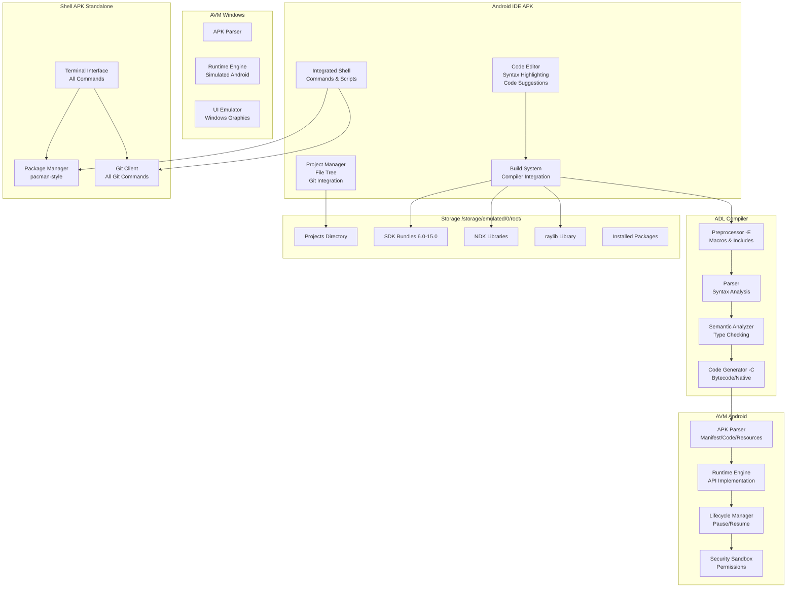
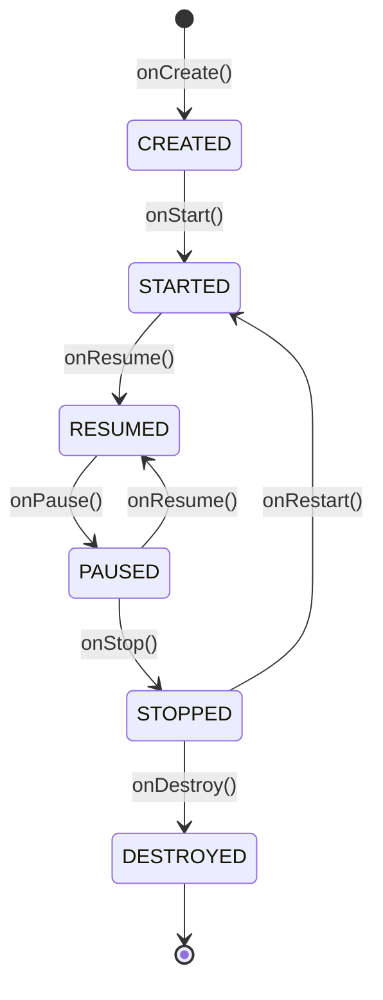

# Design Document: Android Development Ecosystem

## Overview

The Android Development Ecosystem is a comprehensive, self-contained development environment that runs entirely on Android devices (with Windows support for the VM component). The system consists of five major components:

1. **Android IDE** - A full-featured mobile IDE with syntax highlighting, code suggestions, and integrated tools
2. **ADL (Android Development Language)** - Uses pure Java and C++ syntax with built-in Android/NDK/raylib APIs, automatic dependency resolution, and automatic memory management
3. **ADL Compiler** - A smart compiler that automatically discovers dependencies, manages memory, and provides friendly error messages
4. **AVM (Android Virtual Machine)** - A custom APK parser and execution environment for Android and Windows
5. **Shell System** - An integrated and standalone terminal with Linux commands, Git, and package management

**Key Features**:
- **Pure Java and C++ Syntax**: No custom hybrid syntax - write standard Java or C++ code
- **Zero Configuration**: No config files needed - just compile and run
- **Zero Dependencies**: Compiler needs no external tools, DLLs, or libraries
- **Cross-Platform**: Compile to Android APK, Windows .exe, Linux, and macOS from anywhere
- **Automatic Everything**: Compiler automatically discovers dependencies, manages memory, and handles file inclusion
- **Simple Compilation**: Just tell the compiler what to compile - it figures out the rest
- **Friendly Error Messages**: Clear, helpful error messages with suggestions
- **Smaller, Usable Names**: Simplified API names for common operations (original names still available)
- **Built-in raylib**: All raylib graphics, audio, input, and utility functions available without imports
- **Complete Standard Libraries**: All C++, Java, and C standard library functions built-in (no .dll/.so/.a files needed)
- **Flexible APK Packaging**: Choose installer mode (shared runtime) or standalone mode (no dependencies)
- **Multi-Window Support**: Create and manage multiple windows for true multitasking
- **Full Input Support**: Keyboard, mouse, touch, and gamepad input on all platforms
- **Ultra-Simple Game Development**: Make games in just a few lines with raylib - no complex setup
- **Namespace Support**: Full namespace support for code organization
- **Completely Offline**: All SDKs (6.0-15.0), NDK features, raylib, and standard libraries bundled locally

## Architecture

### High-Level Architecture



### Component Interaction Flow

1. **Development Flow**: Developer writes ADL code → IDE provides syntax highlighting and suggestions → Developer triggers build → Compiler processes code → AVM executes result
2. **Shell Flow**: Developer opens shell → Executes commands (Git, pacman, compiler) → Shell interacts with file system and external tools
3. **Cross-Platform Flow**: Code compiled on Android → APK transferred to Windows → AVM Windows executes with simulated environment


## Components and Interfaces

### 1. Android IDE

#### 1.1 Code Editor Component

**Purpose**: Provide real-time code editing with syntax highlighting and intelligent suggestions.

**Data Structures**:
```typescript
interface EditorState {
  currentFile: ADLFile;
  cursorPosition: Position;
  selection: Range | null;
  syntaxTokens: Token[];
  suggestions: Suggestion[];
  undoStack: Edit[];
  redoStack: Edit[];
}

interface Token {
  type: TokenType; // KEYWORD, TYPE, STRING, COMMENT, OPERATOR, IDENTIFIER
  range: Range;
  color: Color;
}

interface Suggestion {
  text: string;
  type: SuggestionType; // METHOD, CLASS, VARIABLE, KEYWORD, API
  signature: string | null;
  documentation: string;
  priority: number;
}

interface Position {
  line: number;
  column: number;
}

interface Range {
  start: Position;
  end: Position;
}
```

**Algorithms**:
- **Syntax Highlighting**: Incremental lexical analysis using a state machine that processes only changed lines
- **Code Suggestions**: Context-aware trie-based lookup with type inference for filtering

**Implementation Details**:
- Use a custom text buffer with gap buffer data structure for efficient insertions/deletions
- Syntax highlighting runs on a background thread with debouncing (300ms delay)
- Suggestion engine maintains an index of all available APIs, updated when SDK version changes
- Support touch gestures: pinch-to-zoom, two-finger scroll, long-press for context menu

#### 1.2 Project Manager Component

**Purpose**: Manage project structure, file operations, and Git integration.

**Data Structures**:
```typescript
interface Project {
  name: string;
  path: string; // Relative to /storage/emulated/0/root/
  files: ADLFile[];
  targetSDK: SDKVersion;
  buildConfig: BuildConfiguration;
  gitStatus: GitStatus | null;
}

interface ADLFile {
  name: string;
  path: string;
  content: string;
  lastModified: Date;
  gitStatus: FileGitStatus; // UNTRACKED, MODIFIED, STAGED, COMMITTED
}

interface BuildConfiguration {
  compilerFlags: string[];
  outputPath: string;
  includeDirectories: string[];
  defines: Map<string, string>;
}

interface GitStatus {
  branch: string;
  remoteURL: string | null;
  uncommittedChanges: number;
  unpushedCommits: number;
}
```

**Implementation Details**:
- File tree uses a virtual scrolling list for performance with large projects
- Git status updates asynchronously every 5 seconds when project is active
- Project state persisted to SQLite database for quick restoration
- Support drag-and-drop file reorganization in the file tree
- Home directory (~) resolution: Replace ~ with /storage/emulated/0/root/ in all file paths

#### 1.3 Build System Component

**Purpose**: Orchestrate compilation process and display results.

**Data Structures**:
```typescript
interface BuildRequest {
  project: Project;
  mode: BuildMode; // PREPROCESS_ONLY, COMPILE, FULL_BUILD
  flags: string[];
}

interface BuildResult {
  success: boolean;
  outputPath: string | null;
  errors: CompilerError[];
  warnings: CompilerWarning[];
  duration: number;
}

interface CompilerError {
  file: string;
  line: number;
  column: number;
  message: string;
  severity: ErrorSeverity; // ERROR, WARNING, INFO
}
```

**Implementation Details**:
- Invoke ADL compiler as a subprocess with IPC for progress updates
- Parse compiler output using regex patterns to extract file:line:column:message
- Display errors inline in the editor with red underlines
- Support incremental builds by tracking file modification timestamps

#### 1.4 Integrated Shell Component

**Purpose**: Provide terminal access within the IDE for command execution.

**Data Structures**:
```typescript
interface ShellSession {
  workingDirectory: string;
  environment: Map<string, string>;
  history: string[];
  historyIndex: number;
  runningProcess: Process | null;
}

interface Process {
  pid: number;
  command: string;
  stdin: Stream;
  stdout: Stream;
  stderr: Stream;
  exitCode: number | null;
}
```

**Implementation Details**:
- Embed a terminal emulator widget with VT100 escape sequence support
- Execute commands using Android's ProcessBuilder with proper environment setup
- Support command history with up/down arrow keys (circular buffer of 1000 commands)
- Implement built-in commands (cd, ls, etc.) natively for performance
- Pipe support: Parse command line and connect stdout of one process to stdin of next
- Home directory: Set HOME environment variable to /storage/emulated/0/root/

### 2. ADL Language

#### 2.1 Language Syntax

**Pure Java and C++ Syntax**: ADL uses standard Java and C++ syntax without any custom hybrid constructs. Developers write pure Java or pure C++ code, and the compiler handles the integration automatically.

**Java Syntax Example**:
```java
// Pure Java syntax - ultra simple!
package com.example;

public class MainActivity {
    public static void main(String[] args) {
        // Built-in Android API (no import needed)
        Activity activity = createActivity();
        activity.setContentView(R.layout.main);
    }
    
    public void onCreate() {
        Button btn = new Button();
        btn.setText("Click me");
    }
}
```

**C++ Syntax Example**:
```cpp
// Pure C++ syntax with namespaces
namespace com::example {
    class DataProcessor {
        void process(int* data, size_t length) {
            // Automatic memory management - no manual free needed
            for (size_t i = 0; i < length; i++) {
                data[i] *= 2;
            }
        }
        
        void render() {
            // OpenGL ES available without includes
            glClear(GL_COLOR_BUFFER_BIT);
            glDrawArrays(GL_TRIANGLES, 0, 3);
        }
    };
}
```

**raylib Example - Even Simpler!**:
```cpp
// Make a game in just a few lines - no imports!
class SimpleGame {
    void run() {
        initWindow(800, 600, "My First Game");
        setTargetFPS(60);
        
        Texture2D player = loadTexture("player.png");
        Vector2 pos = {400, 300};
        
        while (!windowShouldClose()) {
            // Input
            if (isKeyDown(KEY_RIGHT)) pos.x += 5;
            if (isKeyDown(KEY_LEFT)) pos.x -= 5;
            
            // Draw
            beginDrawing();
            clearBackground(RAYWHITE);
            drawTexture(player, pos.x, pos.y, WHITE);
            drawText("Use arrows!", 10, 10, 20, DARKGRAY);
            endDrawing();
        }
        
        closeWindow();
        // No cleanup needed - automatic!
    }
};
```

**Automatic File Inclusion**: The compiler automatically discovers and includes all necessary files in the project. No explicit `#include` or `import` statements are required - the compiler analyzes dependencies and includes files in the correct order.

**Automatic Memory Management**: The compiler provides automatic memory management for both Java and C++ code:
- Automatic garbage collection for Java objects
- Automatic reference counting and cleanup for C++ objects
- No manual `delete` or `free` calls needed
- Compiler inserts cleanup code at appropriate scope boundaries

**Built-in APIs**: All Android SDK, NDK, raylib, and standard library APIs are available without imports or includes:
- Android SDK: Activity, View, Intent, Context, etc.
- NDK Graphics: OpenGL ES, Vulkan, EGL
- NDK Audio: OpenSL ES, AAudio
- NDK Sensors: ASensorManager, accelerometer, gyroscope
- NDK Input: AInputQueue, touch events, keyboard
- JNI: Native method declarations and implementations
- raylib: All graphics, audio, input, textures, models, and utility functions
- C++ Standard Library: iostream, vector, string, map, algorithm, thread, mutex, etc.
- Java Standard Library: Collections, Stream, Optional, Date, Math, etc.
- C Standard Library: stdio, stdlib, string, math, time, etc.

#### 2.2 Type System

**Data Structures**:
```typescript
interface Type {
  name: string;
  kind: TypeKind; // PRIMITIVE, CLASS, INTERFACE, POINTER, ARRAY, NAMESPACE
  namespace: string | null;
  methods: Method[];
  fields: Field[];
  superType: Type | null;
}

interface Method {
  name: string;
  returnType: Type;
  parameters: Parameter[];
  accessModifier: AccessModifier; // PUBLIC, PRIVATE, PROTECTED
  isStatic: boolean;
  isNative: boolean;
}

interface Field {
  name: string;
  type: Type;
  accessModifier: AccessModifier;
  isStatic: boolean;
}
```

**Type Inference**: ADL supports type inference for local variables in both Java and C++:
```java
// Java style
var result = computeValue(); // Type inferred from computeValue() return type
```

```cpp
// C++ style
auto result = computeValue(); // Type inferred from computeValue() return type
```

#### 2.3 Automatic Dependency Resolution

**Compiler Behavior**: When compiling a project, the compiler automatically:
1. Scans all `.adl` files in the project directory
2. Analyzes class and namespace dependencies
3. Determines the correct compilation order
4. Includes files automatically without explicit directives

**Example Project Structure**:
```
MyApp/
  Main.adl        // Uses Utils and Data classes
  Utils.adl       // Utility functions
  Data.adl        // Data models
```

**Compilation**:
```bash
# User simply tells compiler what to compile
$ adlc -C -o app.apk Main.adl

# Compiler automatically:
# 1. Discovers Utils.adl and Data.adl are needed
# 2. Compiles them in dependency order
# 3. Links everything together
```

#### 2.4 Automatic Memory Management

**Java Objects**: Standard garbage collection - objects are automatically freed when no longer referenced.

**C++ Objects**: Compiler provides automatic memory management:
- **Reference Counting**: Compiler tracks object references automatically
- **Scope-Based Cleanup**: Objects are automatically destroyed when leaving scope
- **Smart Pointers**: Compiler converts raw pointers to smart pointers internally
- **No Manual Cleanup**: No need for `delete`, `free`, or manual destructors

**Example**:
```cpp
void processImage() {
    // Compiler automatically manages memory
    Image* img = new Image(1920, 1080);
    img->apply(filter);
    img->save("output.png");
    // No delete needed - compiler inserts cleanup automatically
}
```

**Memory Safety**: Compiler prevents common memory errors:
- No dangling pointers
- No double-free errors
- No memory leaks
- Automatic null checking

### 3. ADL Compiler

#### 3.1 Compiler Architecture

The ADL compiler is a multi-stage compiler with a simplified interface:

**Simple Compilation**: User just specifies what to compile - the compiler handles everything else automatically:
- Discovers all dependencies
- Determines compilation order
- Manages memory automatically
- Provides friendly error messages

**Compiler Modes**:
1. **Compilation Mode (-C)**: Full compilation to executable format
2. **Output Mode (-o)**: Specifies output file path
3. **Preprocessing Mode (-E)**: Optional - outputs preprocessed source (for debugging)

**Zero Configuration**: No configuration files needed unless you want to customize:
```bash
# Just compile - no config needed!
$ adlc -C -o app.apk Main.adl

# That's it! The compiler:
# - Uses sensible defaults for everything
# - Targets latest Android SDK automatically
# - Optimizes for the current device
# - Manages all dependencies
# - No project.json, no build.gradle, no XML configs
```

**Optional Configuration**: Create project.json only if you want to customize:
```json
{
  "name": "MyApp",
  "targetSDK": 33,
  "packageMode": "standalone"
}
```

**Simple Usage**:
```bash
# Android APK (default)
$ adlc -C -o app.apk Main.adl

# Windows executable
$ adlc -C -o app.exe --platform windows Main.adl

# Linux executable
$ adlc -C -o app --platform linux Main.adl

# macOS executable
$ adlc -C -o app.app --platform macos Main.adl

# Cross-compile from Android to Windows
$ adlc -C -o app.exe --platform windows Main.adl

# The compiler:
# - Finds all dependencies automatically
# - Compiles in the right order
# - Manages memory automatically
# - Links everything together
# - No external dependencies needed
```

**Compiler Pipeline**:

```mermaid
graph LR
    Source[ADL Source] --> Discovery[Dependency Discovery]
    Discovery --> Lexer
    Lexer --> Parser
    Parser --> AST[Abstract Syntax Tree]
    AST --> Semantic[Semantic Analyzer]
    Semantic --> TypeChecker[Type Checker]
    TypeChecker --> MemoryMgmt[Memory Management Insertion]
    MemoryMgmt --> Optimizer
    Optimizer --> CodeGen[Code Generator]
    CodeGen --> Output[APK/Binary]
```


#### 3.2 Preprocessor (-E flag)

**Purpose**: Handle C-style preprocessing directives (optional - not required for normal compilation).

**Note**: The preprocessor is optional. The compiler automatically handles file dependencies without requiring `#include` directives. The `-E` flag is provided for advanced users who want to see the preprocessed output.

**Data Structures**:
```typescript
interface PreprocessorState {
  defines: Map<string, MacroDefinition>;
  discoveredFiles: string[]; // Files found by dependency analysis
  currentFile: string;
  currentLine: number;
}

interface MacroDefinition {
  name: string;
  parameters: string[] | null;
  replacement: string;
}
```

**Algorithms**:
- **Automatic File Discovery**: Scan project directory and analyze dependencies
- **Macro Expansion**: Recursive descent with parameter substitution (if macros are used)
- **Dependency Resolution**: Build dependency graph and determine compilation order

**Implementation Details**:
```typescript
class Preprocessor {
  process(entryFile: string, flags: PreprocessorFlags): PreprocessedSource {
    // Phase 1: Discover all files automatically
    const allFiles = this.discoverDependencies(entryFile);
    
    // Phase 2: Combine files in dependency order
    let output = this.combineFiles(allFiles);
    
    // Phase 3: Expand macros (if any)
    output = this.expandMacros(output);
    
    return {
      source: output,
      lineMap: this.buildLineMap()
    };
  }
  
  discoverDependencies(entryFile: string): string[] {
    const discovered = new Set<string>();
    const queue = [entryFile];
    
    while (queue.length > 0) {
      const file = queue.shift()!;
      if (discovered.has(file)) continue;
      
      discovered.add(file);
      
      // Parse file and find referenced classes/namespaces
      const refs = this.findReferences(file);
      
      // Find files that define those references
      for (const ref of refs) {
        const definingFile = this.findDefiningFile(ref);
        if (definingFile && !discovered.has(definingFile)) {
          queue.push(definingFile);
        }
      }
    }
    
    return Array.from(discovered);
  }
  
  findReferences(file: string): string[] {
    // Parse file and extract all class/namespace references
    const source = this.readFile(file);
    const ast = this.parse(source);
    return this.extractReferences(ast);
  }
}
```

#### 3.3 Lexer and Parser

**Purpose**: Convert source code into an Abstract Syntax Tree (AST).

**Data Structures**:
```typescript
interface ASTNode {
  type: NodeType;
  location: SourceLocation;
  children: ASTNode[];
}

interface SourceLocation {
  file: string;
  line: number;
  column: number;
}

// Specific node types
interface ClassDeclaration extends ASTNode {
  name: string;
  namespace: string | null;
  superClass: string | null;
  methods: MethodDeclaration[];
  fields: FieldDeclaration[];
  accessModifier: AccessModifier;
}

interface MethodDeclaration extends ASTNode {
  name: string;
  returnType: TypeReference;
  parameters: Parameter[];
  body: BlockStatement;
  isStatic: boolean;
  isNative: boolean;
}

interface Expression extends ASTNode {
  evaluatedType: Type | null; // Filled in by semantic analyzer
}
```

**Parsing Algorithm**: Recursive descent parser with operator precedence climbing for expressions.

**Implementation Details**:
- Lexer produces tokens with location information for error reporting
- Parser builds AST with full location tracking for every node
- Support both Java-style and C++-style syntax by checking context
- Error recovery: On syntax error, skip to next statement boundary and continue parsing

#### 3.4 Semantic Analyzer and Type Checker

**Purpose**: Validate program semantics and resolve types.

**Data Structures**:
```typescript
interface SymbolTable {
  parent: SymbolTable | null;
  symbols: Map<string, Symbol>;
  
  lookup(name: string): Symbol | null {
    return this.symbols.get(name) ?? this.parent?.lookup(name) ?? null;
  }
  
  define(name: string, symbol: Symbol): void {
    if (this.symbols.has(name)) {
      throw new Error(`Symbol ${name} already defined`);
    }
    this.symbols.set(name, symbol);
  }
}

interface Symbol {
  name: string;
  type: Type;
  kind: SymbolKind; // VARIABLE, METHOD, CLASS, NAMESPACE
  location: SourceLocation;
}
```

**Type Checking Algorithm**:
```typescript
class TypeChecker {
  checkExpression(expr: Expression, symbolTable: SymbolTable): Type {
    switch (expr.type) {
      case NodeType.BINARY_OP:
        const left = this.checkExpression(expr.left, symbolTable);
        const right = this.checkExpression(expr.right, symbolTable);
        return this.checkBinaryOp(expr.operator, left, right);
      
      case NodeType.METHOD_CALL:
        const receiver = this.checkExpression(expr.receiver, symbolTable);
        const method = this.lookupMethod(receiver, expr.methodName);
        this.checkArguments(method, expr.arguments, symbolTable);
        return method.returnType;
      
      case NodeType.IDENTIFIER:
        const symbol = symbolTable.lookup(expr.name);
        if (!symbol) {
          throw new TypeError(`Undefined symbol: ${expr.name}`);
        }
        return symbol.type;
    }
  }
}
```

#### 3.5 Code Generator (-C flag)

**Purpose**: Generate executable bytecode or native code from AST with automatic memory management.

**Output Format**: Hybrid bytecode + native code format
- Java-style code → Dalvik-compatible bytecode with garbage collection
- C++-style code → Native ARM/x86 code with automatic reference counting
- Built-in API calls → Direct function pointers to AVM implementations

**Automatic Memory Management**:
The code generator automatically inserts memory management code:
- **Reference Counting**: Track object references and free when count reaches zero
- **Scope Guards**: Insert cleanup code at scope boundaries
- **Smart Pointer Conversion**: Convert raw pointers to reference-counted smart pointers
- **Null Safety**: Insert automatic null checks before pointer dereferences

**Data Structures**:
```typescript
interface CodeGenContext {
  targetSDK: SDKVersion;
  targetArchitecture: Architecture; // ARM, ARM64, x86, x86_64
  optimizationLevel: number; // 0-3
  outputFormat: OutputFormat; // BYTECODE, NATIVE, HYBRID
  memoryManagement: MemoryManagementStrategy; // AUTO, MANUAL
}

interface GeneratedCode {
  bytecode: BytecodeChunk[];
  nativeCode: NativeCodeChunk[];
  metadata: CodeMetadata;
  memoryManagementCode: MemoryManagementInstructions[];
}

interface MemoryManagementInstructions {
  scopeId: string;
  allocations: Allocation[];
  deallocations: Deallocation[];
  refCountOps: RefCountOperation[];
}

interface BytecodeChunk {
  className: string;
  methods: BytecodeMethod[];
}

interface BytecodeMethod {
  name: string;
  signature: string;
  instructions: Instruction[];
  maxStack: number;
  maxLocals: number;
}

interface NativeCodeChunk {
  functionName: string;
  machineCode: Uint8Array;
  relocations: Relocation[];
}
```

**Code Generation Algorithm**:
```typescript
class CodeGenerator {
  generate(ast: ASTNode, context: CodeGenContext): GeneratedCode {
    const result: GeneratedCode = {
      bytecode: [],
      nativeCode: [],
      metadata: this.buildMetadata(ast),
      memoryManagementCode: []
    };
    
    for (const classNode of ast.classes) {
      if (this.isJavaStyle(classNode)) {
        result.bytecode.push(this.generateBytecode(classNode));
      } else {
        // Generate native code with automatic memory management
        const nativeCode = this.generateNative(classNode);
        const memMgmt = this.insertMemoryManagement(nativeCode);
        result.nativeCode.push(nativeCode);
        result.memoryManagementCode.push(memMgmt);
      }
    }
    
    return result;
  }
  
  insertMemoryManagement(code: NativeCodeChunk): MemoryManagementInstructions {
    // Analyze code to find allocations
    const allocations = this.findAllocations(code);
    
    // Insert reference counting
    const refCountOps = this.insertRefCounting(allocations);
    
    // Insert scope-based cleanup
    const deallocations = this.insertScopeCleanup(allocations);
    
    return {
      scopeId: code.functionName,
      allocations,
      deallocations,
      refCountOps
    };
  }
  
  insertRefCounting(allocations: Allocation[]): RefCountOperation[] {
    const ops: RefCountOperation[] = [];
    
    for (const alloc of allocations) {
      // Insert ref count increment when assigned
      ops.push({
        type: 'INCREMENT',
        pointer: alloc.pointer,
        location: alloc.assignmentLocation
      });
      
      // Insert ref count decrement when leaving scope
      ops.push({
        type: 'DECREMENT',
        pointer: alloc.pointer,
        location: alloc.scopeEnd
      });
    }
    
    return ops;
  }
}
```

**Memory Management Example**:

**Input Code**:
```cpp
void process() {
    Image* img = new Image(1920, 1080);
    img->apply(filter);
    img->save("output.png");
}
```

**Generated Code (conceptual)**:
```cpp
void process() {
    Image* img = new Image(1920, 1080);
    __ref_count_init(img);  // Compiler inserted
    
    img->apply(filter);
    img->save("output.png");
    
    __ref_count_dec(img);   // Compiler inserted
    if (__ref_count_is_zero(img)) {
        __safe_delete(img);  // Compiler inserted
    }
}
```

#### 3.6 Error Reporting

**Purpose**: Provide clear, friendly, actionable error messages.

**Error Message Format**:
```
<file>:<line>:<column>: <severity>: <message>
  <source line>
  <caret indicator>
  
Suggestion: <helpful suggestion>
```

**Example - Friendly Syntax Error**:
```
Main.adl:15:23: error: unknown variable 'result'
    int total = result + 5;
                ^~~~~~
  
Suggestion: Did you mean 'results'? Or did you forget to declare 'result'?
```

**Example - Friendly Type Error**:
```
Main.adl:20:15: error: cannot convert String to int
    int count = "hello";
                ^~~~~~~
  
Suggestion: Use Integer.parseInt("hello") to convert String to int
```

**Example - Friendly Missing Dependency**:
```
Main.adl:10:5: error: class 'Utils' not found
    Utils.log("message");
    ^~~~~
  
Suggestion: Make sure Utils.adl exists in your project directory
```

**Data Structures**:
```typescript
interface CompilerDiagnostic {
  severity: DiagnosticSeverity; // ERROR, WARNING, INFO
  location: SourceLocation;
  message: string;
  friendlyMessage: string; // Human-friendly explanation
  sourceSnippet: string;
  suggestions: string[];
  quickFixes: QuickFix[]; // Automated fixes the IDE can apply
}

interface QuickFix {
  description: string;
  replacement: CodeReplacement;
}

interface CodeReplacement {
  range: Range;
  newText: string;
}
```

**Implementation Details**:
- Collect all errors during compilation (don't stop at first error)
- Sort errors by file, then line, then column
- Include source context (1 line before and after error)
- Provide friendly suggestions for common mistakes:
  - Typos: "Did you mean 'variable'?"
  - Missing declarations: "Did you forget to declare 'x'?"
  - Type mismatches: "Use X.parse() to convert Y to X"
  - Missing files: "Make sure File.adl exists in your project"
- Format output for easy parsing by IDE (file:line:column: prefix)
- Use simple, non-technical language when possible
- Avoid compiler jargon (e.g., say "unknown variable" not "undefined symbol")

### 4. AVM (Android Virtual Machine)

#### 4.1 APK Parser

**Purpose**: Extract and validate APK contents.

**Data Structures**:
```typescript
interface APKStructure {
  manifest: AndroidManifest;
  code: CodeBundle;
  resources: ResourceBundle;
  assets: AssetBundle;
  nativeLibs: Map<Architecture, NativeLibrary[]>;
}

interface AndroidManifest {
  packageName: string;
  versionCode: number;
  versionName: string;
  minSDK: number;
  targetSDK: number;
  permissions: Permission[];
  activities: ActivityDeclaration[];
  services: ServiceDeclaration[];
  entryPoint: string; // Main activity class name
}
```

**Parsing Algorithm**:
```typescript
class APKParser {
  parse(apkPath: string): APKStructure {
    // APK is a ZIP file
    const zip = this.openZip(apkPath);
    
    // Extract manifest (binary XML format)
    const manifestXML = this.decodeBinaryXML(zip.read("AndroidManifest.xml"));
    const manifest = this.parseManifest(manifestXML);
    
    // Extract code (classes.dex or custom format)
    const code = this.parseCode(zip.read("classes.dex"));
    
    // Extract resources (resources.arsc)
    const resources = this.parseResources(zip.read("resources.arsc"));
    
    // Extract assets
    const assets = this.extractAssets(zip, "assets/");
    
    // Extract native libraries
    const nativeLibs = this.extractNativeLibs(zip, "lib/");
    
    return { manifest, code, resources, assets, nativeLibs };
  }
  
  decodeBinaryXML(data: Uint8Array): string {
    // Android uses binary XML format for efficiency
    // Decode using AXML parser
    const parser = new AXMLParser(data);
    return parser.toXMLString();
  }
}
```

**Implementation Details**:
- Use existing ZIP library for APK extraction
- Implement AXML (Android Binary XML) parser for manifest
- Validate APK signature for security
- Support both Dalvik bytecode and custom ADL bytecode formats
- Cache parsed APK structure for faster subsequent launches

#### 4.2 Runtime Engine

**Purpose**: Execute application code and provide Android API implementations.

**Data Structures**:
```typescript
interface RuntimeContext {
  application: Application;
  activities: Map<string, Activity>;
  services: Map<string, Service>;
  permissions: Set<Permission>;
  fileSystem: SandboxedFileSystem;
  classLoader: ClassLoader;
}
```

```typescript
interface ClassLoader {
  loadedClasses: Map<string, Class>;
  
  loadClass(name: string): Class {
    if (this.loadedClasses.has(name)) {
      return this.loadedClasses.get(name);
    }
    
    // Load from bytecode or native code
    const classData = this.findClassData(name);
    const cls = this.defineClass(name, classData);
    this.loadedClasses.set(name, cls);
    return cls;
  }
}

interface Interpreter {
  execute(method: Method, args: any[]): any {
    const frame = new StackFrame(method);
    
    for (const instruction of method.instructions) {
      switch (instruction.opcode) {
        case Opcode.INVOKE_VIRTUAL:
          this.invokeMethod(instruction.target, frame);
          break;
        case Opcode.INVOKE_STATIC:
          this.invokeStaticMethod(instruction.target, frame);
          break;
        case Opcode.INVOKE_BUILTIN:
          this.invokeBuiltinAPI(instruction.apiId, frame);
          break;
        // ... other opcodes
      }
    }
    
    return frame.returnValue;
  }
  
  invokeBuiltinAPI(apiId: number, frame: StackFrame): void {
    // Direct call to AVM's Android API implementation
    const api = this.builtinAPIs[apiId];
    const args = frame.popArguments(api.parameterCount);
    const result = api.implementation(...args);
    frame.push(result);
  }
}
```

**Android API Implementation**: AVM provides implementations for all Android SDK APIs:
- **UI APIs**: Activity, View, ViewGroup, Layout managers
- **Storage APIs**: SharedPreferences, SQLite, File I/O
- **Network APIs**: HttpURLConnection, Socket
- **System APIs**: Intent, Context, PackageManager
- **NDK APIs**: OpenGL ES, Vulkan, OpenSL ES, sensors, input

#### 4.3 Lifecycle Manager

**Purpose**: Manage application lifecycle events (create, start, resume, pause, stop, destroy).

**Data Structures**:
```typescript
interface LifecycleState {
  current: LifecyclePhase;
  history: LifecycleEvent[];
}

enum LifecyclePhase {
  CREATED,
  STARTED,
  RESUMED,
  PAUSED,
  STOPPED,
  DESTROYED
}

interface LifecycleEvent {
  phase: LifecyclePhase;
  timestamp: Date;
}
```

**State Machine**:


**Implementation Details**:
```typescript
class LifecycleManager {
  transition(activity: Activity, newPhase: LifecyclePhase): void {
    const currentPhase = activity.lifecycleState.current;
    
    // Validate transition
    if (!this.isValidTransition(currentPhase, newPhase)) {
      throw new Error(`Invalid lifecycle transition: ${currentPhase} -> ${newPhase}`);
    }
    
    // Call lifecycle callback
    switch (newPhase) {
      case LifecyclePhase.CREATED:
        activity.onCreate();
        break;
      case LifecyclePhase.PAUSED:
        activity.onPause();
        this.saveInstanceState(activity);
        break;
      case LifecyclePhase.DESTROYED:
        activity.onDestroy();
        this.releaseResources(activity);
        break;
    }
    
    activity.lifecycleState.current = newPhase;
  }
}
```

#### 4.4 Security and Sandboxing

**Purpose**: Isolate applications and enforce permission model.

**Data Structures**:
```typescript
interface Sandbox {
  appId: string;
  dataDirectory: string; // /data/data/<package>/
  permissions: Set<Permission>;
  fileAccessPolicy: FileAccessPolicy;
}

interface FileAccessPolicy {
  allowedPaths: string[];
  deniedPaths: string[];
  
  canAccess(path: string): boolean {
    // Check if path is within allowed directories
    for (const allowed of this.allowedPaths) {
      if (path.startsWith(allowed)) {
        return true;
      }
    }
    return false;
  }
}

enum Permission {
  INTERNET,
  READ_EXTERNAL_STORAGE,
  WRITE_EXTERNAL_STORAGE,
  CAMERA,
  LOCATION,
  MICROPHONE,
  // ... all Android permissions
}
```

**Security Enforcement**:
```typescript
class SecurityManager {
  checkPermission(permission: Permission, sandbox: Sandbox): boolean {
    if (!sandbox.permissions.has(permission)) {
      // Permission not granted - prompt user
      return this.requestPermission(permission, sandbox);
    }
    return true;
  }
  
  checkFileAccess(path: string, sandbox: Sandbox): void {
    if (!sandbox.fileAccessPolicy.canAccess(path)) {
      throw new SecurityException(`Access denied: ${path}`);
    }
  }
  
  requestPermission(permission: Permission, sandbox: Sandbox): boolean {
    // Show permission dialog to user
    const granted = this.showPermissionDialog(permission);
    if (granted) {
      sandbox.permissions.add(permission);
    }
    return granted;
  }
}
```

**Implementation Details**:
- Each application runs in isolated process with separate memory space
- File system access restricted to app's data directory and explicitly granted paths
- Network access requires INTERNET permission
- Dangerous permissions require runtime user approval
- System APIs that require permissions check before execution

#### 4.5 AVM Windows Platform

**Purpose**: Run Android applications on Windows for development and testing.

**Architecture Differences**:
- **UI Rendering**: Use Windows GDI+/DirectX instead of Android SurfaceFlinger
- **File System**: Map Android paths to Windows paths (e.g., /data/data/ → C:\Users\...\AppData\)
- **Hardware Emulation**: Simulate sensors, GPS, camera using desktop equivalents or mock data
- **API Implementation**: Same API surface as AVM Android, but with Windows-native backends

**Data Structures**:
```typescript
interface WindowsEmulationLayer {
  windowHandle: HWND;
  graphicsContext: GraphicsContext;
  inputEmulator: InputEmulator;
  sensorEmulator: SensorEmulator;
}

interface GraphicsContext {
  renderAndroidView(view: View): void {
    // Convert Android View hierarchy to Windows controls
    const windowsControl = this.convertToWindowsControl(view);
    this.renderControl(windowsControl);
  }
}

interface SensorEmulator {
  accelerometer: Vector3;
  gyroscope: Vector3;
  gps: GPSCoordinates;
  
  simulateMotion(motion: MotionEvent): void {
    // Update sensor values based on simulated motion
  }
}
```

**Implementation Details**:
- Package AVM Windows as standalone .exe with embedded runtime
- Support drag-and-drop APK files to launch
- Provide developer tools: logcat viewer, file browser, network inspector
- Support debugging with breakpoints and variable inspection
- Emulate multi-touch using mouse + keyboard modifiers

### 5. Shell System

#### 5.1 Integrated Shell (in IDE)

**Purpose**: Provide terminal access within the IDE.

**Command Categories**:
1. **File Operations**: ls, cd, mkdir, rm, cp, mv, cat, grep, find, chmod, chown
2. **Development Tools**: ADL compiler, AVM launcher, build scripts
3. **Version Control**: All Git commands
4. **Package Management**: pacman-style commands
5. **System Tools**: ps, kill, env, export, echo, pwd
6. **Network Tools**: wget, curl, ssh, scp, nmap, netstat, ifconfig
7. **Arch Linux Tools**: systemctl, journalctl, uname

**Data Structures**:
```typescript
interface Command {
  name: string;
  execute(args: string[], context: ShellContext): CommandResult;
  autocomplete(partial: string, context: ShellContext): string[];
}

interface ShellContext {
  workingDirectory: string;
  environment: Map<string, string>;
  stdin: Stream;
  stdout: Stream;
  stderr: Stream;
}

interface CommandResult {
  exitCode: number;
  output: string;
  error: string;
}
```

**Built-in Command Implementation**:
```typescript
class LSCommand implements Command {
  name = "ls";
  
  execute(args: string[], context: ShellContext): CommandResult {
    const flags = this.parseFlags(args); // -l, -a, -h, etc.
    const path = args.find(a => !a.startsWith('-')) ?? context.workingDirectory;
    
    const files = this.listFiles(path, flags.showHidden);
    
    if (flags.longFormat) {
      return this.formatLongListing(files);
    } else {
      return this.formatShortListing(files);
    }
  }
  
  formatLongListing(files: FileInfo[]): CommandResult {
    const lines = files.map(f => 
      `${f.permissions} ${f.owner} ${f.group} ${f.size} ${f.modifiedDate} ${f.name}`
    );
    return { exitCode: 0, output: lines.join('\n'), error: '' };
  }
}
```

**Home Directory Implementation**:
- Set HOME environment variable to /storage/emulated/0/root/
- All shell sessions start in HOME directory
- Tilde (~) expansion: Replace ~ with HOME in all paths
- Create HOME directory on first launch if it doesn't exist

#### 5.2 Standalone Shell APK

**Purpose**: Independent terminal application with full command support.

**Architecture**:
```typescript
interface ShellAPK {
  terminalUI: TerminalView;
  commandExecutor: CommandExecutor;
  sessionManager: SessionManager;
}

interface TerminalView {
  displayPrompt(): void;
  readInput(): Promise<string>;
  writeOutput(text: string, color: Color): void;
  handleKeyPress(key: KeyEvent): void;
}

interface SessionManager {
  sessions: Map<string, ShellSession>;
  activeSession: string;
  
  createSession(): string {
    const id = this.generateSessionId();
    const session = new ShellSession(id);
    session.workingDirectory = "/storage/emulated/0/root/";
    this.sessions.set(id, session);
    return id;
  }
}
```

**Implementation Details**:
- Full VT100 terminal emulation with ANSI color support
- Support multiple tabs/sessions
- Persistent command history across app restarts
- Support for shell scripts (.sh files) with shebang
- Background process management (jobs, fg, bg)
- Signal handling (Ctrl+C, Ctrl+Z)

#### 5.3 Git Integration

**Purpose**: Full Git version control support.

**Implementation Strategy**: Embed libgit2 (C library) with JNI bindings.

**Data Structures**:
```typescript
interface GitRepository {
  path: string;
  head: string; // Current branch or commit
  remotes: Map<string, string>;
  config: GitConfig;
}

interface GitConfig {
  userName: string;
  userEmail: string;
  sshKeyPath: string;
  httpsToken: string;
}
```

**Git Command Implementation**:
```typescript
class GitCommand implements Command {
  name = "git";
  
  execute(args: string[], context: ShellContext): CommandResult {
    const subcommand = args[0];
    
    switch (subcommand) {
      case "clone":
        return this.clone(args[1], context);
      case "add":
        return this.add(args.slice(1), context);
      case "commit":
        return this.commit(args, context);
      case "push":
        return this.push(args, context);
      case "pull":
        return this.pull(args, context);
      case "status":
        return this.status(context);
      // ... all other Git commands
    }
  }
  
  clone(url: string, context: ShellContext): CommandResult {
    const repo = this.gitLib.clone(url, context.workingDirectory);
    return { exitCode: 0, output: `Cloned ${url}`, error: '' };
  }
  
  commit(args: string[], context: ShellContext): CommandResult {
    const message = this.extractMessage(args); // -m flag
    const repo = this.openRepository(context.workingDirectory);
    const commitId = repo.commit(message);
    return { exitCode: 0, output: `[${repo.branch}] ${commitId}`, error: '' };
  }
}
```

**Authentication**:
- SSH: Store keys in ~/.ssh/ directory, use for authentication
- HTTPS: Store tokens in Git credential helper
- Support for GitHub, GitLab, Bitbucket

**IDE Integration**:
- Show file modification status in file tree (M, A, D, ??)
- Display current branch in status bar
- Highlight uncommitted changes in editor gutter
- Quick actions: stage, unstage, commit, push

#### 5.4 Package Manager

**Purpose**: Install and manage development tools and libraries.

**Architecture**:
```typescript
interface PackageManager {
  repositories: Repository[];
  installedPackages: Map<string, Package>;
  packageCache: string; // ~/.cache/pacman/
  
  install(packageName: string): void {
    const pkg = this.resolvePackage(packageName);
    const deps = this.resolveDependencies(pkg);
    
    for (const dep of deps) {
      if (!this.isInstalled(dep)) {
        this.install(dep.name);
      }
    }
    
    this.downloadAndInstall(pkg);
  }
}

interface Package {
  name: string;
  version: string;
  description: string;
  dependencies: Dependency[];
  files: PackageFile[];
  installScript: string | null;
}

interface Repository {
  url: string;
  packages: PackageIndex;
  
  search(query: string): Package[] {
    return this.packages.filter(p => 
      p.name.includes(query) || p.description.includes(query)
    );
  }
}
```

**Pacman-style Commands**:
```typescript
class PacmanCommand implements Command {
  name = "pacman";
  
  execute(args: string[], context: ShellContext): CommandResult {
    const flags = this.parseFlags(args);
    
    if (flags.sync && flags.install) {
      // pacman -S <package>
      return this.install(args.packages);
    } else if (flags.remove) {
      // pacman -R <package>
      return this.remove(args.packages);
    } else if (flags.sync && flags.refresh) {
      // pacman -Sy
      return this.refreshRepositories();
    } else if (flags.sync && flags.upgrade) {
      // pacman -Syu
      return this.upgradeAll();
    } else if (flags.query) {
      // pacman -Q
      return this.listInstalled();
    } else if (flags.search) {
      // pacman -Ss <query>
      return this.search(args.query);
    }
  }
}
```

**Package Repository**:
- Host package repository on CDN for fast downloads
- Package format: tar.gz with metadata file
- Support for binary packages (pre-compiled) and source packages
- Automatic dependency resolution using topological sort
- Package categories: compilers, libraries, tools, utilities, languages

**Example Packages**:
- python3: Python interpreter
- nodejs: Node.js runtime
- gcc: GNU C compiler
- make: Build automation tool
- vim: Text editor
- openssh: SSH client/server
- sqlite3: Database engine

### 6. SDK and NDK Support

#### 6.1 Multi-SDK Version Support

**Purpose**: Support targeting Android SDK versions 6.0 (API 23) through 15.0.

**Data Structures**:
```typescript
interface SDKBundle {
  version: string; // "6.0", "7.0", etc.
  apiLevel: number; // 23, 24, etc.
  apis: APIDefinition[];
  resources: ResourceBundle;
  buildTools: BuildTools;
}

interface APIDefinition {
  className: string;
  methods: MethodSignature[];
  fields: FieldSignature[];
  minSDK: number;
  deprecated: boolean;
}
```

**SDK Storage**:
```
/storage/emulated/0/root/
  sdk/
    android-23/  (6.0)
    android-24/  (7.0)
    android-25/  (7.1)
    android-26/  (8.0)
    android-27/  (8.1)
    android-28/  (9.0)
    android-29/  (10.0)
    android-30/  (11.0)
    android-31/  (12.0)
    android-33/  (13.0)
    android-34/  (14.0)
    android-35/  (15.0)
```

**API Compatibility Checking**:
```typescript
class APICompatibilityChecker {
  checkMethod(method: MethodCall, targetSDK: number): void {
    const apiDef = this.lookupAPI(method.className, method.methodName);
    
    if (apiDef.minSDK > targetSDK) {
      throw new CompatibilityError(
        `${method.className}.${method.methodName} requires API ${apiDef.minSDK}, ` +
        `but target SDK is ${targetSDK}`
      );
    }
    
    if (apiDef.deprecated) {
      this.warn(`${method.className}.${method.methodName} is deprecated`);
    }
  }
}
```

#### 6.2 NDK Feature Support

**Purpose**: Provide access to all NDK APIs for high-performance native code.

**NDK API Categories**:
1. **Graphics**: OpenGL ES 2.0/3.0/3.1/3.2, Vulkan, EGL, raylib
2. **Audio**: OpenSL ES, AAudio, raylib audio
3. **Sensors**: Accelerometer, gyroscope, magnetometer, proximity
4. **Input**: Touch events, keyboard, game controllers, raylib input
5. **Camera**: Camera2 API, image capture
6. **Media**: MediaCodec, MediaMuxer, video encoding/decoding
7. **Native Activity**: NativeActivity for pure native apps
8. **JNI**: Java Native Interface for Java/C++ interop
9. **raylib**: Complete 2D/3D game development library with graphics, audio, input, textures, models, and utilities

**Data Structures**:
```typescript
interface NDKBinding {
  functionName: string;
  nativeSymbol: string;
  parameters: Type[];
  returnType: Type;
  library: string; // libGLESv2.so, libOpenSLES.so, etc.
}

interface NativeLibrary {
  name: string;
  path: string;
  symbols: Map<string, NativeSymbol>;
  dependencies: string[];
}
```

**ADL NDK Integration**:
```java
// Pure Java with simple, usable names
public class GameActivity {
    public void onCreate() {
        // OpenGL ES with friendly names
        Display display = getDisplay();
        display.init();
        
        // Create OpenGL context with simple API
        Context ctx = display.createContext();
        
        // Render loop
        while (running) {
            clear(COLOR_BUFFER | DEPTH_BUFFER);
            renderScene();
            display.swap();
        }
    }
}
```

```cpp
// Pure C++ with simple, usable names
class AudioProcessor {
    void process(short* buffer, int length) {
        // Automatic memory management - no manual cleanup
        Filter* filter = new Filter();
        
        for (int i = 0; i < length; i++) {
            buffer[i] = filter->apply(buffer[i]);
        }
        // No delete needed - compiler handles it
    }
};
```

**Simplified API Names**: ADL provides shorter, more intuitive names for common NDK functions:
- `getDisplay()` instead of `eglGetDisplay(EGL_DEFAULT_DISPLAY)`
- `display.init()` instead of `eglInitialize(display, &major, &minor)`
- `display.createContext()` instead of `eglCreateContext(display, config, EGL_NO_CONTEXT, attribs)`
- `clear(flags)` instead of `glClear(GL_COLOR_BUFFER_BIT | GL_DEPTH_BUFFER_BIT)`
- `display.swap()` instead of `eglSwapBuffers(display, surface)`

**Original NDK names still available**: Developers can use original NDK function names if preferred.

#### 6.3 raylib Integration

**Purpose**: Provide a simple, easy-to-use game development library built into ADL for 2D and 3D graphics, audio, input, and more.

**raylib Philosophy**: raylib is designed to be simple and easy to use, perfect for game development, prototyping, and learning. All raylib functions are available without any imports or includes.

**raylib API Categories**:
1. **Core**: Window management, timing, input handling, camera
2. **Shapes**: 2D shape drawing (circles, rectangles, lines, polygons)
3. **Textures**: Image loading, texture management, sprite rendering
4. **Text**: Font loading and text rendering
5. **Models**: 3D model loading and rendering
6. **Audio**: Sound and music loading and playback
7. **Math**: Vector, matrix, and quaternion operations

**Simplified raylib Syntax**: ADL makes raylib even simpler with ultra-short function names and automatic resource management.

**Example - Simple 2D Game**:
```cpp
// Pure C++ with raylib - no imports needed!
class Game {
    void run() {
        // Initialize window - super simple!
        initWindow(800, 600, "My Game");
        setTargetFPS(60);
        
        // Load resources - automatic memory management
        Texture2D player = loadTexture("player.png");
        Sound jump = loadSound("jump.wav");
        Music bgm = loadMusicStream("music.mp3");
        
        playMusicStream(bgm);
        
        Vector2 pos = {400, 300};
        
        // Game loop
        while (!windowShouldClose()) {
            // Update
            updateMusicStream(bgm);
            
            if (isKeyDown(KEY_RIGHT)) pos.x += 5;
            if (isKeyDown(KEY_LEFT)) pos.x -= 5;
            if (isKeyPressed(KEY_SPACE)) playSound(jump);
            
            // Draw
            beginDrawing();
            clearBackground(RAYWHITE);
            
            drawTexture(player, pos.x, pos.y, WHITE);
            drawText("Use arrows to move!", 10, 10, 20, DARKGRAY);
            drawFPS(10, 40);
            
            endDrawing();
        }
        
        closeWindow();
        // No manual cleanup needed - compiler handles it!
    }
};
```

**Example - 3D Graphics**:
```cpp
class Game3D {
    void run() {
        initWindow(800, 600, "3D Game");
        
        // 3D camera setup - simple!
        Camera3D camera = {0};
        camera.position = {10, 10, 10};
        camera.target = {0, 0, 0};
        camera.up = {0, 1, 0};
        camera.fovy = 45;
        camera.projection = CAMERA_PERSPECTIVE;
        
        // Load 3D model
        Model model = loadModel("robot.obj");
        Texture2D texture = loadTexture("robot.png");
        model.materials[0].maps[MATERIAL_MAP_DIFFUSE].texture = texture;
        
        setTargetFPS(60);
        
        while (!windowShouldClose()) {
            // Update camera
            updateCamera(&camera, CAMERA_ORBITAL);
            
            // Draw
            beginDrawing();
            clearBackground(RAYWHITE);
            
            beginMode3D(camera);
            
            drawModel(model, {0, 0, 0}, 1.0f, WHITE);
            drawGrid(10, 1.0f);
            
            endMode3D();
            
            drawText("3D Model Viewer", 10, 10, 20, DARKGRAY);
            drawFPS(10, 40);
            
            endDrawing();
        }
        
        closeWindow();
    }
};
```

**Example - Audio System**:
```cpp
class AudioDemo {
    void run() {
        initWindow(800, 600, "Audio Demo");
        initAudioDevice();
        
        // Load audio - automatic management
        Music music = loadMusicStream("background.mp3");
        Sound[] sounds = {
            loadSound("explosion.wav"),
            loadSound("pickup.wav"),
            loadSound("laser.wav")
        };
        
        playMusicStream(music);
        setMusicVolume(music, 0.5f);
        
        setTargetFPS(60);
        
        while (!windowShouldClose()) {
            updateMusicStream(music);
            
            // Play sounds on key press
            if (isKeyPressed(KEY_ONE)) playSound(sounds[0]);
            if (isKeyPressed(KEY_TWO)) playSound(sounds[1]);
            if (isKeyPressed(KEY_THREE)) playSound(sounds[2]);
            
            // Volume control
            if (isKeyDown(KEY_UP)) {
                float vol = getMusicVolume(music);
                setMusicVolume(music, vol + 0.01f);
            }
            if (isKeyDown(KEY_DOWN)) {
                float vol = getMusicVolume(music);
                setMusicVolume(music, vol - 0.01f);
            }
            
            beginDrawing();
            clearBackground(RAYWHITE);
            
            drawText("Press 1, 2, 3 for sounds", 10, 10, 20, DARKGRAY);
            drawText("Up/Down for volume", 10, 40, 20, DARKGRAY);
            
            endDrawing();
        }
        
        closeAudioDevice();
        closeWindow();
    }
};
```

**Complete raylib API Available**:

**Core Functions**:
- `initWindow(width, height, title)` - Initialize window
- `closeWindow()` - Close window
- `windowShouldClose()` - Check if window should close
- `setTargetFPS(fps)` - Set target FPS
- `getFrameTime()` - Get frame time
- `getTime()` - Get elapsed time
- `getFPS()` - Get current FPS

**Input Functions**:
- `isKeyPressed(key)` - Check if key pressed once
- `isKeyDown(key)` - Check if key is held down
- `isKeyReleased(key)` - Check if key released
- `isMouseButtonPressed(button)` - Check mouse button
- `getMousePosition()` - Get mouse position
- `getMouseX()`, `getMouseY()` - Get mouse coordinates
- `getTouchPosition(index)` - Get touch position (mobile)
- `getTouchPointCount()` - Get number of touch points

**Drawing Functions**:
- `beginDrawing()` - Start drawing
- `endDrawing()` - End drawing
- `clearBackground(color)` - Clear screen
- `drawPixel(x, y, color)` - Draw pixel
- `drawLine(x1, y1, x2, y2, color)` - Draw line
- `drawCircle(x, y, radius, color)` - Draw circle
- `drawRectangle(x, y, width, height, color)` - Draw rectangle
- `drawTriangle(v1, v2, v3, color)` - Draw triangle
- `drawPoly(center, sides, radius, rotation, color)` - Draw polygon

**Texture Functions**:
- `loadTexture(filename)` - Load texture from file
- `loadTextureFromImage(image)` - Load texture from image
- `unloadTexture(texture)` - Unload texture (optional - auto-managed)
- `drawTexture(texture, x, y, tint)` - Draw texture
- `drawTextureEx(texture, pos, rotation, scale, tint)` - Draw with transform
- `drawTexturePro(texture, source, dest, origin, rotation, tint)` - Advanced draw

**Image Functions**:
- `loadImage(filename)` - Load image
- `loadImageFromTexture(texture)` - Load image from texture
- `exportImage(image, filename)` - Export image to file
- `imageResize(image, width, height)` - Resize image
- `imageCrop(image, crop)` - Crop image
- `imageColorTint(image, color)` - Tint image

**Text Functions**:
- `drawText(text, x, y, fontSize, color)` - Draw text
- `drawTextEx(font, text, position, fontSize, spacing, tint)` - Draw with font
- `loadFont(filename)` - Load font
- `measureText(text, fontSize)` - Measure text width
- `drawFPS(x, y)` - Draw FPS counter

**Audio Functions**:
- `initAudioDevice()` - Initialize audio
- `closeAudioDevice()` - Close audio
- `loadSound(filename)` - Load sound effect
- `playSound(sound)` - Play sound
- `stopSound(sound)` - Stop sound
- `pauseSound(sound)` - Pause sound
- `resumeSound(sound)` - Resume sound
- `setSoundVolume(sound, volume)` - Set volume (0.0-1.0)
- `loadMusicStream(filename)` - Load music
- `playMusicStream(music)` - Play music
- `updateMusicStream(music)` - Update music (call every frame)
- `stopMusicStream(music)` - Stop music
- `pauseMusicStream(music)` - Pause music
- `resumeMusicStream(music)` - Resume music
- `setMusicVolume(music, volume)` - Set music volume

**3D Functions**:
- `beginMode3D(camera)` - Begin 3D mode
- `endMode3D()` - End 3D mode
- `loadModel(filename)` - Load 3D model
- `drawModel(model, position, scale, tint)` - Draw model
- `drawModelEx(model, position, rotationAxis, angle, scale, tint)` - Draw with rotation
- `drawCube(position, width, height, length, color)` - Draw cube
- `drawSphere(position, radius, color)` - Draw sphere
- `drawGrid(slices, spacing)` - Draw grid
- `updateCamera(camera, mode)` - Update camera

**Camera Functions**:
- `setCameraMode(camera, mode)` - Set camera mode
- `updateCamera(camera, mode)` - Update camera
- Camera modes: `CAMERA_FREE`, `CAMERA_ORBITAL`, `CAMERA_FIRST_PERSON`, `CAMERA_THIRD_PERSON`

**Math Functions** (all built-in):
- Vector2: `vector2Add`, `vector2Subtract`, `vector2Length`, `vector2Normalize`, `vector2DotProduct`
- Vector3: `vector3Add`, `vector3Subtract`, `vector3Length`, `vector3Normalize`, `vector3CrossProduct`
- Matrix: `matrixIdentity`, `matrixTranslate`, `matrixRotate`, `matrixScale`, `matrixMultiply`
- Quaternion: `quaternionIdentity`, `quaternionFromEuler`, `quaternionToEuler`, `quaternionSlerp`

**Colors** (all predefined):
- `LIGHTGRAY`, `GRAY`, `DARKGRAY`, `YELLOW`, `GOLD`, `ORANGE`, `PINK`, `RED`, `MAROON`, `GREEN`, `LIME`, `DARKGREEN`, `SKYBLUE`, `BLUE`, `DARKBLUE`, `PURPLE`, `VIOLET`, `DARKPURPLE`, `BEIGE`, `BROWN`, `DARKBROWN`, `WHITE`, `BLACK`, `BLANK`, `MAGENTA`, `RAYWHITE`

**Key Constants**:
- `KEY_SPACE`, `KEY_ENTER`, `KEY_ESCAPE`, `KEY_BACKSPACE`, `KEY_TAB`
- `KEY_RIGHT`, `KEY_LEFT`, `KEY_DOWN`, `KEY_UP`
- `KEY_A` through `KEY_Z`, `KEY_ZERO` through `KEY_NINE`
- `MOUSE_BUTTON_LEFT`, `MOUSE_BUTTON_RIGHT`, `MOUSE_BUTTON_MIDDLE`

**Data Structures**:
```typescript
interface RaylibBinding {
  functionName: string;
  category: RaylibCategory;
  parameters: Type[];
  returnType: Type;
  description: string;
  simplified: boolean; // Whether this is a simplified ADL version
}

enum RaylibCategory {
  CORE,
  SHAPES,
  TEXTURES,
  TEXT,
  MODELS,
  AUDIO,
  MATH,
  INPUT
}

interface RaylibResource {
  type: ResourceType; // TEXTURE, SOUND, MUSIC, MODEL, FONT
  handle: number;
  path: string;
  autoManaged: boolean; // Compiler handles cleanup
}
```

**Automatic Resource Management**: The compiler automatically manages raylib resources:
- Textures, sounds, music, models, and fonts are automatically unloaded when out of scope
- No need to call `unloadTexture()`, `unloadSound()`, etc.
- Compiler inserts cleanup code at appropriate boundaries
- Prevents resource leaks and memory issues

**Integration with Android**:
- raylib window runs in Android Activity
- Touch input automatically mapped to mouse input
- Accelerometer accessible through raylib sensor functions
- Audio uses Android audio backend
- File I/O uses Android asset system

**Performance**: raylib is highly optimized:
- Hardware-accelerated rendering using OpenGL ES
- Efficient batching of draw calls
- Minimal overhead for 2D games
- Full 3D capabilities with model loading

**Why raylib?**:
- Much simpler than OpenGL ES or Vulkan
- Perfect for 2D games, prototypes, and learning
- Complete game development library in one package
- No external dependencies or complex setup
- Works great alongside OpenGL ES and Vulkan for advanced users

#### 6.4 Standard Library Support

**Purpose**: Provide complete C, C++, and Java standard library functionality without requiring external .dll, .so, or .a files.

**Philosophy**: All standard library functions are built directly into the ADL runtime. No linking, no external dependencies, no missing libraries - everything just works.

**C++ Standard Library (Complete)**:

All C++ standard headers are available without includes:

**Containers**:
```cpp
// All STL containers work without includes!
class DataManager {
    void process() {
        // Vectors
        vector<int> numbers = {1, 2, 3, 4, 5};
        numbers.push_back(6);
        
        // Maps
        map<string, int> scores;
        scores["player1"] = 100;
        scores["player2"] = 200;
        
        // Sets
        set<string> uniqueNames;
        uniqueNames.insert("Alice");
        uniqueNames.insert("Bob");
        
        // Lists
        list<double> values;
        values.push_front(3.14);
        values.push_back(2.71);
        
        // Queues and Stacks
        queue<int> taskQueue;
        stack<int> undoStack;
        
        // Unordered containers
        unordered_map<string, int> fastLookup;
        unordered_set<int> fastSet;
    }
};
```

**Algorithms**:
```cpp
class AlgorithmDemo {
    void run() {
        vector<int> data = {5, 2, 8, 1, 9};
        
        // Sorting
        sort(data.begin(), data.end());
        
        // Searching
        auto it = find(data.begin(), data.end(), 8);
        
        // Transforming
        transform(data.begin(), data.end(), data.begin(), 
                  [](int x) { return x * 2; });
        
        // Filtering
        auto result = copy_if(data.begin(), data.end(), 
                              back_inserter(filtered),
                              [](int x) { return x > 5; });
        
        // Accumulating
        int sum = accumulate(data.begin(), data.end(), 0);
        
        // Min/Max
        int minVal = *min_element(data.begin(), data.end());
        int maxVal = *max_element(data.begin(), data.end());
    }
};
```

**Strings**:
```cpp
class StringDemo {
    void process() {
        // String operations
        string text = "Hello, World!";
        string upper = text;
        transform(upper.begin(), upper.end(), upper.begin(), ::toupper);
        
        // String streams
        stringstream ss;
        ss << "Value: " << 42 << ", Pi: " << 3.14;
        string result = ss.str();
        
        // Parsing
        stringstream parser("123 456 789");
        int a, b, c;
        parser >> a >> b >> c;
        
        // Regular expressions
        regex pattern("\\d+");
        smatch matches;
        regex_search(text, matches, pattern);
    }
};
```

**I/O Streams**:
```cpp
class IODemo {
    void fileOperations() {
        // File output
        ofstream outFile("data.txt");
        outFile << "Line 1" << endl;
        outFile << "Line 2" << endl;
        outFile.close();
        
        // File input
        ifstream inFile("data.txt");
        string line;
        while (getline(inFile, line)) {
            cout << line << endl;
        }
        inFile.close();
        
        // Binary I/O
        ofstream binFile("data.bin", ios::binary);
        int value = 42;
        binFile.write(reinterpret_cast<char*>(&value), sizeof(value));
        binFile.close();
    }
};
```

**Threading and Concurrency**:
```cpp
class ThreadDemo {
    void runParallel() {
        // Threads
        thread t1([]() { cout << "Thread 1" << endl; });
        thread t2([]() { cout << "Thread 2" << endl; });
        t1.join();
        t2.join();
        
        // Mutex
        mutex mtx;
        mtx.lock();
        // Critical section
        mtx.unlock();
        
        // Lock guard (RAII)
        {
            lock_guard<mutex> lock(mtx);
            // Automatically unlocked
        }
        
        // Condition variables
        condition_variable cv;
        unique_lock<mutex> lock(mtx);
        cv.wait(lock);
        cv.notify_one();
        
        // Atomic operations
        atomic<int> counter(0);
        counter++;
        counter.fetch_add(5);
        
        // Futures and promises
        promise<int> prom;
        future<int> fut = prom.get_future();
        thread t([&prom]() { prom.set_value(42); });
        int result = fut.get();
        t.join();
    }
};
```

**Smart Pointers**:
```cpp
class SmartPointerDemo {
    void manage() {
        // Unique pointer (exclusive ownership)
        unique_ptr<int> ptr1 = make_unique<int>(42);
        
        // Shared pointer (reference counted)
        shared_ptr<int> ptr2 = make_shared<int>(100);
        shared_ptr<int> ptr3 = ptr2; // Shared ownership
        
        // Weak pointer (non-owning reference)
        weak_ptr<int> weak = ptr2;
        if (auto locked = weak.lock()) {
            // Use locked pointer
        }
    }
};
```

**Chrono (Time)**:
```cpp
class TimeDemo {
    void timing() {
        // Current time
        auto now = chrono::system_clock::now();
        
        // Duration
        auto duration = chrono::seconds(5);
        auto millis = chrono::milliseconds(500);
        
        // Timing code
        auto start = chrono::high_resolution_clock::now();
        // ... do work ...
        auto end = chrono::high_resolution_clock::now();
        auto elapsed = chrono::duration_cast<chrono::milliseconds>(end - start);
        
        // Sleep
        this_thread::sleep_for(chrono::seconds(1));
    }
};
```

**Java Standard Library (Complete)**:

All Java standard classes are available without imports:

**Collections**:
```java
class CollectionsDemo {
    void process() {
        // Lists
        ArrayList<String> list = new ArrayList<>();
        list.add("Apple");
        list.add("Banana");
        
        LinkedList<Integer> linked = new LinkedList<>();
        linked.addFirst(1);
        linked.addLast(2);
        
        // Sets
        HashSet<String> set = new HashSet<>();
        set.add("unique");
        
        TreeSet<Integer> sorted = new TreeSet<>();
        sorted.add(5);
        sorted.add(1);
        
        // Maps
        HashMap<String, Integer> map = new HashMap<>();
        map.put("key", 42);
        
        TreeMap<String, String> sortedMap = new TreeMap<>();
        sortedMap.put("a", "first");
    }
}
```

**Streams**:
```java
class StreamDemo {
    void process() {
        List<Integer> numbers = Arrays.asList(1, 2, 3, 4, 5);
        
        // Filter and map
        List<Integer> doubled = numbers.stream()
            .filter(n -> n > 2)
            .map(n -> n * 2)
            .collect(Collectors.toList());
        
        // Reduce
        int sum = numbers.stream()
            .reduce(0, Integer::sum);
        
        // Parallel processing
        numbers.parallelStream()
            .forEach(System.out::println);
    }
}
```

**Optional**:
```java
class OptionalDemo {
    void handle() {
        Optional<String> maybe = Optional.of("value");
        
        // Check and get
        if (maybe.isPresent()) {
            String value = maybe.get();
        }
        
        // Or else
        String result = maybe.orElse("default");
        
        // Map
        Optional<Integer> length = maybe.map(String::length);
    }
}
```

**Date and Time**:
```java
class DateTimeDemo {
    void timing() {
        // Current date/time
        LocalDate today = LocalDate.now();
        LocalTime now = LocalTime.now();
        LocalDateTime dateTime = LocalDateTime.now();
        
        // Formatting
        DateTimeFormatter formatter = DateTimeFormatter.ofPattern("yyyy-MM-dd");
        String formatted = today.format(formatter);
        
        // Parsing
        LocalDate parsed = LocalDate.parse("2024-01-15", formatter);
        
        // Arithmetic
        LocalDate tomorrow = today.plusDays(1);
        LocalDate nextWeek = today.plusWeeks(1);
    }
}
```

**C Standard Library (Complete)**:

All C standard functions are available:

```cpp
// C standard library - no includes needed!
class CLibDemo {
    void standardC() {
        // stdio.h
        printf("Hello, %s!\n", "World");
        scanf("%d", &value);
        FILE* file = fopen("data.txt", "r");
        fprintf(file, "Data: %d\n", 42);
        fclose(file);
        
        // stdlib.h
        int* arr = (int*)malloc(10 * sizeof(int));
        free(arr);
        int random = rand();
        srand(time(NULL));
        int num = atoi("123");
        
        // string.h
        char str[100];
        strcpy(str, "Hello");
        strcat(str, " World");
        int len = strlen(str);
        int cmp = strcmp(str, "Hello World");
        char* found = strstr(str, "World");
        
        // math.h
        double result = sqrt(16.0);
        double power = pow(2.0, 3.0);
        double sine = sin(3.14159 / 2);
        double cosine = cos(0.0);
        double absolute = fabs(-5.5);
        
        // time.h
        time_t now = time(NULL);
        struct tm* timeinfo = localtime(&now);
        char buffer[80];
        strftime(buffer, 80, "%Y-%m-%d %H:%M:%S", timeinfo);
    }
};
```

**Implementation Details**:
- All standard library functions are compiled directly into the ADL runtime
- No external .dll, .so, or .a files required
- No linking step needed - everything is built-in
- Full compatibility with standard C++17, Java 11, and C11
- Automatic memory management for C++ and Java (C functions still require manual management)
- Thread-safe implementations for all concurrent operations

**Performance**:
- Zero overhead for standard library calls
- Optimized implementations for mobile devices
- Efficient memory usage
- Hardware acceleration where applicable

#### 6.5 APK Packaging Options

**Purpose**: Provide flexible APK packaging for different deployment scenarios.

**Two Packaging Modes**:

1. **Installer APK** (Recommended for distribution)
2. **Standalone APK** (Recommended for single-app deployment)

**Installer APK Mode**:

The APK includes the AVM runtime, ADL compiler, and IDE as an installer:

```bash
# Compile as installer APK
$ adlc -C -o MyApp.apk --package-mode installer Main.adl

# When installed on device:
# 1. Installs AVM runtime (if not present)
# 2. Installs ADL compiler (if not present)
# 3. Installs Android IDE (if not present)
# 4. Installs the application
```

**Benefits**:
- Smaller individual APK size (shared runtime)
- Multiple apps can share the same AVM/compiler
- Easy updates (update runtime once, all apps benefit)
- Full development environment available

**Standalone APK Mode**:

The APK bundles everything needed to run independently:

```bash
# Compile as standalone APK
$ adlc -C -o MyApp.apk --package-mode standalone Main.adl

# When installed on device:
# - Runs completely independently
# - No dependencies on other apps
# - Works on any Android version (6.0+)
```

**Benefits**:
- No dependencies - works anywhere
- Guaranteed compatibility
- Single APK distribution
- No shared runtime conflicts

**Android Version Compatibility**:

Both modes support all Android versions from 6.0 (API 23) onwards:

```typescript
interface APKPackaging {
  mode: PackageMode; // INSTALLER or STANDALONE
  minSDK: number; // Minimum: 23 (Android 6.0)
  targetSDK: number; // User-specified
  includeRuntime: boolean; // True for standalone
  includeCompiler: boolean; // True for installer
  includeIDE: boolean; // True for installer
}

enum PackageMode {
  INSTALLER,   // Installs AVM + Compiler + IDE + App
  STANDALONE   // Self-contained, no dependencies
}
```

**Compilation Options**:
```bash
# Installer mode (default)
$ adlc -C -o app.apk Main.adl

# Standalone mode
$ adlc -C -o app.apk --standalone Main.adl

# Specify minimum Android version
$ adlc -C -o app.apk --min-sdk 23 --target-sdk 33 Main.adl

# Include specific components in installer
$ adlc -C -o app.apk --include-runtime --include-compiler --include-ide Main.adl
```

**Project Configuration**:
```json
{
  "name": "MyApp",
  "version": "1.0.0",
  "packageMode": "standalone",
  "minSDK": 23,
  "targetSDK": 33,
  "buildConfig": {
    "entryPoint": "Main.adl",
    "outputPath": "build/app.apk",
    "includeRuntime": true,
    "includeCompiler": false,
    "includeIDE": false
  }
}
```

#### 6.6 Windowing System

**Purpose**: Enable true multitasking with multiple windows, just like desktop operating systems.

**Philosophy**: ADL applications can create and manage multiple windows, allowing users to multitask efficiently on Android devices.

**Window Management**:

```cpp
// Create multiple windows - ultra simple!
class MultiWindowApp {
    void run() {
        // Create main window
        Window mainWindow = createWindow(800, 600, "Main Window");
        setWindowPosition(mainWindow, 100, 100);
        
        // Create secondary window
        Window toolWindow = createWindow(400, 300, "Tools");
        setWindowPosition(toolWindow, 920, 100);
        
        // Create floating window
        Window floatWindow = createWindow(300, 200, "Floating");
        setWindowFloating(floatWindow, true);
        setWindowAlwaysOnTop(floatWindow, true);
        
        // Main loop
        while (!shouldCloseAllWindows()) {
            // Update main window
            if (isWindowFocused(mainWindow)) {
                setCurrentWindow(mainWindow);
                beginDrawing();
                clearBackground(RAYWHITE);
                drawText("Main Window", 10, 10, 20, BLACK);
                endDrawing();
            }
            
            // Update tool window
            if (isWindowFocused(toolWindow)) {
                setCurrentWindow(toolWindow);
                beginDrawing();
                clearBackground(LIGHTGRAY);
                drawText("Tools", 10, 10, 20, BLACK);
                endDrawing();
            }
            
            // Update floating window
            if (isWindowFocused(floatWindow)) {
                setCurrentWindow(floatWindow);
                beginDrawing();
                clearBackground(SKYBLUE);
                drawText("Floating", 10, 10, 20, BLACK);
                endDrawing();
            }
        }
        
        closeAllWindows();
    }
};
```

**Window API**:

**Window Creation**:
```cpp
// Create window
Window createWindow(int width, int height, const char* title);

// Create window with flags
Window createWindowEx(int width, int height, const char* title, WindowFlags flags);

// Window flags
enum WindowFlags {
    WINDOW_RESIZABLE = 0x01,
    WINDOW_UNDECORATED = 0x02,
    WINDOW_TRANSPARENT = 0x04,
    WINDOW_ALWAYS_ON_TOP = 0x08,
    WINDOW_FULLSCREEN = 0x10,
    WINDOW_MAXIMIZED = 0x20,
    WINDOW_MINIMIZED = 0x40
};
```

**Window Properties**:
```cpp
// Position and size
void setWindowPosition(Window window, int x, int y);
void setWindowSize(Window window, int width, int height);
Vector2 getWindowPosition(Window window);
Vector2 getWindowSize(Window window);

// State
void setWindowTitle(Window window, const char* title);
void setWindowIcon(Window window, Image icon);
void setWindowMinSize(Window window, int width, int height);
void setWindowMaxSize(Window window, int width, int height);

// Visibility
void showWindow(Window window);
void hideWindow(Window window);
void minimizeWindow(Window window);
void maximizeWindow(Window window);
void restoreWindow(Window window);

// Focus
void focusWindow(Window window);
bool isWindowFocused(Window window);
Window getFocusedWindow();

// Floating and layering
void setWindowFloating(Window window, bool floating);
void setWindowAlwaysOnTop(Window window, bool alwaysOnTop);
void setWindowOpacity(Window window, float opacity);

// Close
void closeWindow(Window window);
bool shouldCloseWindow(Window window);
bool shouldCloseAllWindows();
void closeAllWindows();
```

**Window Events**:
```cpp
class WindowEventDemo {
    void handleEvents() {
        Window window = createWindow(800, 600, "Events");
        
        while (!shouldCloseWindow(window)) {
            // Window events
            if (isWindowResized(window)) {
                Vector2 size = getWindowSize(window);
                printf("Resized to %dx%d\n", (int)size.x, (int)size.y);
            }
            
            if (isWindowMoved(window)) {
                Vector2 pos = getWindowPosition(window);
                printf("Moved to %d,%d\n", (int)pos.x, (int)pos.y);
            }
            
            if (isWindowFocusGained(window)) {
                printf("Window gained focus\n");
            }
            
            if (isWindowFocusLost(window)) {
                printf("Window lost focus\n");
            }
            
            if (isWindowMinimized(window)) {
                printf("Window minimized\n");
            }
            
            if (isWindowMaximized(window)) {
                printf("Window maximized\n");
            }
            
            // Render
            setCurrentWindow(window);
            beginDrawing();
            clearBackground(RAYWHITE);
            drawText("Window Events", 10, 10, 20, BLACK);
            endDrawing();
        }
        
        closeWindow(window);
    }
};
```

**Multi-Window Rendering**:
```cpp
class MultiWindowRenderer {
    void render() {
        Window window1 = createWindow(800, 600, "View 1");
        Window window2 = createWindow(800, 600, "View 2");
        
        Texture2D texture = loadTexture("image.png");
        
        while (!shouldCloseAllWindows()) {
            // Render to window 1
            setCurrentWindow(window1);
            beginDrawing();
            clearBackground(RAYWHITE);
            drawTexture(texture, 0, 0, WHITE);
            drawText("Window 1", 10, 10, 20, BLACK);
            endDrawing();
            
            // Render to window 2
            setCurrentWindow(window2);
            beginDrawing();
            clearBackground(LIGHTGRAY);
            drawTexture(texture, 100, 100, WHITE);
            drawText("Window 2", 10, 10, 20, BLACK);
            endDrawing();
        }
        
        closeAllWindows();
    }
};
```

**Window Manager Integration**:

ADL windows integrate with the Android window manager:

```typescript
interface WindowManager {
  windows: Map<number, WindowState>;
  focusedWindow: number | null;
  
  createWindow(config: WindowConfig): Window {
    const window = this.allocateWindow(config);
    this.registerWithAndroid(window);
    return window;
  }
  
  registerWithAndroid(window: Window): void {
    // Register as Android window
    // Appears in recent apps
    // Supports split-screen
    // Supports picture-in-picture
  }
}

interface WindowState {
  id: number;
  title: string;
  position: Vector2;
  size: Vector2;
  flags: WindowFlags;
  surface: Surface; // Android Surface for rendering
  focused: boolean;
  visible: boolean;
}
```

**Android Integration**:
- Each window appears as a separate task in Android's recent apps
- Windows support Android split-screen mode
- Windows support picture-in-picture mode
- Windows respect Android's window management policies
- Windows can be moved between displays (multi-display support)

**Desktop-Like Experience**:
- Drag windows to reposition
- Resize windows by dragging edges
- Minimize/maximize/close buttons
- Window snapping (snap to edges)
- Alt+Tab window switching
- Taskbar integration (if available)

**Performance**:
- Each window has its own rendering context
- Efficient multi-window rendering
- Hardware acceleration for all windows
- Minimal overhead per window

**Use Cases**:
- Multi-document interfaces (MDI)
- Tool palettes and floating panels
- Split-view applications
- Multi-monitor support
- Picture-in-picture video
- Floating widgets

#### 6.7 Cross-Platform Compilation

**Purpose**: Compile ADL code to native executables for Windows, Linux, and macOS from any platform.

**Philosophy**: Write once, compile anywhere. The ADL compiler can generate native executables for any platform without requiring platform-specific tools or dependencies.

**Supported Platforms**:
1. **Android** - APK files (default)
2. **Windows** - .exe executables
3. **Linux** - Native executables
4. **macOS** - .app bundles

**Cross-Compilation**:

The ADL compiler can cross-compile from any platform to any other platform:

```bash
# Compile on Android, target Windows
$ adlc -C -o game.exe --platform windows Main.adl

# Compile on Android, target Linux
$ adlc -C -o game --platform linux Main.adl

# Compile on Android, target macOS
$ adlc -C -o game.app --platform macos Main.adl

# Compile on Windows, target Android
$ adlc -C -o game.apk --platform android Main.adl

# Compile for all platforms at once
$ adlc -C -o game --platform all Main.adl
# Generates: game.apk, game.exe, game (Linux), game.app (macOS)
```

**Platform-Specific Code**:

Use platform detection for platform-specific features:

```cpp
class CrossPlatformApp {
    void run() {
        initWindow(800, 600, "Cross-Platform App");
        
        // Platform detection
        #ifdef PLATFORM_ANDROID
            // Android-specific code
            enableTouchInput();
        #endif
        
        #ifdef PLATFORM_WINDOWS
            // Windows-specific code
            enableMouseInput();
        #endif
        
        #ifdef PLATFORM_LINUX
            // Linux-specific code
            setupX11();
        #endif
        
        #ifdef PLATFORM_MACOS
            // macOS-specific code
            setupCocoa();
        #endif
        
        // Common code works everywhere
        while (!windowShouldClose()) {
            beginDrawing();
            clearBackground(RAYWHITE);
            drawText("Works on all platforms!", 10, 10, 20, BLACK);
            endDrawing();
        }
        
        closeWindow();
    }
};
```

**Keyboard and Mouse Input API**:

**Keyboard Functions**:
```cpp
// Key state
bool isKeyPressed(int key);      // Key pressed once
bool isKeyDown(int key);          // Key held down
bool isKeyReleased(int key);      // Key released
bool isKeyUp(int key);            // Key not pressed

// Key codes (all platforms)
KEY_SPACE, KEY_ENTER, KEY_ESCAPE, KEY_BACKSPACE, KEY_TAB
KEY_RIGHT, KEY_LEFT, KEY_DOWN, KEY_UP
KEY_A through KEY_Z
KEY_ZERO through KEY_NINE
KEY_F1 through KEY_F12
KEY_LEFT_SHIFT, KEY_RIGHT_SHIFT
KEY_LEFT_CONTROL, KEY_RIGHT_CONTROL
KEY_LEFT_ALT, KEY_RIGHT_ALT
KEY_LEFT_SUPER, KEY_RIGHT_SUPER (Windows key / Command key)
```

**Mouse Functions**:
```cpp
// Mouse buttons
bool isMouseButtonPressed(int button);
bool isMouseButtonDown(int button);
bool isMouseButtonReleased(int button);

// Mouse position
Vector2 getMousePosition();
int getMouseX();
int getMouseY();
Vector2 getMouseDelta();          // Movement since last frame

// Mouse wheel
float getMouseWheelMove();        // Vertical scroll
Vector2 getMouseWheelMoveV();     // Horizontal + vertical scroll

// Mouse cursor
void showCursor();
void hideCursor();
void enableCursor();              // Normal cursor
void disableCursor();             // Locked cursor (FPS games)
```

**Zero Dependencies**:

The ADL compiler has absolutely zero external dependencies:

**No External Compilers**:
- Does NOT require GCC, Clang, MSVC, or any other compiler
- Does NOT require Android NDK
- Does NOT require Java JDK
- Does NOT require any build tools (Make, CMake, Gradle, etc.)

**No External Libraries**:
- Does NOT require .dll files (Windows)
- Does NOT require .so files (Linux/Android)
- Does NOT require .dylib files (macOS)
- Does NOT require .a files (static libraries)
- Does NOT require any system libraries

**Self-Contained**:
- Single executable file (adlc or adlc.exe)
- All code generation built-in
- All standard libraries built-in
- All platform support built-in
- No installation required - just run it

**Compilation Speed**:
- Small projects (<100 files): <1 second
- Medium projects (100-1000 files): 1-5 seconds
- Large projects (1000+ files): 5-30 seconds
- Incremental builds: <1 second

**JNI Support**:
```java
// Pure Java - JNI-style native method declaration
public class NativeLib {
    public native int compute(int[] data);
    
    static {
        System.loadLibrary("native-lib");
    }
}
```

```cpp
// Pure C++ - Implementation in separate file (compiler links automatically)
// File: NativeLib.cpp
extern "C" JNIEXPORT jint JNICALL
Java_NativeLib_compute(JNIEnv* env, jobject obj, jintArray data) {
    jint* elements = env->GetIntArrayElements(data, nullptr);
    jint result = 0;
    
    // Native computation with automatic memory management
    for (int i = 0; i < length; i++) {
        result += elements[i] * elements[i];
    }
    
    env->ReleaseIntArrayElements(data, elements, 0);
    return result;
    // No manual cleanup needed - compiler handles it
}
```

### 7. Code Suggestion System

#### 7.1 Suggestion Engine

**Purpose**: Provide intelligent, context-aware code completion.

**Data Structures**:
```typescript
interface SuggestionEngine {
  apiIndex: APIIndex;
  symbolTable: SymbolTable;
  typeInference: TypeInferenceEngine;
}

interface APIIndex {
  classes: Map<string, ClassInfo>;
  methods: Map<string, MethodInfo[]>;
  
  search(prefix: string, context: CodeContext): Suggestion[] {
    const results: Suggestion[] = [];
    
    // Search classes
    for (const [name, info] of this.classes) {
      if (name.startsWith(prefix)) {
        results.push(this.createClassSuggestion(info));
      }
    }
    
    // Search methods
    for (const [name, infos] of this.methods) {
      if (name.startsWith(prefix)) {
        results.push(...infos.map(i => this.createMethodSuggestion(i)));
      }
    }
    
    return this.rankSuggestions(results, context);
  }
}
```

**Context-Aware Filtering**:
```typescript
interface CodeContext {
  cursorPosition: Position;
  currentExpression: Expression | null;
  expectedType: Type | null;
  scope: SymbolTable;
}

class TypeInferenceEngine {
  inferType(expr: Expression, scope: SymbolTable): Type | null {
    switch (expr.type) {
      case ExprType.IDENTIFIER:
        const symbol = scope.lookup(expr.name);
        return symbol?.type ?? null;
      
      case ExprType.METHOD_CALL:
        const receiver = this.inferType(expr.receiver, scope);
        if (receiver) {
          const method = this.lookupMethod(receiver, expr.methodName);
          return method?.returnType ?? null;
        }
        return null;
      
      case ExprType.MEMBER_ACCESS:
        const object = this.inferType(expr.object, scope);
        if (object) {
          const field = this.lookupField(object, expr.memberName);
          return field?.type ?? null;
        }
        return null;
    }
  }
}
```

**Suggestion Ranking Algorithm**:
```typescript
class SuggestionRanker {
  rank(suggestions: Suggestion[], context: CodeContext): Suggestion[] {
    return suggestions
      .map(s => ({ suggestion: s, score: this.score(s, context) }))
      .sort((a, b) => b.score - a.score)
      .map(x => x.suggestion);
  }
  
  score(suggestion: Suggestion, context: CodeContext): number {
    let score = 0;
    
    // Prefix match quality
    score += this.prefixMatchScore(suggestion.text, context.prefix);
    
    // Type compatibility
    if (context.expectedType && this.isCompatible(suggestion.type, context.expectedType)) {
      score += 50;
    }
    
    // Frequency of use (learn from user behavior)
    score += this.usageFrequency(suggestion.text) * 10;
    
    // Recency (recently used suggestions ranked higher)
    score += this.recencyScore(suggestion.text);
    
    return score;
  }
}
```

#### 7.2 API Discovery

**Purpose**: Help developers discover available APIs without documentation.

**Implementation**:
- Show method signatures with parameter names and types
- Display brief documentation from API metadata
- Show example usage for common APIs
- Suggest related APIs (e.g., if using Activity, suggest Intent)

**Data Structures**:
```typescript
interface APIDocumentation {
  className: string;
  methodName: string;
  signature: string;
  description: string;
  parameters: ParameterDoc[];
  returnValue: string;
  example: string;
  relatedAPIs: string[];
}

interface ParameterDoc {
  name: string;
  type: string;
  description: string;
}
```

**UI Presentation**:
```
┌─────────────────────────────────────────┐
│ Suggestions                             │
├─────────────────────────────────────────┤
│ ▸ setContentView(View view)            │
│   Set the activity content to a view   │
│   Parameters:                           │
│     view: The view to display           │
│                                         │
│ ▸ setContentView(int layoutResID)      │
│   Set the activity content from layout  │
│   Parameters:                           │
│     layoutResID: Resource ID of layout  │
└─────────────────────────────────────────┘
```

### 8. Cross-Component Integration

#### 8.1 IDE to Compiler Integration

**Data Flow**:
```
IDE Build Request → Compiler Invocation → Compiler Output → IDE Error Display
```

**Implementation**:
```typescript
class BuildIntegration {
  async build(project: Project): Promise<BuildResult> {
    // Prepare compiler arguments
    const args = [
      '-C',  // Compile mode
      '-o', project.buildConfig.outputPath,
      '--target-sdk', project.targetSDK.toString(),
      ...project.buildConfig.compilerFlags,
      ...project.files.map(f => f.path)
    ];
    
    // Invoke compiler
    const process = this.spawnCompiler(args);
    
    // Stream output
    const errors: CompilerError[] = [];
    process.stdout.on('data', (data) => {
      const error = this.parseCompilerOutput(data);
      if (error) {
        errors.push(error);
        this.displayErrorInEditor(error);
      }
    });
    
    await process.waitForExit();
    
    return {
      success: process.exitCode === 0,
      outputPath: project.buildConfig.outputPath,
      errors: errors,
      warnings: [],
      duration: process.duration
    };
  }
}
```

#### 8.2 IDE to AVM Integration

**Data Flow**:
```
IDE Run Request → AVM Launch → Application Execution → Runtime Events → IDE Display
```

**Implementation**:
```typescript
class AVMIntegration {
  async runApplication(apkPath: string): Promise<void> {
    // Launch AVM with APK
    const avm = this.launchAVM(apkPath);
    
    // Set up IPC for debugging
    this.setupDebugConnection(avm);
    
    // Monitor application lifecycle
    avm.on('lifecycle', (event: LifecycleEvent) => {
      this.updateIDEStatus(event);
    });
    
    // Monitor runtime errors
    avm.on('error', (error: RuntimeError) => {
      this.displayRuntimeError(error);
    });
    
    // Monitor log output
    avm.on('log', (message: LogMessage) => {
      this.appendToLogcat(message);
    });
  }
  
  async setBreakpoint(file: string, line: number): Promise<void> {
    // Send breakpoint to AVM via IPC
    await this.debugConnection.send({
      type: 'SET_BREAKPOINT',
      file: file,
      line: line
    });
  }
}
```

#### 8.3 Compiler to AVM Integration

**Output Format**: Custom bytecode format with metadata.

**Data Structures**:
```typescript
interface CompiledAPK {
  manifest: AndroidManifest;
  code: CodeBundle;
  resources: ResourceBundle;
  metadata: CompilationMetadata;
}

interface CompilationMetadata {
  sourceFiles: SourceFileMapping[];
  debugSymbols: DebugSymbol[];
  lineNumberTable: LineNumberMapping[];
}

interface SourceFileMapping {
  originalPath: string;
  checksum: string;
}

interface LineNumberMapping {
  bytecodeOffset: number;
  sourceFile: string;
  sourceLine: number;
}
```

**Debugging Support**:
- Compiler embeds source file mappings for stack traces
- Line number table maps bytecode to source lines
- Debug symbols include variable names and types
- AVM uses metadata to provide meaningful error messages

#### 8.4 Shell to Compiler/AVM Integration

**Command Line Interface**:
```bash
# Simple compilation - compiler handles everything
$ adlc -C -o app.apk Main.adl

# Compiler automatically:
# - Finds all dependencies
# - Compiles in correct order
# - Manages memory
# - Links everything

# Optional: See preprocessed output (for debugging)
$ adlc -E -o preprocessed.adl Main.adl

# Run application
$ avm app.apk

# Run with debugging
$ avm --debug --port 5005 app.apk
```

**Implementation**:
```typescript
class ShellIntegration {
  registerCommands(): void {
    this.commandRegistry.register(new ADLCompilerCommand());
    this.commandRegistry.register(new AVMCommand());
  }
}

class ADLCompilerCommand implements Command {
  name = "adlc";
  
  execute(args: string[], context: ShellContext): CommandResult {
    const flags = this.parseFlags(args);
    const entryFile = args.find(a => a.endsWith('.adl'));
    
    if (!entryFile) {
      return { 
        exitCode: 1, 
        output: '', 
        error: 'Error: Please specify an ADL file to compile\nUsage: adlc -C -o output.apk Main.adl'
      };
    }
    
    const compiler = new ADLCompiler();
    const result = compiler.compile(entryFile, flags);
    
    if (result.success) {
      return { 
        exitCode: 0, 
        output: `✓ Compiled successfully\n  Output: ${flags.outputPath}`, 
        error: '' 
      };
    } else {
      // Friendly error messages
      const errors = result.errors.map(e => e.friendlyMessage).join('\n\n');
      return { 
        exitCode: 1, 
        output: '', 
        error: errors
      };
    }
  }
}
```

## Data Models

### Project Structure

```
/storage/emulated/0/root/
  projects/
    MyApp/
      Main.adl          # Entry point - compiler finds dependencies automatically
      Utils.adl         # Utility functions
      Data.adl          # Data models
      res/
        layout/
          main.xml
        values/
          strings.xml
      build/
        app.apk
      .git/
      project.json
```

**project.json**:
```json
{
  "name": "MyApp",
  "version": "1.0.0",
  "targetSDK": 33,
  "minSDK": 23,
  "packageName": "com.example.myapp",
  "buildConfig": {
    "entryPoint": "Main.adl",
    "outputPath": "build/app.apk",
    "optimizationLevel": 2
  }
}
```

**Note**: No need to list all source files - the compiler automatically discovers them from the entry point.

### File System Layout

```
/storage/emulated/0/root/          # Home directory (~)
  projects/                         # User projects
    MyApp/
    AnotherApp/
  sdk/                              # Android SDK bundles
    android-23/
    android-24/
    ...
    android-35/
  ndk/                              # NDK libraries
    lib/
      arm64-v8a/
        libGLESv2.so
        libOpenSLES.so
        libraylib.so
      armeabi-v7a/
      x86/
      x86_64/
    include/
      GLES2/
      SLES/
      raylib/
        raylib.h
        raymath.h
        rlgl.h
  .ssh/                             # SSH keys for Git
    id_rsa
    id_rsa.pub
    known_hosts
  .cache/                           # Package manager cache
    pacman/
      packages/
  .config/                          # Configuration files
    git/
      config
    shell/
      history
      aliases
```

### Database Schema

**IDE Database** (SQLite):
```sql
CREATE TABLE projects (
  id INTEGER PRIMARY KEY,
  name TEXT NOT NULL,
  path TEXT NOT NULL UNIQUE,
  target_sdk INTEGER,
  last_opened TIMESTAMP,
  git_remote TEXT
);

CREATE TABLE files (
  id INTEGER PRIMARY KEY,
  project_id INTEGER,
  path TEXT NOT NULL,
  last_modified TIMESTAMP,
  git_status TEXT,
  FOREIGN KEY (project_id) REFERENCES projects(id)
);

CREATE TABLE editor_state (
  file_id INTEGER PRIMARY KEY,
  cursor_line INTEGER,
  cursor_column INTEGER,
  scroll_position INTEGER,
  folded_regions TEXT, -- JSON array
  FOREIGN KEY (file_id) REFERENCES files(id)
);

CREATE TABLE suggestions_usage (
  suggestion TEXT PRIMARY KEY,
  usage_count INTEGER,
  last_used TIMESTAMP
);
```

## Correctness Properties

*A property is a characteristic or behavior that should hold true across all valid executions of a system—essentially, a formal statement about what the system should do. Properties serve as the bridge between human-readable specifications and machine-verifiable correctness guarantees.*

Before defining the correctness properties, I need to analyze each acceptance criterion from the requirements document to determine which are testable as properties, examples, or edge cases.

