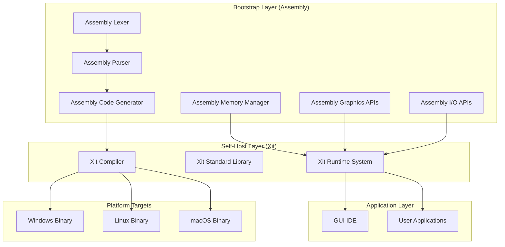

# Design Document: Xit Programming Language

## Overview

The xit programming language is designed as a self-hosting, memory-safe, high-performance language that operates completely independently from system APIs and external tools. This design addresses the failures of 13 previous attempts by focusing on a phased bootstrap approach, complete system independence, and robust memory safety.

The language follows a three-phase development strategy:
1. **Bootstrap Phase**: Pure assembly implementation of core components
2. **Self-Hosting Phase**: Rewrite compiler in xit itself
3. **Enhancement Phase**: Add advanced features and optimizations

Key design principles:
- Complete independence from external APIs and tools
- Memory safety without performance penalties
- Cross-platform binary generation from scratch
- Minimal but complete feature set for self-hosting
- Extensible architecture for future enhancements

## Architecture

### High-Level System Architecture



### Bootstrap Architecture

The bootstrap phase implements the absolute minimum required to compile a simple xit program:

**Assembly Components:**
- **Lexer**: Tokenizes xit source code
- **Parser**: Builds abstract syntax tree (AST)
- **Code Generator**: Produces machine code or assembly
- **Memory Manager**: Safe memory allocation/deallocation
- **Basic I/O**: File reading/writing
- **System Interface**: Direct system calls without APIs

**Bootstrap Compiler Capabilities:**
- Parse minimal xit syntax (functions, variables, basic types)
- Generate executable code for target platform
- Provide memory-safe operations
- Support basic control flow (if/else, loops)

## Components and Interfaces

### 1. Lexical Analysis System

**Purpose**: Convert source code text into tokens

**Interface**:
```c
// Token types
typedef enum {
    TOKEN_IDENTIFIER,
    TOKEN_NUMBER,
    TOKEN_STRING,
    TOKEN_KEYWORD,
    TOKEN_OPERATOR,
    TOKEN_DELIMITER,
    TOKEN_EOF
} TokenType;

typedef struct {
    TokenType type;
    char* value;
    int line;
    int column;
} Token;

// Core lexer functions
Token* lex_next_token(LexerState* state);
LexerState* lexer_create(char* source_code);
void lexer_destroy(LexerState* state);
```

**Implementation Strategy**:
- Hand-written in assembly for bootstrap
- Character-by-character processing
- Direct memory management
- No regular expressions or external libraries

### 2. Direct Binary Generation Parser System

**Purpose**: Parse source code and directly generate machine code without intermediate AST

**Parser Interface**:
```c
typedef struct {
    Token* current_token;
    Token* tokens;
    uint8_t* code_buffer;
    size_t code_size;
    SymbolTable* symbols;
    int current_scope_depth;
} DirectParser;

DirectParser* parser_create(Token* tokens);
void parse_program(DirectParser* parser);
void parse_function(DirectParser* parser);
void parse_statement(DirectParser* parser);
void emit_executable(DirectParser* parser, char* filename);
```

**Direct Code Generation Strategy**:
- Parse and emit machine code in single pass
- No intermediate representation or AST
- Direct x86-64 instruction encoding during parsing
- Immediate symbol resolution and code patching
- Stack-based expression evaluation with direct code emission

**Grammar Subset for Bootstrap**:
```
program     := function*
function    := 'func' IDENTIFIER '(' params? ')' type? '{' statement* '}'
statement   := assignment | if_stmt | while_stmt | return_stmt
expression  := term (('+' | '-') term)*
term        := factor (('*' | '/') factor)*
factor      := NUMBER | IDENTIFIER | '(' expression ')'
```

### 3. Direct Machine Code Generation System

**Purpose**: Generate machine code directly during parsing without intermediate representation

**Direct Code Generator Interface**:
```c
typedef struct {
    uint8_t* code_buffer;
    size_t code_size;
    size_t code_capacity;
    SymbolTable* symbols;
    int* label_stack;
    int label_count;
} DirectCodeGen;

void emit_instruction(DirectCodeGen* gen, uint8_t* instruction, size_t length);
void emit_function_prologue(DirectCodeGen* gen);
void emit_function_epilogue(DirectCodeGen* gen);
void emit_arithmetic_op(DirectCodeGen* gen, TokenType op);
void emit_jump(DirectCodeGen* gen, int label_id);
```

**Direct Generation Strategy**:
- Single-pass compilation from source to machine code
- Immediate instruction encoding during parsing
- Stack-based expression evaluation
- Direct register allocation without optimization
- Forward reference resolution with label patching

### 4. Memory Safety System

**Purpose**: Prevent C/C++ style memory vulnerabilities

**Safety Mechanisms**:
```c
// Safe memory allocation with metadata
typedef struct {
    size_t size;
    uint32_t magic;
    uint8_t allocated;
} MemoryHeader;

void* safe_malloc(size_t size);
void safe_free(void* ptr);
int bounds_check(void* ptr, size_t offset, size_t access_size);
```

**Safety Features**:
- **Bounds Checking**: Every array/pointer access validated
- **Use-After-Free Protection**: Memory marked as freed
- **Double-Free Protection**: Detect multiple free attempts
- **Stack Overflow Detection**: Monitor stack usage
- **Memory Leak Detection**: Track all allocations

### 5. Cross-Platform Binary Generator

**Purpose**: Generate native executables for different operating systems

**Binary Format Support**:
- **Windows**: PE (Portable Executable) format
- **Linux**: ELF (Executable and Linkable Format)
- **macOS**: Mach-O format

**Binary Generator Interface**:
```c
typedef enum {
    PLATFORM_WINDOWS,
    PLATFORM_LINUX,
    PLATFORM_MACOS
} Platform;

typedef struct {
    Platform target;
    uint8_t* code_section;
    uint8_t* data_section;
    SymbolTable* exports;
    SymbolTable* imports;
} BinaryBuilder;

BinaryBuilder* binary_create(Platform target);
void binary_add_code(BinaryBuilder* builder, uint8_t* code, size_t size);
void binary_write_executable(BinaryBuilder* builder, char* filename);
```

### 6. Primitive Graphics System

**Purpose**: Render basic geometric shapes without system graphics APIs

**Shape System**:
```c
typedef struct {
    float x, y;
} Point;

typedef struct {
    Point center;
    float radius;
    uint32_t color;
} Circle;

typedef struct {
    Point top_left;
    float width, height;
    uint32_t color;
} Rectangle;

typedef struct {
    Point vertices[3];
    uint32_t color;
} Triangle;
```

**Graphics Interface**:
```c
void graphics_init(int width, int height);
void draw_circle(Circle* circle);
void draw_rectangle(Rectangle* rect);
void draw_triangle(Triangle* tri);
void graphics_present();
```

**Rendering Strategy**:
- Software rasterization (no GPU dependencies)
- Pixel-by-pixel drawing to framebuffer
- Basic vector math for transformations
- Direct memory mapping to display buffer

### 7. Comprehensive Input Capture System

**Purpose**: Capture all keyboard and mouse events including modifier keys

**Input Event System**:
```c
typedef enum {
    INPUT_KEY_PRESS,
    INPUT_KEY_RELEASE,
    INPUT_MOUSE_BUTTON,
    INPUT_MOUSE_MOVE,
    INPUT_MOUSE_SCROLL,
    INPUT_KEY_COMBINATION
} InputEventType;

typedef enum {
    KEY_MODIFIER_NONE = 0,
    KEY_MODIFIER_CTRL = 1,
    KEY_MODIFIER_ALT = 2,
    KEY_MODIFIER_SHIFT = 4,
    KEY_MODIFIER_WIN = 8
} KeyModifier;

typedef struct {
    InputEventType type;
    union {
        struct { 
            int key_code; 
            int modifiers;  // Bitfield of KeyModifier
            char character; // Actual character if printable
        } key;
        struct { 
            int button; 
            int x, y; 
            int modifiers;
        } mouse_button;
        struct { int x, y; } mouse_move;
        struct { 
            int delta_x, delta_y; 
            int modifiers;
        } scroll;
        struct {
            int primary_key;
            int modifiers;
            char* combination_string; // e.g., "Ctrl+C"
        } key_combo;
    } data;
} InputEvent;

int input_poll_event(InputEvent* event);
void input_init();
int input_is_key_pressed(int key_code);
int input_get_modifier_state();
```

**Implementation**:
- Direct hardware interrupt handling for all input devices
- Complete keyboard scancode processing including function keys
- Mouse state tracking with all buttons and scroll wheels
- Modifier key state management and combination detection
- Event queue management with priority handling

### 8. Image Rendering and Pixel Manipulation System

**Purpose**: Render images from raw pixel data and provide pixel-level control

**Image System**:
```c
typedef enum {
    PIXEL_FORMAT_RGB,
    PIXEL_FORMAT_RGBA,
    PIXEL_FORMAT_BGR,
    PIXEL_FORMAT_BGRA,
    PIXEL_FORMAT_GRAYSCALE
} PixelFormat;

typedef struct {
    uint8_t* pixel_data;
    int width, height;
    PixelFormat format;
    int bytes_per_pixel;
    int stride; // Bytes per row
} Image;

typedef struct {
    float x, y;
    float scale_x, scale_y;
    float rotation; // In radians
    uint8_t alpha; // Global alpha for blending
} ImageTransform;
```

**Image Interface**:
```c
Image* image_create(int width, int height, PixelFormat format);
Image* image_from_data(uint8_t* data, int width, int height, PixelFormat format);
void image_destroy(Image* img);
void image_set_pixel(Image* img, int x, int y, uint32_t color);
uint32_t image_get_pixel(Image* img, int x, int y);
void image_render(Image* img, int dest_x, int dest_y, ImageTransform* transform);
void image_blend(Image* dest, Image* src, int x, int y, uint8_t alpha);
Image* image_scale(Image* src, float scale_x, float scale_y);
Image* image_rotate(Image* src, float angle);
void image_convert_format(Image* img, PixelFormat new_format);
```

**Rendering Strategy**:
- Direct pixel buffer manipulation
- Software-based scaling and rotation algorithms
- Alpha blending and compositing
- Efficient memory management for large images
- Format conversion without external libraries

### 9. Complete GUI Library System (GUIO)

**Purpose**: Provide comprehensive GUI functionality through modular library

**Window Management**:
```c
typedef struct {
    int id;
    char* title;
    int x, y, width, height;
    int is_resizable;
    int is_minimizable;
    int is_maximizable;
    int is_visible;
    uint8_t* framebuffer;
    void* render_context;
} Window;

typedef struct {
    int type; // Window event, input event, etc.
    int window_id;
    InputEvent input;
    union {
        struct { int new_width, new_height; } resize;
        struct { int new_x, new_y; } move;
        struct { int minimized, maximized; } state;
    } data;
} GUIEvent;
```

**GUIO Interface**:
```c
// Window management
Window* guio_create_window(char* title, int x, int y, int width, int height);
void guio_destroy_window(Window* window);
void guio_show_window(Window* window);
void guio_hide_window(Window* window);
void guio_set_window_title(Window* window, char* title);
void guio_set_window_size(Window* window, int width, int height);
void guio_set_window_position(Window* window, int x, int y);

// Event handling
int guio_poll_event(GUIEvent* event);
void guio_process_events();

// Rendering context
void guio_begin_render(Window* window);
void guio_end_render(Window* window);
void guio_clear_window(Window* window, uint32_t color);

// Drawing utilities
void guio_draw_shape(Window* window, void* shape, int shape_type);
void guio_draw_image(Window* window, Image* img, int x, int y);
void guio_draw_text(Window* window, char* text, int x, int y, uint32_t color);

// Window decorations (built from shapes)
void guio_draw_title_bar(Window* window);
void guio_draw_window_border(Window* window);
void guio_draw_minimize_button(Window* window);
void guio_draw_maximize_button(Window* window);
void guio_draw_close_button(Window* window);
```

**Purpose**: Render images from raw pixel data and provide pixel-level control

**Image System**:
```c
typedef enum {
    PIXEL_FORMAT_RGB,
    PIXEL_FORMAT_RGBA,
    PIXEL_FORMAT_BGR,
    PIXEL_FORMAT_BGRA,
    PIXEL_FORMAT_GRAYSCALE
} PixelFormat;

typedef struct {
    uint8_t* pixel_data;
    int width, height;
    PixelFormat format;
    int bytes_per_pixel;
    int stride; // Bytes per row
} Image;

typedef struct {
    float x, y;
    float scale_x, scale_y;
    float rotation; // In radians
    uint8_t alpha; // Global alpha for blending
} ImageTransform;
```

**Image Interface**:
```c
Image* image_create(int width, int height, PixelFormat format);
Image* image_from_data(uint8_t* data, int width, int height, PixelFormat format);
void image_destroy(Image* img);
void image_set_pixel(Image* img, int x, int y, uint32_t color);
uint32_t image_get_pixel(Image* img, int x, int y);
void image_render(Image* img, int dest_x, int dest_y, ImageTransform* transform);
void image_blend(Image* dest, Image* src, int x, int y, uint8_t alpha);
Image* image_scale(Image* src, float scale_x, float scale_y);
Image* image_rotate(Image* src, float angle);
void image_convert_format(Image* img, PixelFormat new_format);
```

**Rendering Strategy**:
- Direct pixel buffer manipulation
- Software-based scaling and rotation algorithms
- Alpha blending and compositing
- Efficient memory management for large images
- Format conversion without external libraries

### 9. Complete GUI Library System (GUIO)

**Purpose**: Provide comprehensive GUI functionality through modular library

**Window Management**:
```c
typedef struct {
    int id;
    char* title;
    int x, y, width, height;
    int is_resizable;
    int is_minimizable;
    int is_maximizable;
    int is_visible;
    uint8_t* framebuffer;
    void* render_context;
} Window;

typedef struct {
    int type; // Window event, input event, etc.
    int window_id;
    InputEvent input;
    union {
        struct { int new_width, new_height; } resize;
        struct { int new_x, new_y; } move;
        struct { int minimized, maximized; } state;
    } data;
} GUIEvent;
```

**GUIO Interface**:
```c
// Window management
Window* guio_create_window(char* title, int x, int y, int width, int height);
void guio_destroy_window(Window* window);
void guio_show_window(Window* window);
void guio_hide_window(Window* window);
void guio_set_window_title(Window* window, char* title);
void guio_set_window_size(Window* window, int width, int height);
void guio_set_window_position(Window* window, int x, int y);

// Event handling
int guio_poll_event(GUIEvent* event);
void guio_process_events();

// Rendering context
void guio_begin_render(Window* window);
void guio_end_render(Window* window);
void guio_clear_window(Window* window, uint32_t color);

// Drawing utilities
void guio_draw_shape(Window* window, void* shape, int shape_type);
void guio_draw_image(Window* window, Image* img, int x, int y);
void guio_draw_text(Window* window, char* text, int x, int y, uint32_t color);

// Window decorations (built from shapes)
void guio_draw_title_bar(Window* window);
void guio_draw_window_border(Window* window);
void guio_draw_minimize_button(Window* window);
void guio_draw_maximize_button(Window* window);
void guio_draw_close_button(Window* window);
```

### 10. 3D Rendering and Mesh Manipulation System

**Purpose**: Provide complete 3D graphics capabilities without external 3D APIs

**3D Data Structures**:
```c
typedef struct {
    float x, y, z;
} Vector3;

typedef struct {
    float x, y, z, w;
} Vector4;

typedef struct {
    float m[4][4];
} Matrix4x4;

typedef struct {
    Vector3 position;
    Vector3 normal;
    float u, v; // Texture coordinates
} Vertex;

typedef struct {
    int v1, v2, v3; // Vertex indices
} Face;

typedef struct {
    Vertex* vertices;
    Face* faces;
    int vertex_count;
    int face_count;
    Image* texture;
    Vector3 position;
    Vector3 rotation;
    Vector3 scale;
} Mesh;

typedef struct {
    Vector3 position;
    Vector3 target;
    Vector3 up;
    float fov;
    float near_plane;
    float far_plane;
    Matrix4x4 view_matrix;
    Matrix4x4 projection_matrix;
} Camera;
```

**3D Rendering Interface**:
```c
// Mesh operations
Mesh* mesh_create(int vertex_count, int face_count);
void mesh_destroy(Mesh* mesh);
void mesh_add_vertex(Mesh* mesh, Vector3 pos, Vector3 normal, float u, float v);
void mesh_add_face(Mesh* mesh, int v1, int v2, int v3);
void mesh_transform(Mesh* mesh, Matrix4x4* transform);

// Camera operations
Camera* camera_create(Vector3 position, Vector3 target, float fov);
void camera_update_view(Camera* camera);
void camera_move(Camera* camera, Vector3 direction);
void camera_rotate(Camera* camera, float yaw, float pitch);

// 3D rendering
void render_mesh(Mesh* mesh, Camera* camera);
void render_scene(Mesh** meshes, int mesh_count, Camera* camera);

// Matrix operations
Matrix4x4 matrix_identity();
Matrix4x4 matrix_translate(Vector3 translation);
Matrix4x4 matrix_rotate(Vector3 rotation);
Matrix4x4 matrix_scale(Vector3 scale);
Matrix4x4 matrix_multiply(Matrix4x4 a, Matrix4x4 b);
```

### 11. Runtime Loop System and FPS Control

**Purpose**: Provide precise timing control and runtime loop management

**Runtime Loop System**:
```c
typedef struct {
    float interval; // Seconds between updates
    void (*callback)(float delta_time);
    float last_update;
    int active;
} UpdateLoop;

typedef struct {
    float target_fps;
    float current_fps;
    float frame_time;
    float last_frame_time;
    int fps_limit_enabled;
} FPSController;
```

**Runtime Loop Interface**:
```c
// FPS control
void SETMAXFPS_GLOBAL(float max_fps);
float GETFPS();
void fps_controller_update();

// Runtime loops
void RUN_UPDATE_1(); // Update every 1 second
void RUN_UPDATE_0_5(); // Update every 0.5 seconds
void RUN_UPDATE_0_1(); // Update every 0.1 seconds
void RUN_UPDATE_0_016(); // Update every ~60 FPS (0.016 seconds)

// Custom update loops
int create_update_loop(float interval, void (*callback)(float));
void destroy_update_loop(int loop_id);
void pause_update_loop(int loop_id);
void resume_update_loop(int loop_id);

// Timing utilities
float get_time(); // Get current time in seconds
void sleep_precise(float seconds); // Precise sleep without system calls
```

### 12. Dynamic Data Structures System

**Purpose**: Provide Python-like dictionaries with runtime manipulation

**Dynamic Data Types**:
```c
typedef enum {
    DTYPE_STRING,
    DTYPE_INT,
    DTYPE_FLOAT,
    DTYPE_DICT,
    DTYPE_ARRAY,
    DTYPE_BOOL
} DataType;

typedef struct DataValue {
    DataType type;
    union {
        char* string_val;
        int int_val;
        float float_val;
        struct Dict* dict_val;
        struct Array* array_val;
        int bool_val;
    } data;
} DataValue;

typedef struct DictNode {
    char* key;
    DataValue* value;
    struct DictNode* next;
} DictNode;

typedef struct Dict {
    DictNode* nodes;
    int count;
    int capacity;
} Dict;

typedef struct Array {
    DataValue** elements;
    int count;
    int capacity;
} Array;
```

**Dynamic Data Interface**:
```c
// Dictionary operations
Dict* dict_create();
void dict_destroy(Dict* dict);
void dict_set(Dict* dict, char* key, DataValue* value);
DataValue* dict_get(Dict* dict, char* key);
void dict_delete(Dict* dict, char* key);
int dict_has_key(Dict* dict, char* key);
char** dict_keys(Dict* dict);

// Value creation with automatic type detection
DataValue* value_from_string(char* str); // Auto-detects int/float/string
DataValue* value_from_int(int val);
DataValue* value_from_float(float val);
DataValue* value_create_dict();
DataValue* value_create_array();

// Type conversion and detection
DataType detect_string_type(char* str);
int value_to_int(DataValue* val);
float value_to_float(DataValue* val);
char* value_to_string(DataValue* val);

// Nested operations
void dict_set_nested(Dict* dict, char* path, DataValue* value); // e.g., "user.settings.theme"
DataValue* dict_get_nested(Dict* dict, char* path);

// Runtime manipulation
void dict_add_node_runtime(Dict* dict, char* key);
void dict_write_data_runtime(Dict* dict, char* key, char* data);
DataValue* dict_refer_runtime(Dict* dict, char* key);
void dict_delete_runtime(Dict* dict, char* key);
```

## Data Models

### 1. Type System

**Basic Types**:
```c
typedef enum {
    TYPE_VOID,
    TYPE_INT8, TYPE_INT16, TYPE_INT32, TYPE_INT64,
    TYPE_UINT8, TYPE_UINT16, TYPE_UINT32, TYPE_UINT64,
    TYPE_FLOAT32, TYPE_FLOAT64,
    TYPE_BOOL,
    TYPE_CHAR,
    TYPE_STRING,
    TYPE_POINTER,
    TYPE_ARRAY,
    TYPE_STRUCT,
    TYPE_FUNCTION,
    TYPE_BIGINT  // Arbitrary precision integer
} TypeKind;

typedef struct Type {
    TypeKind kind;
    union {
        struct Type* pointer_to;
        struct {
            struct Type* element_type;
            size_t length;
        } array;
        struct {
            char* name;
            struct Field* fields;
            int field_count;
        } struct_type;
    } data;
} Type;
```

### 2. Symbol Table

**Symbol Management**:
```c
typedef struct Symbol {
    char* name;
    Type* type;
    enum { SYM_VARIABLE, SYM_FUNCTION, SYM_TYPE } kind;
    union {
        struct {
            int offset;  // Stack offset for local vars
            int is_global;
        } variable;
        struct {
            ASTNode* body;
            Type** param_types;
            int param_count;
        } function;
    } data;
} Symbol;

typedef struct SymbolTable {
    Symbol** symbols;
    int count;
    int capacity;
    struct SymbolTable* parent;  // For nested scopes
} SymbolTable;
```

### 3. Big Integer System

**Arbitrary Precision Integers**:
```c
typedef struct {
    uint32_t* digits;    // Array of 32-bit digits
    size_t digit_count;
    size_t capacity;
    int sign;            // 1 for positive, -1 for negative
} BigInt;

BigInt* bigint_create(int64_t initial_value);
BigInt* bigint_add(BigInt* a, BigInt* b);
BigInt* bigint_multiply(BigInt* a, BigInt* b);
int bigint_compare(BigInt* a, BigInt* b);
```

**Bit Stacking Implementation**:
- Dynamic array of 32-bit chunks
- Automatic expansion when overflow occurs
- Efficient algorithms for basic arithmetic
- Integration with type system for seamless use

### 4. File Format Definitions

**XHI Header Files**:
```c
// .xhi file structure
typedef struct {
    uint32_t magic;           // 'XHI\0'
    uint32_t version;
    uint32_t symbol_count;
    Symbol* symbols;          // Function/type declarations
} XHIHeader;
```

**XHL Object Files**:
```c
// .xhl file structure (like .o files)
typedef struct {
    uint32_t magic;           // 'XHL\0'
    uint32_t version;
    uint32_t code_size;
    uint8_t* code_section;
    uint32_t data_size;
    uint8_t* data_section;
    uint32_t symbol_count;
    Symbol* symbols;
    uint32_t relocation_count;
    Relocation* relocations;
} XHLObject;
```

**XLL Shared Libraries**:
```c
// .xll file structure (like .dll/.so)
typedef struct {
    uint32_t magic;           // 'XLL\0'
    uint32_t version;
    uint32_t export_count;
    Symbol* exports;
    uint32_t code_size;
    uint8_t* code_section;
    uint32_t data_size;
    uint8_t* data_section;
} XLLLibrary;
```
## Correctness Properties

*A property is a characteristic or behavior that should hold true across all valid executions of a system-essentially, a formal statement about what the system should do. Properties serve as the bridge between human-readable specifications and machine-verifiable correctness guarantees.*

### Property 1: Bootstrap Compilation Round-Trip
*For any* valid xit program written in the minimal bootstrap subset, compiling with the bootstrap compiler then executing should produce the expected output, and parsing then pretty-printing then parsing should yield an equivalent AST.
**Validates: Requirements 1.1, 1.3, 1.4**

### Property 2: Self-Hosting Independence
*For any* version of the self-hosting compiler, compiling itself should produce a functionally equivalent compiler that operates without any external dependencies (nasm, gcc, ld).
**Validates: Requirements 2.2, 2.4, 2.5**

### Property 3: Cross-Platform Binary Generation
*For any* valid xit program, the compiler should generate appropriate native executables for Windows (PE), Linux (ELF), and macOS (Mach-O) that run correctly on their respective platforms without external tools.
**Validates: Requirements 16.1, 16.2, 16.3, 16.4, 16.5, 16.6**

### Property 4: Memory Safety Guarantee
*For any* memory operation (allocation, deallocation, array access, pointer dereference), the runtime system should prevent buffer overflows, use-after-free, null pointer dereferences, double-free, and memory leaks through automatic checking and tracking.
**Validates: Requirements 14.1, 14.5, 14.6, 18.1, 18.2, 18.3, 18.6, 18.7**

### Property 5: Big Integer Arithmetic
*For any* integer arithmetic operation, when the result exceeds standard bit limits (32/64-bit), the system should automatically extend precision using bit stacking and maintain mathematical correctness.
**Validates: Requirements 14.2, 14.3, 14.4**

### Property 6: Shape Rendering System
*For any* geometric shape (circle, rectangle, triangle) with any valid properties (position, size, color, rotation), the graphics system should render it correctly without using system graphics APIs.
**Validates: Requirements 17.1, 17.2, 17.3, 17.4, 17.7**

### Property 7: Comprehensive Input Event Capture
*For any* input event (all key presses/releases including modifiers, all mouse buttons, mouse movement, scroll events, key combinations), the input capture system should detect and deliver complete event data to xit programs without using system APIs.
**Validates: Requirements 6.1, 6.2, 6.3, 6.4, 6.5, 6.6, 6.7, 6.8**

### Property 8: File Format Handling
*For any* valid xit source file, the system should correctly generate and process .xhi header files (declarations only), .xhl object files (relocatable code), and .xll shared libraries (dynamically loadable).
**Validates: Requirements 11.1, 11.2, 12.1, 12.2, 12.3, 12.4**

### Property 9: System Independence
*For any* system operation (file I/O, graphics, input, memory management), the implementation should use direct system calls or custom implementations without relying on Windows APIs, Linux APIs, or external libraries.
**Validates: Requirements 3.4, 3.5, 3.7, 15.1, 15.2, 15.6**

### Property 10: Taskbar Control Without APIs
*For any* taskbar operation (icon setting, progress indication, system tray), the system should provide complete control through direct system calls and custom icon creation from raw pixel data without using Windows Shell APIs.
**Validates: Requirements 10.1, 10.2, 10.3, 10.4, 10.5, 10.6**

### Property 11: Language Completeness
*For any* fundamental programming construct (data types, control flow, functions, user-defined types, memory management), the xit language should provide complete, robust implementations without arbitrary limitations.
**Validates: Requirements 7.1, 7.2, 7.3, 7.4, 7.5, 19.1, 19.2, 19.4, 19.7**

### Property 12: Error Handling Quality
*For any* error condition (compilation error, runtime error, I/O error), the system should provide clear, informative error messages with appropriate context (line numbers, stack traces, descriptions).
**Validates: Requirements 8.1, 8.2, 8.5, 9.4**

### Property 13: Performance Requirements
*For any* equivalent algorithm implemented in both xit and C, the xit version should perform within 20% of the C version, with minimal runtime overhead for function calls and memory allocation.
**Validates: Requirements 5.2, 5.3**

### Property 15: Image Rendering and Pixel Manipulation
*For any* image data (raw pixels, different formats, transformations), the graphics system should correctly render, manipulate, and composite images without using system graphics APIs.
**Validates: Requirements 22.1, 22.2, 22.3, 22.4, 22.5, 22.6, 22.7, 22.8**

### Property 16: Complete GUI Library Functionality
*For any* GUI operation (window creation, event handling, rendering context management), the GUIO library should provide complete functionality through .xhi/.xll interface without external dependencies.
**Validates: Requirements 23.1, 23.2, 23.3, 23.4, 23.5, 23.6, 23.7, 23.8**

### Property 17: 3D Rendering and Mesh Manipulation
*For any* 3D mesh operation (creation, transformation, rendering), the graphics system should correctly handle 3D geometry, lighting, and texturing without using external 3D APIs.
**Validates: Requirements 24.1, 24.2, 24.3, 24.4, 24.5, 24.6, 24.7, 24.8**

### Property 18: Runtime Loop System and FPS Control
*For any* runtime loop configuration (update intervals, FPS limits), the system should maintain precise timing and frame rate control across different hardware configurations.
**Validates: Requirements 25.1, 25.2, 25.3, 25.4, 25.5, 25.6, 25.7**

### Property 19: Dynamic Data Structures
*For any* dynamic data operation (dictionary creation, node addition/deletion, type detection), the system should provide flexible runtime data manipulation without memory issues or type constraints.
**Validates: Requirements 26.1, 26.2, 26.3, 26.4, 26.5, 26.6, 26.7, 26.8**

### Property 20: Python-like Language Features
*For any* Python-like language feature (list comprehensions, dynamic typing, lambda functions, automatic memory management), the system should provide expressive programming capabilities with C-style syntax.
**Validates: Requirements 27.1, 27.2, 27.3, 27.4, 27.5, 27.6, 27.7, 27.8**

### Property 21: Standard I/O Library
*For any* I/O operation (console input/output, file operations, formatting), the IO library should provide comprehensive functionality through io.xhi/.xll interface.
**Validates: Requirements 28.1, 28.2, 28.3, 28.4, 28.5, 28.6, 28.7, 28.8**

### Property 22: INFINITY and Division by Zero Handling
*For any* mathematical operation involving infinity or division by zero, the system should handle edge cases gracefully and provide proper infinity arithmetic.
**Validates: Requirements 29.1, 29.2, 29.3, 29.4, 29.5, 29.6, 29.7, 29.8**
### Property 14: System Validation
*For any* system component update, the compiler should verify all dependent systems are properly updated and refuse to operate if any core component is outdated or corrupted.
**Validates: Requirements 21.4, 21.5, 21.6, 21.7**

## Error Handling

### Error Categories

**Compile-Time Errors**:
- Syntax errors with precise location information
- Type checking errors with context
- Symbol resolution errors
- File access errors during compilation

**Runtime Errors**:
- Memory safety violations (bounds checking, null access)
- Stack overflow detection
- Division by zero and arithmetic errors
- File I/O errors with descriptive messages

**System Errors**:
- Component integrity failures
- Platform compatibility issues
- Resource exhaustion (memory, file handles)

### Error Handling Strategy

**Graceful Degradation**:
- Compiler continues parsing after syntax errors to find multiple issues
- Runtime system attempts recovery where possible
- Clear error messages guide users toward solutions

**Error Recovery**:
- Parser uses error recovery techniques to continue after syntax errors
- Runtime system provides stack unwinding for error propagation
- Memory system automatically cleans up on error conditions

**Debugging Support**:
- Debug symbol generation for all compiled code
- Stack trace generation with function names and line numbers
- Memory allocation tracking for leak detection
- Performance profiling hooks for optimization

## Testing Strategy

### Dual Testing Approach

The xit programming language requires both unit testing and property-based testing for comprehensive validation:

**Unit Tests**: Focus on specific examples, edge cases, and integration points
- Bootstrap compiler with known minimal programs
- Specific error conditions and recovery
- Platform-specific executable generation
- GUI IDE functionality with user interactions
- File format parsing and generation

**Property-Based Tests**: Verify universal properties across all inputs
- Compilation round-trip properties
- Memory safety across all operations
- Cross-platform binary generation
- Input event handling
- Graphics rendering correctness

### Property-Based Testing Configuration

**Testing Framework**: Custom property-based testing framework implemented in xit itself
- Minimum 100 iterations per property test
- Configurable random seed for reproducible failures
- Shrinking capability to find minimal failing examples

**Test Organization**:
- Each correctness property implemented as a single property-based test
- Tests tagged with feature name and property reference
- Tag format: **Feature: xit-programming-language, Property {number}: {property_text}**

**Coverage Requirements**:
- All acceptance criteria covered by either unit tests or property tests
- Critical paths (bootstrap, self-hosting, memory safety) have both unit and property tests
- Performance benchmarks validate optimization requirements
- Cross-platform tests run on actual target operating systems

### Testing Phases

**Phase 1: Bootstrap Testing**
- Assembly implementation validation
- Minimal xit subset compilation
- Basic memory safety verification
- Simple graphics primitive rendering

**Phase 2: Self-Hosting Testing**
- Compiler self-compilation verification
- Full language feature testing
- Advanced memory safety validation
- Complete graphics system testing

**Phase 3: Production Testing**
- Performance benchmarking against C
- Large program compilation testing
- GUI IDE comprehensive testing
- Cross-platform compatibility validation

### Continuous Validation

**System Integrity Checking**:
- Automated verification of component dependencies
- Cross-platform build validation
- Performance regression detection
- Memory safety violation monitoring

**Quality Metrics**:
- Code coverage for both unit and property tests
- Performance benchmarks tracked over time
- Memory usage profiling for all components
- Error message quality assessment